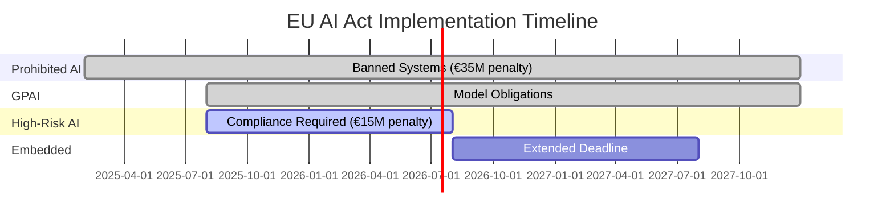

The [EU AI Act](https://artificialintelligenceact.eu/) went into force on August 1, 2024.

Prohibited AI systems were banned on **February 2, 2025**. That deadline passed.

GPAI transparency requirements became mandatory on **August 2, 2025**. That deadline also passed.

If you haven't addressed these, you're currently non-compliant.

And the penalties aren't gentle: **up to €35 million or 7% of global annual revenue**, whichever is higher.

Most companies I talk to have no idea whether their AI systems fall under the EU AI Act. They're waiting for "more clarity" or planning to "deal with it later."

Later is now.

Let me break down what you actually need to do, when you need to do it, and how to prioritize.

## The four deadlines (two have passed)

The EU AI Act rolls out in phases. Here's what's already happened and what's coming:

### ✅ February 2, 2025: Prohibited AI Systems (ACTIVE NOW)

These AI practices are **banned immediately**:
- Social scoring systems
- Real-time biometric identification in public spaces (with exceptions for law enforcement)
- Emotion recognition in workplaces and schools
- Manipulative AI that exploits vulnerabilities

**Penalty for violations**: Up to **€35M or 7% of global revenue**

**Status**: Enforcement began. If you're using any of these, you need to stop immediately.

### ✅ August 2, 2025: GPAI Model Obligations (ACTIVE NOW)

If you provide General Purpose AI models (think: foundation models like GPT, Claude, Llama), you must:
- Publish detailed technical documentation
- Comply with EU copyright law
- Implement cybersecurity measures
- Report serious incidents

**Who this affects**: Model providers (OpenAI, Anthropic, Google), not most end users

**Status**: Active. Model providers are complying.

### ⏰ August 2, 2026: High-Risk AI Systems (18 months away)

This is the big one for most companies.

If your AI system is classified as "high-risk," you must:
- Implement risk management systems
- Ensure data governance and quality
- Maintain technical documentation
- Provide transparency to users
- Enable human oversight
- Ensure accuracy, robustness, and cybersecurity

**Penalty**: Up to **€15M or 3% of global revenue**

**Status**: 18 months to comply. This is what most companies need to focus on.

### ⏰ August 2, 2027: Embedded Systems (30 months away)

AI systems embedded into regulated products (medical devices, cars, machinery) get an extended deadline.

**Status**: Extended deadline for complex integrations

## How to know if you're affected (the risk classification)

The EU AI Act uses a four-tier risk classification system. Your obligations depend on which tier your AI falls into.

| Risk Tier | Examples | Obligations | Penalty |
|-----------|----------|-------------|---------|
| **Unacceptable (Tier 1)** | Social scoring, real-time biometric surveillance, emotion recognition in workplace | **BANNED** | €35M or 7% revenue |
| **High-Risk (Tier 2)** | Hiring AI, credit scoring, medical diagnostics, employee monitoring | Full compliance by Aug 2026 | €15M or 3% revenue |
| **Limited (Tier 3)** | Chatbots, deepfakes, emotion recognition (non-work) | Transparency disclosures | €7.5M or 1.5% revenue |
| **Minimal (Tier 4)** | Spam filters, video games, recommendation engines | None | None |

### Tier 1: Unacceptable Risk (PROHIBITED)

These are banned immediately (as of Feb 2, 2025):
- Social scoring by governments
- Exploitation of vulnerabilities (children, disabilities)
- Real-time biometric surveillance (with exceptions)
- Emotion recognition in schools/workplaces

**Your action**: If you're doing any of this, stop.

### Tier 2: High-Risk (STRICT REGULATION)

This is where most enterprise AI will fall. You're high-risk if your AI:

**Is used in these sectors**:
- Biometrics and identification
- Critical infrastructure management
- Education (admissions, exam scoring)
- Employment (hiring, promotion, monitoring)
- Essential services (credit scoring, insurance)
- Law enforcement
- Migration and border control
- Justice and democratic processes

**OR is a safety component** of products covered by EU safety legislation (medical devices, cars, etc.)

**Example high-risk systems**:
- AI that screens job applicants
- Credit scoring algorithms
- AI-based medical diagnostics
- Automated loan approval systems
- Employee monitoring tools

**Your obligation**: Full compliance by August 2, 2026 (18 months)

### Tier 3: Limited Risk (TRANSPARENCY REQUIRED)

AI systems with limited risk need transparency but not full compliance:
- Chatbots (must disclose they're AI)
- Emotion recognition systems
- Biometric categorization
- Deep fakes (must be labeled)

**Your action**: Ensure users know they're interacting with AI

### Tier 4: Minimal Risk (NO REGULATION)

Most AI falls here:
- Spam filters
- AI-powered video games
- Recommendation engines (in most cases)
- Inventory management AI

**Your action**: No compliance requirements, but monitor for reclassification

## The compliance reality check

Here's what surprised me while researching this:

**Only 5-15% of AI systems are high-risk.** Most enterprise AI systems fall into minimal or limited risk categories.

But the systems that *are* high-risk (HR, finance, healthcare) are core business functions for many companies.

And here's the kicker: **The EU AI Act has extraterritorial reach.** If you're a US company serving EU customers, you're subject to EU AI Act compliance.

### Who needs to comply?

✅ You're affected if ANY of these apply:
- Your company is based in the EU
- You provide AI systems/products to the EU market
- You're using AI systems in the EU (even if developed elsewhere)
- Your AI system's output is used in the EU

Even if you're a US-based SaaS company, if you have EU customers using your AI features, you need to comply.

## The NIST AI Risk Management Framework (your implementation guide)

While the EU AI Act sets the rules, [NIST's AI RMF](https://www.nist.gov/itl/ai-risk-management-framework) provides a practical framework for implementing AI governance.

It's voluntary in the US but has become the de facto standard globally. Here's how it works:

### The Four Functions

**GOVERN**: Establish AI governance structure
- Policies and procedures
- Roles and responsibilities
- Risk tolerance definition
- Accountability structures

**MAP**: Understand your AI context
- Identify AI use cases
- Map risks and impacts
- Understand stakeholders
- Document purposes and scope

**MEASURE**: Assess and analyze risks
- Define metrics
- Test for bias, accuracy, robustness
- Evaluate against benchmarks
- Document limitations

**MANAGE**: Control and monitor risks
- Implement controls
- Monitor in production
- Incident response plans
- Continuous improvement

The key insight: **Govern comes first**. Most companies jump to Measure (testing) without having governance structures in place. That's backwards.

## What Microsoft, Google, and IBM actually do

I looked at how major tech companies implement AI governance. Here's what they're doing:

### Microsoft: Responsible AI Standard v2

Microsoft's approach has six principles:
1. **Fairness**: AI systems should treat everyone fairly
2. **Reliability & Safety**: AI should perform safely and reliably
3. **Privacy & Security**: AI should be secure and respect privacy
4. **Inclusiveness**: AI should empower and engage everyone
5. **Transparency**: AI systems should be understandable
6. **Accountability**: People should be accountable for AI systems

But principles alone don't matter. Their implementation process:
- **Goals**: Define responsible AI objectives
- **Requirements**: Specific measurable requirements
- **Implementation**: Tools and practices to meet requirements
- **Measurement**: Metrics and testing

Every AI project must complete a Responsible AI Impact Assessment before deployment.

### Google: AI Principles + Frontier Safety Framework

Google has 7 AI objectives:
1. Be socially beneficial
2. Avoid creating or reinforcing unfair bias
3. Be built and tested for safety
4. Be accountable to people
5. Incorporate privacy design principles
6. Uphold high standards of scientific excellence
7. Be made available for uses that accord with these principles

For frontier models (their most advanced AI), they have a specialized safety framework with:
- Early warning signals
- Critical capability evaluations
- Third-party red teaming
- Deployment safeguards

### IBM: AI Ethics Board

IBM's structure is interesting because they have a formal decision-making body:
- **AI Ethics Board**: Reviews high-risk AI projects, has authority to halt deployments
- **Focal Points**: Embedded ethics experts in each business unit
- **Tools**: Factsheets (model cards), fairness toolkits, explainability tools

The key difference: IBM's board can actually stop AI projects. It's not just advisory.

## Your practical compliance roadmap (5 phases)

Based on the research and the August 2026 deadline, here's a practical timeline:

### Phase 1: Discovery and Classification (Weeks 1-4)

**Actions**:
- Inventory all AI systems in your organization
- Classify each by risk level (prohibited, high, limited, minimal)
- Identify EU-facing systems
- Map data flows and decision processes

**Deliverables**:
- AI system inventory spreadsheet
- Risk classification for each system
- Priority list (high-risk systems first)

**Tools**: Spreadsheet, interviews with product/engineering teams

### Phase 2: Governance Structure (Weeks 5-8)

**Actions**:
- Establish AI governance committee
- Define roles (AI Officer, Ethics reviewers, Compliance leads)
- Document risk tolerance and policies
- Set up approval processes

**Deliverables**:
- AI Governance Charter
- Role definitions (RACI matrix)
- Policy documents
- Decision-making process

**Who's involved**: C-suite, Legal, Compliance, Engineering, Product

### Phase 3: High-Risk System Compliance (Weeks 9-20)

**Actions** (for each high-risk system):
- Implement risk management process
- Ensure data governance (quality, bias testing)
- Create technical documentation
- Build transparency mechanisms (UI disclosures)
- Enable human oversight (overrides, review processes)
- Test accuracy, robustness, security

**Deliverables** (per system):
- Risk management documentation
- Data governance plan
- Technical documentation
- User transparency disclosures
- Human oversight procedures
- Testing reports

**This is the longest phase** and where most work happens.

### Phase 4: Limited-Risk Transparency (Weeks 21-24)

**Actions**:
- Add AI disclosure to chatbots
- Label AI-generated content
- Update privacy policies
- User education materials

**Deliverables**:
- UI updates with AI disclosures
- Updated legal docs
- User-facing communications

### Phase 5: Continuous Monitoring (Ongoing)

**Actions**:
- Monitor AI systems in production
- Track incidents and issues
- Regular audits and testing
- Update documentation as systems change
- Respond to regulatory guidance

**Deliverables**:
- Monitoring dashboards
- Incident reports
- Audit schedules
- Updated documentation

## The cost-benefit reality

Let's talk numbers. What does compliance actually cost?

### Compliance Costs (Industry Estimates)

**Per high-risk AI system**:
- Initial compliance: €52,000 - €137,000
- Annual maintenance: €50,000 - €110,000

**For a typical enterprise** (5-10 high-risk systems):
- Initial: €260,000 - €1.37M
- Annual ongoing: €250,000 - €1.1M

**For startups** (1-2 high-risk systems):
- Initial: €52,000 - €274,000
- Annual: €50,000 - €220,000

### Penalty Risk

**Prohibited AI**: €35M or 7% of global revenue (whichever is higher)

For reference:
- $100M revenue company → €7M penalty
- $1B revenue company → €70M penalty
- $10B revenue company → €700M penalty

**High-risk non-compliance**: €15M or 3% of revenue

The risk-reward ratio is clear: Spending €100K-1M on compliance is better than risking €7M-700M in penalties.

### ROI Benefits (Often Overlooked)

Beyond avoiding penalties, compliance delivers:

1. **Premium pricing**: Compliance becomes a differentiator (10-15% price premium for "EU AI Act compliant" solutions)

2. **Market access**: Required to sell to regulated industries and enterprises

3. **Operational improvements**: Better data governance, clearer processes, reduced AI incidents

4. **Competitive advantage**: Most companies are behind; early compliance = advantage

5. **Risk reduction**: Better AI governance reduces liability from AI failures

## The three implementation strategies

Companies are taking three approaches:

### Strategy 1: Global Compliance

Implement EU AI Act standards globally, even for non-EU markets.

**Pros**:
- Simpler to maintain one standard
- Ready for other jurisdictions (US, UK likely to follow)
- Easier to scale internationally

**Cons**:
- Higher initial costs
- May be overkill for some markets

**Who's doing this**: Microsoft, Google, large enterprises with global operations

### Strategy 2: Regional Compliance

EU-specific compliance, different standards elsewhere.

**Pros**:
- Lower initial cost
- Flexibility in other markets

**Cons**:
- More complex to maintain
- Risk of data/system separation issues
- Harder to scale

**Who's doing this**: Mid-size companies with distinct regional operations

### Strategy 3: EU Exit

Stop serving EU market to avoid compliance burden.

**Pros**:
- Zero compliance costs
- No regulatory risk

**Cons**:
- Lose EU market (450M people, $15T economy)
- Reputational risk ("refused to comply")
- Locked out when other regions adopt similar rules

**Who's doing this**: Early-stage startups, niche US-only companies

## What surprised me most

After researching EU AI Act compliance, three things stood out:

**1. Most AI isn't high-risk**

The headlines make it sound like all AI needs full compliance. Reality: only 5-15% of AI systems are high-risk.

If your AI doesn't touch hiring, credit, healthcare, or other sensitive areas, you're likely minimal or limited risk.

**2. The governance requirement is actually good**

Forced to build governance frameworks, companies are catching AI issues earlier, reducing incidents, and building better systems.

Compliance isn't just about avoiding penalties—it's about building better AI.

**3. The timeline is tight but doable**

18 months sounds like a lot. It's not.

For companies with 10+ high-risk systems, you need to start now. For startups with 1-2 systems, you have more time.

But don't wait for "more clarity." The rules are set. The deadlines are firm.

## Your next steps (depending on your situation)

### If you're a large enterprise (10+ high-risk AI systems)

**Immediate actions** (this week):
- [ ] Create AI system inventory
- [ ] Classify by risk level
- [ ] Identify EU-facing systems
- [ ] Assign executive owner (CAIO or CTO)
- [ ] Budget for compliance (€500K-2M)

**Next 30 days**:
- [ ] Establish AI governance committee
- [ ] Hire or assign compliance lead
- [ ] Prioritize high-risk systems by business impact
- [ ] Start Phase 1 (Discovery) for top 3 systems

**Next 6 months**:
- [ ] Complete governance structure
- [ ] Full compliance for top 5 high-risk systems
- [ ] Pilot monitoring and testing processes

### If you're a mid-size company (3-5 high-risk systems)

**Immediate actions**:
- [ ] Inventory AI systems (can be done in spreadsheet)
- [ ] Risk classification
- [ ] Assign owner (VP Engineering or VP Product)

**Next 60 days**:
- [ ] Document governance policies
- [ ] Choose compliance approach (global vs regional)
- [ ] Budget €150K-500K

**Next 12 months**:
- [ ] Compliance for all high-risk systems
- [ ] Implement monitoring

### If you're a startup (1-2 high-risk systems)

**Immediate actions**:
- [ ] Confirm if your AI is actually high-risk
- [ ] If not, just implement transparency (chatbot disclosures, etc.)
- [ ] If yes, assign owner and start documentation

**Next 6 months**:
- [ ] Build governance into product development
- [ ] Complete compliance docs
- [ ] Test and validate

**Budget**: €50K-200K (depending on complexity)

### If you have no high-risk systems

**Actions**:
- [ ] Confirm classification (don't guess—document it)
- [ ] Implement transparency requirements (chatbot disclosures)
- [ ] Monitor for reclassification risk
- [ ] Document why your AI isn't high-risk

Even minimal-risk AI should have basic documentation in case of audits or reclassification.

## What I'm doing

For my own projects, here's my approach:

1. **Inventory first**: I listed every AI feature in products I work on
2. **Conservative classification**: When in doubt, I assume higher risk tier
3. **Document everything**: Even for minimal-risk AI, I'm documenting purposes, data sources, limitations
4. **Transparency by default**: All AI features disclose they're AI-powered
5. **Human oversight**: Critical decisions always have human review capability

The goal: build compliance into product development, not retrofit it later.

## The 2026-2027 outlook

What I expect to see:

**1. Compliance becomes table stakes**

By mid-2026, "EU AI Act compliant" will be a checkbox on enterprise procurement requirements.

Companies that aren't compliant will lose deals.

**2. US follows (maybe)**

Expect US federal AI regulation within 2-3 years, likely based on NIST AI RMF.

Companies that implemented EU AI Act compliance will have a head start.

**3. Enforcement examples emerge**

So far, no public enforcement actions. That will change in 2026.

The first €35M penalty will get everyone's attention.

**4. SME provisions clarify**

The EU promises reduced compliance burden for SMEs (small/medium enterprises). Exactly what that looks like is still emerging.

## The bottom line

The EU AI Act is not theoretical. It's not "coming soon."

**Two deadlines have already passed** (prohibited AI, GPAI transparency).

**The big one is 18 months away** (high-risk systems, August 2026).

Most companies still don't know if they're compliant. Many are waiting for "more clarity" that isn't coming.

The smart move:
1. **Inventory your AI systems** (this week)
2. **Classify by risk** (this month)
3. **Start compliance for high-risk systems** (this quarter)
4. **Build governance into product development** (ongoing)

The penalties are too high to ignore: €35M or 7% of revenue.

The benefits are too valuable to miss: market access, premium pricing, operational improvements.

And the timeline is too tight to delay.

Start now.

---

## Coming up next

In Part 4, I'll dive into the modern AI infrastructure stack—how we went from needing $100K in GPUs and months of training to deploying production LLMs in 90 days. The shift from MLOps to LLMOps changed everything about how AI gets built.

**Read Part 4**: [From MLOps to LLMOps](./mlops-to-llmops-modern-ai-infrastructure)

---

## Series Navigation

1. [Part 1: Why 94% of Companies Struggle with AI](./state-of-ai-2025-why-94-percent-fail)
2. [Part 2: The GenAI Paradox](./genai-paradox-37b-spent-95-percent-fail)
3. **Part 3: AI Governance is No Longer Optional** ← You are here
4. [Part 4: From MLOps to LLMOps](./mlops-to-llmops-modern-ai-infrastructure)
5. [Part 5: The Rise of the Chief AI Officer](./chief-ai-officer-rise-organizational-models)
6. [Part 6: Scaling AI - Why Technology Isn't the Bottleneck](./scaling-ai-organizational-barriers-not-technology)
7. [Part 7: AI Transparency and the Innovation Debate](./ai-transparency-innovation-debate-whats-next)
