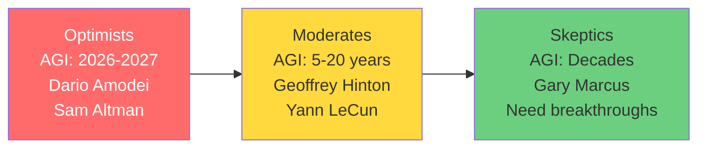

Anthropic's mechanistic interpretability research was named MIT Technology Review's Breakthrough Technology for 2026.

For the first time, researchers could look inside a production LLM and see what individual neurons were doing. They found neurons that activate for "Arabic script," "DNA sequences," and "Golden Gate Bridge."

We can finally peer into the black box.

At the same time, a debate is raging: Is AI innovation slowing down?

| Evidence | Slowdown Camp | Growth Camp |
|----------|--------------|-------------|
| **Model Capability** | GPT-4 to GPT-4.5 shows diminishing returns | Model efficiency improved 142x |
| **Benchmarks** | MMLU saturating at 90%+ | New benchmarks emerging constantly |
| **Data** | High-quality data exhaustion by 2026-2032 | Synthetic data scaling unlocked |
| **Investment** | Reduced ROI per dollar | $252.3B in 2024 (+44.5% YoY) |
| **Patents** | Fewer breakthrough inventions | 800% increase since 2017 |
| **Research** | Conference submissions plateauing | 21,575 NeurIPS submissions (record) |
| **Expert Predictions** | Decades to AGI (Gary Marcus) | AGI by 2026-2027 (Dario Amodei) |

**My take**: Innovation isn't slowing. It's **maturing**.

After going through the research, here's what I found: The debate is asking the wrong question.

Innovation isn't slowing. It's **maturing**.

Let me show you what's actually happening.

## The mechanistic interpretability breakthrough

For years, LLMs were black boxes. You could prompt them, get outputs, but had no idea *why* they chose those outputs.

[Anthropic's research team changed that](https://www.anthropic.com/research).

### What they did

Using a technique called "dictionary learning," they mapped millions of "features" (concepts) inside Claude Sonnet.

**The breakthrough finding**:
- Identified 70% of 15,000 latent directions mapped to single concepts
- Found neurons for: Arabic script, DNA motifs, Golden Gate Bridge, specific legal concepts
- Can now activate/deactivate specific concepts

**Why it matters**:
- **Safety**: Can identify and suppress dangerous capabilities
- **Alignment**: Can understand how models make decisions
- **Trust**: Can explain model behavior to users and regulators

**Example**: They found a "Golden Gate Bridge" neuron. When activated, Claude would steer conversations toward Golden Gate Bridge regardless of topic.

This is the first detailed look inside a production-grade LLM.

### The transparency implications

[The EU AI Act requires explainability](https://artificialintelligenceact.eu/) for high-risk AI systems.

Before mechanistic interpretability: "Our AI said no because... the model decided?"

After: "Our AI said no because these specific features activated, which correlate with these risk factors."

Not perfect explainability. But a huge leap forward.

**The challenge**: Scales exponentially with model size. Explaining a 100B parameter model requires analyzing billions of potential feature combinations.

## How explainability actually works today

While mechanistic interpretability is cutting-edge research, enterprises need explainability now.

Here's what actually works in production:

### SHAP (SHapley Additive exPlanations)

**What it does**: Uses game theory to determine feature importance

**Pros**:
- Theoretically sound (based on Shapley values)
- Works for any model (model-agnostic)
- Global + local explanations

**Cons**:
- Computationally expensive
- Slow for large models
- Requires many model evaluations

**Best for**: Critical decisions (loan approvals, medical diagnoses) where you need defensible explanations

**Example output**: "This loan was denied because: 30% credit score, 25% debt-to-income ratio, 20% employment history, 15% loan amount, 10% other factors"

### LIME (Local Interpretable Model-agnostic Explanations)

**What it does**: Approximates model behavior locally with simpler model

**Pros**:
- Fast (compared to SHAP)
- Intuitive explanations
- Model-agnostic

**Cons**:
- Local only (explains individual predictions, not global behavior)
- Can be unstable (different runs give different explanations)
- Less rigorous than SHAP

**Best for**: Rapid prototyping, debugging, quick explanations

**Example output**: "This transaction was flagged as fraud because: amount >$10K, new merchant, foreign country, time of day unusual"

### Constitutional AI (Anthropic's Approach)

**What it does**: Training methodology that bakes principles into model behavior

**How it works**:
- Define principles (constitution)
- Model evaluates own outputs against principles
- Self-improves through reinforcement learning

**Pros**:
- Alignment baked in at training time
- Reduces need for post-hoc filtering
- More robust than prompt engineering

**Cons**:
- Only works at training time (can't be retrofitted)
- Requires access to model training
- LLM-specific (doesn't apply to traditional ML)

**Best for**: Foundation model providers (Anthropic, OpenAI, Google)

**Example**: Claude refusing harmful requests isn't just a filter—it's trained to value helpfulness, harmlessness, and honesty.

### The Performance-Interpretability Trade-off Myth

For years, conventional wisdom said: "More interpretable models are less accurate."

You could have a simple decision tree (interpretable) or a complex neural network (accurate). Not both.

[2025 research challenges this](https://www.mdpi.com/2079-9292/14/1/178):

> "Recent findings show there is no strict performance-interpretability trade-off for tabular data—transparent models can achieve competitive accuracy (within 5%) while remaining fully interpretable."

**What this means**: For many use cases (especially tabular data like loan decisions, fraud detection), you can have accuracy *and* explainability.

The trade-off still exists for unstructured data (images, text, audio). But it's less severe than we thought.

## The innovation debate: slowdown or maturation?

Now let's tackle the big question: Is AI innovation slowing down?

### Evidence FOR slowdown

**1. Benchmark Saturation**

[MMLU](https://hai.stanford.edu/ai-index/2025-ai-index-report) (Massive Multitask Language Understanding):
- GPT-3 (2020): 70%
- GPT-4 (2023): 86%
- Claude 3.5 Sonnet (2024): 90%
- GPT-4.5 (2025): 91%

We're hitting ceiling effects. The remaining 9% may not be achievable with current approaches.

**HellaSwag** (commonsense reasoning): GPT-4 achieved 95.3%. Hard to improve meaningfully.

**The response**: Researchers are developing harder benchmarks (MMLU-Pro, GPQA). But this just kicks the can down the road.

**2. Diminishing Returns on Scale**

**GPT-3 to GPT-4**: Massive quality leap (10x parameters, huge improvement)

**GPT-4 to GPT-4.5**: Small quality improvement (similar parameters, marginal gains)

The "bigger = better" era may be ending.

**3. Data Exhaustion Predictions**

[Epoch AI research](https://epochai.org/) predicts:
- High-quality language data exhausted by 2026
- Image data exhausted by 2027
- Video data exhausted by 2032

Once you've trained on "all human knowledge," where do you get more training data?

**4. Training Cost Approaching $1B**

[Frontier model training costs](https://epochai.org/) are growing 3.5x per year:
- GPT-3 (2020): ~$5M
- GPT-4 (2023): ~$100M
- GPT-5/Claude Opus 4 (projected 2026): ~$1B+

At some point, even Google/Microsoft/Meta will hit budget constraints.

### Evidence AGAINST slowdown

**1. Investment Still Accelerating**

[Global AI investment 2024](https://hai.stanford.edu/ai-index/2025-ai-index-report): **$252.3 billion** (+44.5% YoY)

That's not slowing down. That's accelerating.

**U.S. private AI investment**: $109.1B (12x China's $9.3B)

**GenAI investment**: $33.9B globally (+18.7% from 2023)

If innovation were stalling, investment would decline. It's not.

**2. Patent Explosion**

[WIPO data shows](https://www.wipo.int/tech_trends/en/artificial_intelligence/):
- AI patent filings nearly doubled (2010-2024)
- GenAI patents: 733 (2014) → 14,000+ (2023)
- **800% increase since Transformer architecture (2017)**

Patents lag innovation by 1-2 years. This suggests strong innovation through 2024+.

**3. Model Efficiency Breakthrough**

[The real innovation isn't bigger models—it's efficiency](https://epochai.org/):
- **142x parameter reduction** for same performance (2022-2024)
- **280x inference cost reduction** (Nov 2022 - Oct 2024)
- **Training efficiency**: 3x cheaper year-over-year

**Example**: Llama 3.3 70B matches GPT-4 performance. It's not about scale anymore.

**4. Algorithmic Efficiency Gains**

[Epoch AI estimates](https://epochai.org/):
- **35% of performance gains** from algorithmic efficiency
- **65% from scale**

Better algorithms matter as much as bigger models.

**Breakthroughs**:
- Flash Attention (2x faster inference)
- Speculative decoding (3x faster generation)
- LoRA/QLoRA (10-100x cheaper fine-tuning)

**5. Scientific AI Breakthroughs**

AI is accelerating discovery in other fields:
- **AlphaFold 3** (protein structure prediction)
- **ASI-Arch** (nanomaterial design)
- **Co-Scientist** (autonomous lab research)

These show AI capability expansion, not stagnation.

### The Consensus: Maturation, Not Stagnation

After reviewing all the research, here's my take:

**AI innovation isn't slowing. It's shifting**.

**2017-2023**: Scale era ("bigger models = better")
- Focus on model size
- Measured by parameters
- Training cost exploding

**2024-2027**: Efficiency era ("smarter models = better")
- Focus on algorithmic efficiency
- Measured by performance per dollar
- Inference cost matters more than training

It's not slowdown. It's **maturation**.

Similar to semiconductors: Moore's Law slowed, but we got better architectures (GPUs, TPUs, specialized AI chips).

## Expert predictions: AGI in 2026 or decades away?

The range of expert predictions is wild.

### The Optimists (AGI 2026-2027)

**Dario Amodei (Anthropic CEO)**:
[Predicts AGI by 2026-2027](https://www.anthropic.com/research), calls it "a country of geniuses in a datacenter."

> "If you extrapolate the curves we've been seeing, it's very clear that we're going to get something that's fundamentally very different in the next few years."

**Demis Hassabis (Google DeepMind)**:
[Predicts transformative AI agents in 12 months](https://deepmind.google/), human-level AI by 2030-2035.

> "I think we're probably at the second or third inning of the game... There's a long way to go before we get artificial general intelligence."

**Sam Altman (OpenAI)**:
[Predicts AGI within 5 years](https://openai.com/research/), but says societal change will be "surprisingly little."

> "I think in 2025 we may see the first AI agents 'join the workforce' and materially change the output of companies."

### The Moderates (5-20 Years)

**Geoffrey Hinton**:
Revised prediction from 30-50 years to 5-20 years.

> "I think it's quite conceivable that within the next five years, AI will be smarter than people. And I think many jobs will be replaced in 2026."

**Yann LeCun (Meta)**:
Skeptical of current LLM approaches, says we need [better architectures first](https://ai.meta.com/blog/).

Recently started a $5B world model research lab at Meta. Believes spatial/video understanding is key.

**Nathan Benaich (State of AI Report)**:
[Predicts incremental progress](https://www.stateof.ai/), not sudden breakthroughs. OpenAI leads, but pack is closing fast.

### The Skeptics (Decades Away)

**Gary Marcus**:
[Says "no AGI by 2026-2027"](https://garymarcus.substack.com/) and current approaches are insufficient.

> "We need fundamental breakthroughs in neurosymbolic AI, common-sense reasoning, and causality understanding."

Notably, 16 of his 17 predictions for 2025 proved correct. The skeptics have a better prediction track record.

### The Pattern

**Optimists**: Building frontier models (direct stake in hype)

**Moderates**: Academic researchers (less incentive to hype)

**Skeptics**: Outside major labs (can be objective)

**My read**: Truth is probably in the middle. Transformative AI by 2030, but not full AGI. Dramatic workplace changes by 2026-2027, but not job apocalypse.

## What the 2025 data actually shows

Let's look at what happened in 2025:

### Conference Submission Growth

**ICML** (International Conference on Machine Learning):
- 2023: 6,538 submissions
- 2024: 9,653 submissions
- **48% year-over-year growth**

**NeurIPS** (Neural Information Processing Systems):
- 2025: 21,575 submissions (new record)

If innovation were slowing, submissions would decline. They're accelerating.

**But**: Quality concerns emerging. Some papers are AI-generated, undermining peer review.

### AI Incidents Rising

[AI Incidents Database](https://hai.stanford.edu/ai-index/2025-ai-index-report):
- 2024: 233 AI-related incidents (record high)
- **56.4% increase over 2023**

More incidents suggests:
- More AI deployment (not slowdown)
- More capability (more powerful = more ways to fail)
- More scrutiny (we're looking for problems)

### Open Source Closing the Gap

**Llama 3.3 70B** matches GPT-4 on many benchmarks.

**DeepSeek-R1** matches o1 performance at fraction of cost.

**Mistral Large 3**: 256K context, Apache 2.0 license.

The gap between open and closed models is narrowing. Competitive moat is shifting from model quality to ecosystem and data.

### Model Download Shift

[China became dominant in model downloads](https://hai.stanford.edu/ai-index/2025-ai-index-report) (summer 2025).

Previously USA-dominant. Geographic shift suggests:
- Global AI capability spreading
- China accelerating (despite chip restrictions)
- Open source enabling global access

## The transparency-innovation tension

Here's the uncomfortable reality:

**More transparency** (explainability, mechanistic interpretability) **may slow innovation**.

Why?

**1. Interpretability is computationally expensive**

SHAP analysis can take 10-100x longer than inference. For real-time systems, that's prohibitive.

**2. Transparency reveals vulnerabilities**

If you know which neurons activate for "harmful content," you can engineer prompts to bypass filters.

**3. Regulatory compliance adds friction**

EU AI Act requires explainability for high-risk systems. That means more testing, documentation, auditing.

**4. Open research enables adversaries**

Publishing mechanistic interpretability research helps both defenders and attackers.

### The Balance

The industry is settling on:
- **High-risk systems**: Full transparency (required by regulation)
- **Consumer AI**: Basic transparency (chatbot disclosures, watermarks)
- **Research models**: Detailed documentation (model cards, system cards)
- **Production models**: Selective transparency (balance innovation vs. safety)

**OpenAI's approach**: Detailed GPT-4 System Card (capabilities, limitations, testing), but not full model weights.

**Anthropic's approach**: Constitutional AI (built-in alignment) + selective interpretability research.

**Meta's approach**: Open source everything (Llama 3), let community handle safety.

No consensus yet. The debate is ongoing.

## The 2026-2027 outlook

Based on the data and expert consensus, here's what I expect:

### 1. Benchmark Saturation Drives New Metrics

MMLU, HellaSwag, etc. hitting ceilings.

**New focus**: Real-world task completion, agentic capabilities, multimodal reasoning.

Benchmarks will shift from "can it answer questions" to "can it complete workflows."

### 2. Efficiency Innovation Dominates

**Not**: "Can we build a 10T parameter model?"

**Instead**: "Can we match GPT-4 with 10B parameters?"

**Key techniques**:
- Mixture of experts (MoE)
- Quantization (4-bit, 2-bit models)
- Sparse activation
- Distillation

### 3. Agentic AI Goes Mainstream

[23% of organizations already scaling AI agents](https://www.mckinsey.com/capabilities/quantumblack/our-insights/the-state-of-ai).

**2027 prediction**: 60%+ of enterprises using AI agents for workflows.

**Examples**: Customer service agents, coding assistants, research agents, data analysis agents.

### 4. Regulation Forces Transparency

EU AI Act enforcement will drive adoption of explainability techniques.

Companies that built governance early will have advantage.

### 5. Open Models Reach Parity

By end of 2027, open models will match closed models on most benchmarks.

Competitive advantage shifts to:
- Proprietary data
- Workflow integration
- Ecosystem lock-in

## The bottom line

Is AI innovation slowing down?

**No**. But it's changing.

**The scale era (2017-2023)**: Bigger models = better
- Measured by parameters
- Training cost exploding
- Closed model dominance

**The efficiency era (2024-2027)**: Smarter models = better
- Measured by performance per dollar
- Inference optimization matters
- Open models competitive

**The evidence**:
- Investment: $252B in 2024 (+44.5%)
- Patents: 800% increase since 2017
- Model efficiency: 142x improvement
- Conference submissions: +48% YoY

**But also**:
- Benchmarks saturating
- Diminishing returns on scale
- Training costs approaching $1B

**The pattern**: Maturation, not stagnation. Like semiconductors post-Moore's Law—still improving, just differently.

**Expert predictions**: Range from AGI by 2026 (optimists) to decades away (skeptics). Reality probably middle: transformative by 2030, but not full AGI.

**Transparency**: Mechanistic interpretability breakthrough opens black boxes. But tension between transparency and innovation remains.

The question isn't "is innovation slowing?" It's "**what kind of innovation matters now**?"

And the answer: Efficiency, reliability, transparency, and workflow integration.

The technology gold rush is over. The operational excellence era is beginning.

---

## Series Complete

This concludes the 7-part series on AI-driven business transformation. Here's what we covered:

1. **Why 94% Struggle**: Organizational capability > Technology
2. **GenAI Paradox**: 95% fail at 6 months, 74% succeed at 18 months (J-curve)
3. **AI Governance**: EU AI Act compliance is mandatory (€35M penalties)
4. **Infrastructure**: From MLOps to LLMOps (API calls > Training)
5. **Chief AI Officer**: 40% of Fortune 500 by 2026 (36% ROI advantage)
6. **Scaling AI**: Culture > Technology (92% cite culture as #1 barrier)
7. **Transparency & Innovation**: Maturation, not stagnation (efficiency era)

**The common thread**: Success isn't about technology. It's about organizational capability.

The companies winning at AI:
- Redesign workflows (3x multiplier)
- Invest in change management (not just technology)
- Set realistic timelines (12-18 months)
- Build governance early (compliance + ROI)
- Structure AI leadership (CAIO, hub-and-spoke)

The losers:
- Bolt AI onto existing processes
- Expect 6-month ROI
- Measure activities (pilots launched) not outcomes (EBIT impact)
- Ignore organizational barriers

You have the research. You have the frameworks. You have the case studies.

The question is: Will you join the 6% capturing real value?

Or stay with the 94% still struggling?

---

## Series Navigation

1. [Part 1: Why 94% of Companies Struggle with AI](./state-of-ai-2025-why-94-percent-fail)
2. [Part 2: The GenAI Paradox](./genai-paradox-37b-spent-95-percent-fail)
3. [Part 3: AI Governance is No Longer Optional](./ai-governance-eu-ai-act-compliance-guide)
4. [Part 4: From MLOps to LLMOps](./mlops-to-llmops-modern-ai-infrastructure)
5. [Part 5: The Rise of the Chief AI Officer](./chief-ai-officer-rise-organizational-models)
6. [Part 6: Scaling AI - Why Technology Isn't the Bottleneck](./scaling-ai-organizational-barriers-not-technology)
7. **Part 7: AI Transparency and the Innovation Debate** ← You are here (SERIES COMPLETE)
