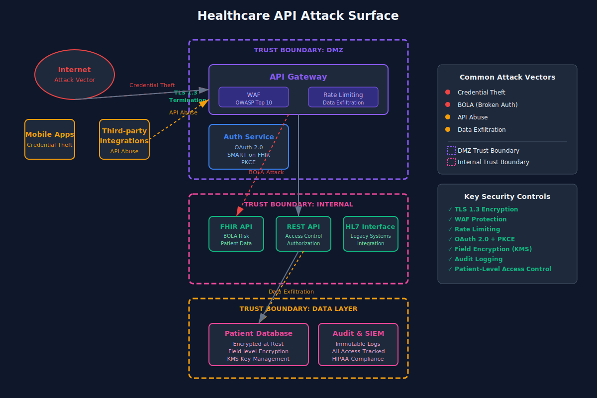
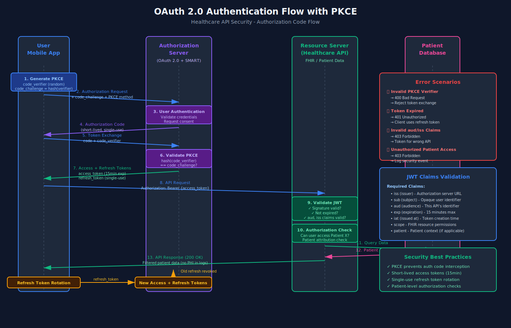
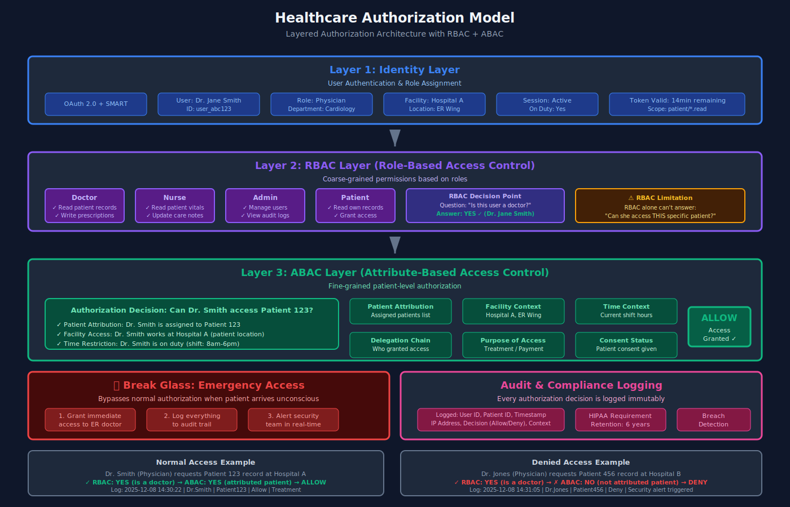
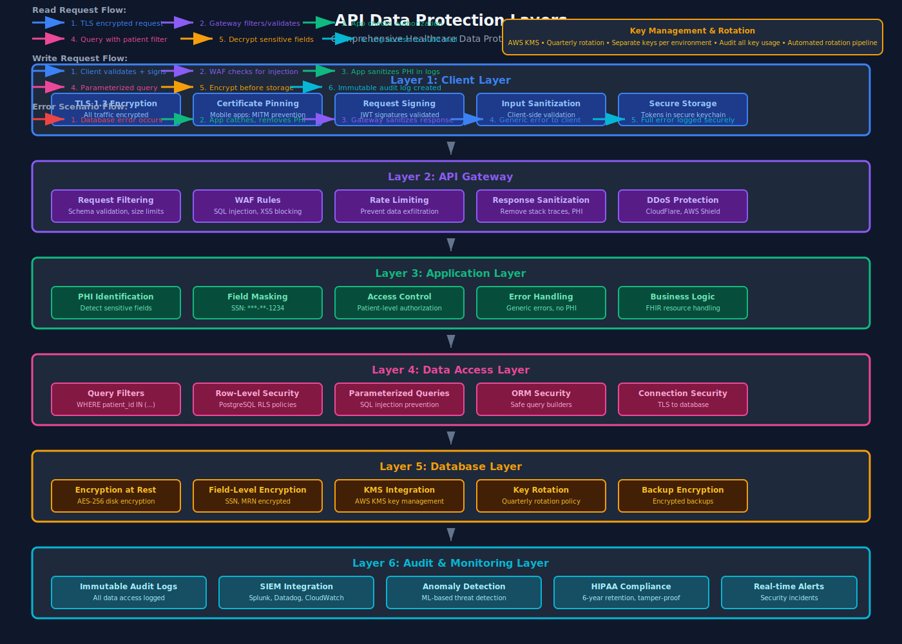

# API Security for Healthcare: Your Auth Works, But You're Still Vulnerable

Your API has auth. Great. It's probably still vulnerable. Let me show you what attackers actually target.

I've spent the last few years building healthcare APIs that serve 100+ hospitals. Every system starts with "we have OAuth" and ends with "wait, how did they access that patient record?" Basic authentication is table stakes. The real work starts after you verify identity.

## Healthcare APIs: Why Attackers Care

Healthcare data sells for 10-50x more than credit card data on the dark web. Not because I have statistics—because attackers actually spend time on these systems.

Your API serves patient records, lab results, imaging data, prescriptions. Each endpoint is a potential HIPAA violation worth $50,000+ per record. Attackers know this. They're not brute-forcing passwords anymore.

They're exploiting broken object-level authorization. They're abusing your rate limits. They're extracting PHI from error messages you thought were helpful.

## Authentication Done Right

OAuth 2.0 is your starting point, not your finish line. For healthcare, you need authorization code flow with PKCE. No implicit flow. No password grants.

Here's what I see go wrong with JWTs constantly:
- Short expiration without refresh tokens
- Refresh tokens that never expire
- Token validation that checks signatures but not claims
- `sub` claims that contain user IDs instead of opaque identifiers
- No token revocation strategy when employees leave

Your access token should expire in 15 minutes max. Refresh tokens should be single-use and rotated on every refresh. When someone logs out, you need to blacklist their tokens—yes, it means state, yes, it's worth it.

And for the love of all that is secure: validate the `aud` claim. I've seen APIs accept tokens from completely different applications because they only checked the signature.

## Authorization That Actually Works

Authentication tells you who they are. Authorization tells you what they can access. This is where healthcare APIs die.

RBAC (Role-Based Access Control) is fine for "is this user a doctor?" ABAC (Attribute-Based Access Control) is what you need for "can this doctor access this specific patient?"

Your authorization layer needs to understand:
- Patient attribution (which patients is this provider authorized for?)
- Facility access (which hospital locations can they see?)
- Time-based restrictions (are they currently on duty?)
- Delegation chains (who granted this access?)

The "break glass" pattern is critical for emergencies. When a patient arrives unconscious, the ER doctor needs immediate access. Log everything. Alert security. Require justification within 24 hours. But don't block care.

Here's what this looks like in practice: Every API request should validate not just "are you a doctor?" but "are you this patient's doctor, right now, at this facility?"

## API Gateway: Your First Line of Defense

AWS API Gateway, Kong, or Apigee—doesn't matter which. You need something between the internet and your application.

Rate limiting isn't about preventing DDoS. It's about preventing data exfiltration. If someone steals credentials, you don't want them downloading 100,000 patient records in five minutes. Set per-user, per-endpoint limits. 10 requests per second to search patients? Reasonable. 100? Suspicious.

Request validation should happen at the gateway. Schema validation against OpenAPI specs. Size limits on payloads. Header validation. Don't let malformed requests reach your application code.

WAF rules should block OWASP Top 10 patterns. SQL injection attempts. Script tags in inputs. Path traversal. These aren't theoretical—I see blocked attempts every single day in our logs.

## Data Protection: Beyond TLS

TLS 1.3 is mandatory. But encryption in transit is just the start.

Certificate pinning for mobile apps prevents man-in-the-middle attacks. Yes, it's a pain to update. Do it anyway. Healthcare apps can't trust arbitrary certificate authorities.

Response filtering is critical. Never include PHI in error messages. I've seen APIs return full patient objects in 500 errors because an engineer thought it would help with debugging. It helped attackers instead.

Field-level encryption for sensitive data means even if someone dumps your database, they can't read SSNs or medical record numbers. Encrypt with AWS KMS or similar. Rotate keys quarterly.

Audit logging for every single request. Not just write operations—reads too. Every patient record access needs a log entry with user ID, timestamp, IP, and purpose of access. HIPAA requires this. More importantly, it's how you catch breaches early.

## FHIR API Security Specifics

If you're building FHIR APIs, you need SMART on FHIR. It's OAuth 2.0 with healthcare-specific scopes.

Scopes should be granular. Not `patient/*.*` (all patient data). Use `patient/Observation.read`, `patient/MedicationRequest.read`. If an app only needs vitals, don't give it prescription access.

Backend service authentication uses client credentials flow with signed JWTs. Your server's private key signs the JWT. The authorization server validates it. No shared secrets getting leaked in environment variables.

Common mistakes I see:
- Accepting wildcard scopes in production
- Not validating scope syntax
- Allowing scope escalation through refresh tokens
- Implementing FHIR search without access control filters

Every FHIR search needs to filter by authorized patients. Adding `?patient=123` to the query isn't enough—validate at the database level that the requesting user can access patient 123.

## Testing Your Security

Start with the OWASP API Security Top 10. Every single one applies to healthcare:
- Broken Object Level Authorization (BOLA)
- Broken Authentication
- Broken Object Property Level Authorization
- Unrestricted Resource Consumption
- Broken Function Level Authorization
- Unrestricted Access to Sensitive Business Flows
- Server Side Request Forgery (SSRF)
- Security Misconfiguration
- Improper Inventory Management
- Unsafe Consumption of APIs

For scanning, use:
- OWASP ZAP for automated vulnerability scanning
- Burp Suite for manual testing
- Nuclei for CVE detection
- Semgrep for SAST in your CI pipeline

Penetration testing should happen annually at minimum. For SOC2 or HITRUST, it's required. Find a firm that specializes in healthcare. They need to understand FHIR, HL7, and healthcare workflows.

Test your incident response too. Someone will eventually get breached. You need runbooks for token revocation, user notification, and breach reporting.

## Your Security Checklist

Before you deploy to production:

**Authentication:**
- [ ] OAuth 2.0 with authorization code + PKCE flow
- [ ] Access tokens expire in 15 minutes or less
- [ ] Refresh tokens are single-use and rotated
- [ ] Token revocation is implemented and tested
- [ ] All JWT claims are validated, including `aud`, `iss`, `exp`

**Authorization:**
- [ ] Patient-level access control on every endpoint
- [ ] Facility-based restrictions enforced
- [ ] Break glass emergency access pattern implemented
- [ ] Authorization decisions logged with full context

**API Gateway:**
- [ ] Rate limiting per user, per endpoint
- [ ] Request schema validation against OpenAPI
- [ ] WAF rules for OWASP Top 10
- [ ] DDoS protection configured

**Data Protection:**
- [ ] TLS 1.3 enforced
- [ ] Certificate pinning in mobile apps
- [ ] No PHI in error messages or logs
- [ ] Field-level encryption for sensitive data
- [ ] Full audit logs for all data access

**Testing:**
- [ ] OWASP API Top 10 tested and mitigated
- [ ] Automated security scanning in CI/CD
- [ ] Annual penetration test completed
- [ ] Incident response runbooks documented

When to get a professional audit? If you're handling real patient data, the answer is now. HIPAA compliance isn't optional. SOC2 Type 2 opens doors with enterprise customers. HITRUST certification is the gold standard.

But honestly? Start with the basics. Fix your authorization bugs. Log everything. Test your security. You can't secure what you don't understand, and you can't improve what you don't measure.

Your authentication works. Now make sure your authorization does too.
