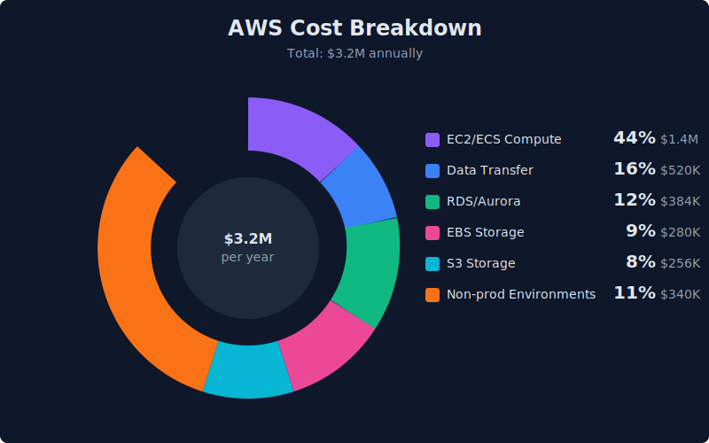
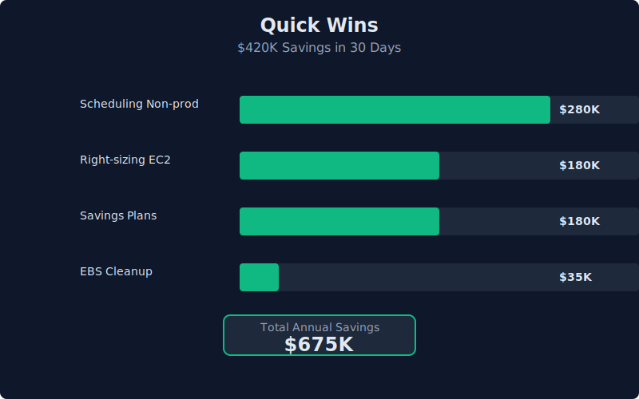
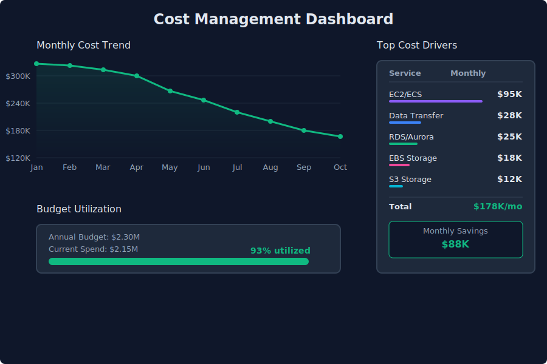

I'll never forget the Slack message: "Aaron, can you look at this month's AWS bill? Something seems off."

$3.2 million. Annual run rate. For a healthcare platform serving about 100 hospitals. My first thought was "that's... actually not insane for our scale?" But my CTO's face said otherwise. We had budget for $2M, maybe $2.3M if we stretched it.

That "something seems off" moment turned into a six-month cost optimization project that saved us $1.05M annually. Here's how I did it, and what I wish I'd known from day one.

## The Audit: Following the Money

I started where everyone starts—AWS Cost Explorer. Sorted by service, then by resource tags (spoiler: half our resources had zero tags, which was problem #1).

The biggest offenders? Honestly embarrassing:

- **Compute (EC2/ECS)**: $1.4M annually. We had 47 m5.2xlarge instances averaging 15% CPU utilization. *Fifteen percent.*
- **Data Transfer**: $520K annually. Shuffling data between regions for "redundancy" is expensive. Who knew? (Everyone. Everyone knew.)
- **EBS Volumes**: $280K annually. Including 140 volumes not attached to anything. Just... floating there. Costing money.
- **Dev/staging environments**: Running 24/7, costing $340K annually, being used maybe 8 hours a day.

I built a spreadsheet. Color-coded it. Sent it to the team with the subject line "We're literally burning money." Very dramatic. It worked.

## Quick Wins (First 30 Days)

The low-hanging fruit saved us $420K annually:

**Right-sizing everything.** Those m5.2xlarge instances? Most became m5.large. Some became t3.large. I used AWS Compute Optimizer but verified each one manually—you can't just trust automation in healthcare.

**Savings Plans over Reserved Instances.** Went with Compute Savings Plans for base load (1-year, partial upfront). More flexibility than RIs. Saved $180K annually on compute alone.

**Scheduling non-prod environments.** Dev and staging now shut down at 7 PM and start at 7 AM weekdays. Weekends? Completely off unless someone manually starts them. Instance Scheduler made this trivial. $280K saved.

**The great EBS cleanup.** Wrote a Lambda to identify unattached volumes older than 7 days and send Slack notifications. Deleted 140 volumes in week one. Now we never let them pile up.

## Architecture Changes (The Real Work)

Quick wins were great. Architecture changes found the other $630K.

**Moved batch processing to containers.** EC2 instances running 24/7 for batch HL7 processing? Moved to ECS Fargate with scheduled tasks. Instances only exist when there's work. Month-long migration, $220K annual savings.

**Database right-sizing.** Our staging database was a db.r5.4xlarge. Why? Someone clicked it in 2020. Staging is now db.t4g.large. Production stayed Aurora MySQL but we tuned based on actual CloudWatch metrics. $140K saved.

**S3 Intelligent-Tiering.** Years of medical images in S3 Standard. Moved to Intelligent-Tiering with Glacier transition for 5+ year old data. Break-even in 8 months. $95K annual savings.

**CloudFront for static assets.** Medical dashboard loaded assets from S3 directly. Now cached at edge. Data transfer dropped 35%. Plus it's faster. Win-win. $75K saved.

## Healthcare-Specific Challenges

Here's where it gets tricky. Healthcare isn't like e-commerce.

**HIPAA means audit logging forever.** CloudTrail, VPC Flow Logs, application logs—all retained. Can't just delete after 90 days. Moved logs older than 1 year to Glacier Deep Archive, but we still keep them.

**Encryption is non-negotiable.** Everything encrypted at rest and in transit. KMS costs add up at scale. Consolidated keys where possible, but there's a floor.

**Redundancy isn't optional.** Multi-AZ everything. Daily backups with 30-day retention minimums. Real-time replication. When a nurse pulls up patient records at 3 AM, downtime isn't acceptable.

Know your constraints before optimizing. Some costs are the cost of doing business.

## Setting Up Ongoing Governance

One-time savings are great. Making them permanent requires systems.

**AWS Budgets with alerts.** Budgets per environment and team. Slack alerts at 80%, 100%, 120%. First month: 23 alerts. Now: maybe one per quarter.

**Mandatory tagging.** Every resource needs: Environment, Team, Application, CostCenter. Lambda sends angry Slack messages for untagged resources. I'm not popular, but cost allocation is pristine.

**Monthly cost reviews.** 30 minutes, first Monday of every month. Each team lead reviews their costs. Boring. Works.

**Cost anomaly detection.** AWS built-in service, configured for anomalies over $500. Caught a runaway Lambda loop that would've cost $3K before it became a problem.

## What I'd Do Differently

Start with governance. Tagging, budgets, and alerts should be day one, not month three.

Negotiate with AWS earlier. Once we showed optimization work and growth projections, we got better pricing. Should've started that conversation sooner.

Involve engineering teams from the beginning. My initial approach was "I'll find savings and tell everyone what to change." Bad idea. People got defensive. Better approach: share data, ask for ideas, let them own changes.

## The Takeaways

**Start with visibility.** Can't optimize what you can't measure. Tagging and cost allocation first.

**Quick wins build momentum.** Right-sizing and scheduling bought time for harder architectural changes.

**Automate governance.** Manual cost reviews don't scale.

**Healthcare has different rules.** What works for startups doesn't always work with patient data and compliance.

We went from $3.2M to $2.15M in annual AWS costs. Same platform. Same performance. Actually better in some cases. Just way more intentional about spending.

Six months later, still at $2.1M. The savings stuck. That's how you know you built something sustainable.

---

*Aaron Dsilva manages AWS infrastructure for healthcare systems serving 100+ hospitals. He's saved clients over $1M through architecture optimization while maintaining HIPAA compliance.*
