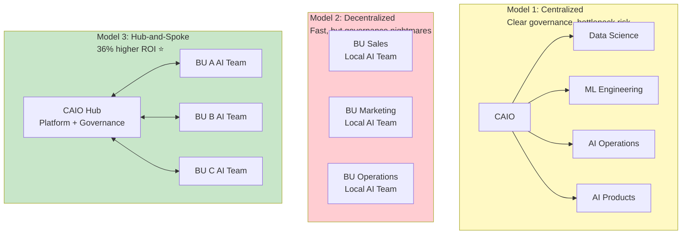

[26% of organizations now have a Chief AI Officer](https://www.cio.com/article/3845414/caios-role-reclaims-its-position-from-that-of-cio.html)—up from 11% just two years ago.

By 2026, over [40% of Fortune 500 companies](https://www.slaytonsearch.com/2025/10/the-rise-of-the-chief-ai-officer/) will have a CAIO.

And here's the kicker: [organizations with CAIOs see 10% higher ROI](https://www.pwc.com/us/en/executive-leadership-hub/caio.html) on AI investments.

But most companies don't know what a CAIO actually does. Is it just a CTO with a different title? Is it a VP of Data Science rebranded? Or is it something fundamentally new?

After looking at how companies like Microsoft, Google, Netflix, and JPMorgan structure their AI organizations, I found something interesting: **the org structure matters more than the title**.

Companies using centralized or "hub-and-spoke" AI models see [36% higher ROI](https://www.pwc.com/us/en/executive-leadership-hub/caio.html) than those with decentralized models.

Let me break down what's working, what's not, and how to structure AI leadership in your organization.

## Why the CAIO role exploded

From 11% (2023) to 26% (2025) to 40% projected (2026)—that's a 264% growth trajectory in 3 years.

What changed?

### 1. AI moved from experiments to strategic bets

In 2020, AI was "something IT is playing with."

In 2025, AI is a **board-level priority**. CEOs are asking "what's our AI strategy?" in every earnings call.

You can't manage a strategic priority without strategic-level leadership. Hence, CAIO.

### 2. GenAI made AI accessible (and risky)

Before ChatGPT, only data scientists used AI.

After ChatGPT, **everyone** uses AI. Employees are putting company data into public LLMs. Shadow AI is everywhere.

Someone needs to own: governance, risk, compliance, strategy. That's the CAIO.

### 3. Regulatory pressure (EU AI Act, etc.)

With the [EU AI Act in full effect](https://artificialintelligenceact.eu/) and penalties up to €35M, companies need someone accountable.

CFOs and General Counsels demanded: "Who's responsible for AI compliance?"

Answer: We need a CAIO.

### 4. U.S. Executive Order 14110 (federal mandate)

In March 2024, [the U.S. government mandated](https://boarddeveloper.com/the-rise-of-the-chief-ai-officer/) that all federal agencies appoint CAIOs within 60 days.

(The order was revoked in January 2025, but the organizational learning remains: CAIOs work.)

This legitimized the role. If the federal government needs CAIOs, private companies followed.

## What does a CAIO actually do?

After analyzing job descriptions and talking to CAIOs, here's what the role actually involves:

### Core Responsibilities

**1. AI Strategy**
- Define AI vision and roadmap
- Align AI initiatives with business objectives
- Identify high-impact use cases
- Build vs buy decisions

**2. Governance & Risk Management**
- AI ethics and responsible AI frameworks
- Regulatory compliance (EU AI Act, etc.)
- Risk assessment and mitigation
- Audit and transparency mechanisms

**3. Implementation & Execution**
- Oversee AI projects from pilot to production
- Ensure cross-functional collaboration
- Drive workflow redesign (not just technology deployment)
- Scale successful use cases

**4. Team Leadership**
- Build and manage AI teams (data scientists, ML engineers, AI product managers)
- Talent acquisition and development
- Foster AI literacy across organization
- Partner with business unit leaders

**5. Innovation & Research**
- Track AI technology trends
- Evaluate new capabilities (agents, multimodal, etc.)
- Pilot emerging technologies
- Strategic partnerships with AI vendors

### The Budget Authority

[61% of CAIOs control their organization's AI budget](https://www.jeffwinterinsights.com/insights/the-chief-ai-officer-role), which ranges by company size:

| Company Size | Annual AI Budget | CAIO Budget Control |
|--------------|------------------|---------------------|
| **Small** (<1,000 employees) | $5M - $20M | 61% have control |
| **Mid-size** (1,000-10,000) | $20M - $100M | 61% have control |
| **Large Enterprise** (10,000+) | $100M - $500M+ | 61% have control |
| **Tech Giants** (Microsoft, Google) | $1B - $10B+ | Full control |

**Microsoft's AI budget**: Estimated $10B+ annually

Control over budget = real authority = ability to drive change.

### Who CAIOs Report To

This matters more than you think. [Reporting structure determines success](https://www.cio.com/article/3845414/caios-role-reclaims-its-position-from-that-of-cio.html).

| Reports To | % of CAIOs | Signal |
|------------|-----------|---------|
| **CEO** | 40% | Strategic priority |
| **CIO** | 24% | IT/operational focus |
| **CTO** | 15% | Technical/platform focus |
| **CDO** | 10% | Data-driven approach |
| **Other C-suite** | 11% | Varies by company |

[Over 57% report to CEO or Board](https://www.pwc.com/us/en/executive-leadership-hub/caio.html) at Fortune 500 companies.

**The pattern**: When AI is strategic (revenue-driving, transformative), CAIO reports to CEO. When AI is operational (cost-saving, efficiency), CAIO reports to CIO/CTO.

## The three organizational models (and which one wins)

After studying companies from startups to Fortune 500, three models emerge:

### Model 1: Centralized AI

**Structure**: All AI teams roll up to CAIO

```
CEO
 └── CAIO
      ├── Data Science Team
      ├── ML Engineering Team
      ├── AI Product Team
      └── AI Operations Team
```

**Pros**:
- Clear governance
- Efficient resource allocation
- Consistent standards and tooling
- Deep technical expertise

**Cons**:
- Bottleneck risk (all AI goes through one team)
- Slower deployment to business units
- Can become ivory tower (disconnected from business needs)

**Who uses this**: Early-stage AI adoption, highly regulated industries

**Example**: Financial services companies (need tight control for compliance)

### Model 2: Decentralized AI

**Structure**: Each business unit has its own AI team

```
CEO
 ├── BU A (Sales)
 │    └── Local AI Team
 ├── BU B (Marketing)
 │    └── Local AI Team
 └── BU C (Operations)
      └── Local AI Team
```

**Pros**:
- Fast deployment (no central bottleneck)
- AI tailored to specific business needs
- Business units own their AI outcomes
- High autonomy

**Cons**:
- Duplication of effort
- Inconsistent tooling and standards
- Governance nightmares
- Expensive (need AI talent in every unit)

**Who uses this**: Tech giants with mature business units

**Example**: Netflix (each product team has ML capabilities)

### Model 3: Hub-and-Spoke (The Winner)

**Structure**: Central AI platform + governance, local AI execution

```
CEO
 └── CAIO (Central Hub)
      ├── AI Platform Team
      ├── Governance & Standards
      └── Centers of Excellence
           ↕ (bidirectional)
      BU A AI Team ← → BU B AI Team ← → BU C AI Team
```

**How it works**:
- **Hub (CAIO)** provides: Platform, governance, standards, training, shared services
- **Spokes (BU teams)** execute: Use cases, deployment, business-specific AI

**Pros**:
- Speed + Control (best of both worlds)
- Scale without chaos
- Local ownership with central governance
- Efficient resource use

**Cons**:
- More complex to coordinate
- Requires mature org design
- Need strong CAIO leadership

**Who uses this**: Most Fortune 500 adopting AI at scale

**Example**: Capital One, JPMorgan, Walmart

### The ROI Data

[IBM's research shows](https://www.pwc.com/us/en/executive-leadership-hub/caio.html):

**Hub-and-spoke delivers 36% higher ROI** than decentralized models.

Why? You get:
- Consistency (central governance)
- Speed (local execution)
- Leverage (shared platform amortizes costs)



## Real company examples: what actually works

Let me show you how this plays out in practice.

### Microsoft: Product-Led with Strategic Research

**Structure**: Hybrid with strong product focus

**Key elements**:
- AI integrated into every product (Office 365, Azure, GitHub)
- Microsoft Research as innovation engine
- Product groups have AI autonomy
- Central Responsible AI team for governance

**CAIO equivalent**: Distributed across product leaders + Corporate VP for AI Platform

**Budget**: $10B+ annually on AI

**What works**: AI is in DNA of products, not bolted on. Each product team owns AI roadmap.

**Challenge**: Coordinating across silos (sometimes duplicate efforts)

### Google DeepMind: Research-Led Organization

**Structure**: Centralized research with product partnerships

**Key elements**:
- 5,600+ employees focused on AI research
- Partnerships with Google products for deployment
- Strong academic culture
- Frontier research (AGI-focused)

**Leadership**: Demis Hassabis (CEO)

**What works**: Best-in-class AI research, attracts top talent

**Challenge**: Research-to-product gap (not all research ships)

### Netflix: Decentralized with Strong Platform

**Structure**: Decentralized AI, centralized data platform

**Key elements**:
- Each product team has ML engineers
- Central data platform (Metaflow) used by all teams
- No central AI team, but shared infrastructure
- Strong experimentation culture

**What works**: Fast iteration, business-specific AI

**Challenge**: High dependency on platform team, need ML talent everywhere

### JPMorgan Chase: Hub-and-Spoke at Scale

**Structure**: Firmwide AI + Data organization (hub-and-spoke)

**Key elements**:
- Teresa Heitsenrether as Chief Data & Analytics Officer
- $18B tech budget (portion for AI)
- Central AI platform (COIN, DocuSign AI, etc.)
- Business units own use case execution

**What works**: Governance + speed, compliance + innovation

**Scale**: Serves 60M households, needs tight controls

### Walmart: Centralized Platform Model

**Structure**: Centralized AI platform team

**Key elements**:
- Element platform (GenAI for 2.1M associates)
- 200+ AI agents for store managers
- Central team builds, BUs adopt
- Strong workflow integration

**What works**: Consistent experience, fast scaling

**Challenge**: Ensuring adoption across diverse use cases

### Capital One: Center of Excellence

**Structure**: Hub-and-spoke with academic partnerships

**Key elements**:
- Central AI CoE (Center of Excellence)
- Partnership with MIT for research
- Required AI training for all product managers
- Responsible AI framework embedded

**What works**: Balance of rigor and speed

**Innovation**: Open-sourced tools (benefits ecosystem)

## The team structure: who you actually need

What roles does a CAIO need to hire?

Based on real org charts, here's the typical structure:

### Growth-Stage Team (5-8 people)

**Core team**:
1. **AI Product Manager** (1): Define use cases, prioritize, roadmap
2. **ML Engineers** (2-3): Build models, deploy systems
3. **Data Engineers** (1-2): Pipelines, data quality, infrastructure
4. **AI Architect** (1): Platform design, tech strategy
5. **MLOps Engineer** (1): Deployment, monitoring, operations

**Budget**: $1M-2M/year (fully loaded)

### Enterprise Scale Team (15-50+ people)

Add:
- **Data Scientists** (5-10): Research, experimentation
- **Prompt Engineers** (2-4): GenAI-specific optimization
- **AI Product Managers** (3-5): Multiple product lines
- **AI Governance Lead** (1-2): Compliance, ethics, risk
- **AI Business Analysts** (2-4): ROI measurement, business cases

**Budget**: $5M-15M/year (fully loaded)

### Fortune 500 Scale Team (hundreds to thousands)

Examples:
- **Microsoft**: Estimated 5,000+ AI-focused employees
- **Google DeepMind**: 5,600+ employees
- **Meta**: 4,000+ AI researchers and engineers

At this scale, you have specialized teams for:
- Research
- Platform engineering
- Product AI
- Responsible AI
- AI operations
- Field AI (customer-facing)

## Compensation: what CAIOs actually make

[CAIO salaries range](https://www.searchsvc.com/2025/12/12/what-is-a-chief-ai-officer/):

**Startups/Scaleups**: $250K-400K total comp

**Mid-market companies**: $350K-550K total comp

**Fortune 500**: $500K-$1M+ total comp
- Base: $300K-600K
- Bonus: $200K-400K
- Equity: $500K-2M (vesting over 4 years)

**Example**: Netflix engineering VP (CAIO-equivalent): $800K+ total comp

**Contrast with other C-suite**:
- CTO: $400K-$1.2M
- CIO: $350K-$800K
- CFO: $500K-$2M

CAIOs are converging toward CTO-level comp (makes sense—similar strategic importance).

## Should your company have a CAIO?

Not every company needs a dedicated CAIO. Here's how to decide:

### You NEED a CAIO if:

✅ **AI is strategic** (core to your business model)
- Example: AI products drive revenue
- Example: AI is a competitive differentiator

✅ **You're scaling AI** (5+ AI systems in production)
- Need coordination
- Governance becomes critical
- Can't scale without dedicated leadership

✅ **You're regulated** (finance, healthcare, government)
- Compliance requirements
- Risk management essential
- Need clear accountability

✅ **Board/CEO demands AI strategy**
- C-suite priority
- Investor pressure
- Market expectations

### You DON'T need a CAIO (yet) if:

❌ **AI is experimental** (1-2 pilots, no production)
- VP of Engineering can own it
- Don't create role prematurely

❌ **You're a small company** (<100 employees)
- CTO can own AI strategy
- Hire AI lead (director-level) under CTO

❌ **AI isn't strategic** (just using tools like ChatGPT)
- CIO or CTO can manage AI tooling
- Focus on governance policy, not dedicated role

### The Alternative: AI Leadership Without CAIO Title

Many companies have AI leadership without the CAIO title:

- **VP of AI** (reports to CTO)
- **Head of Data Science** (expanded scope)
- **Chief Data & Analytics Officer** (includes AI)

The title matters less than the authority and scope.

## The 2026 outlook: what's coming

Based on trends, here's what I expect:

**1. CAIO becomes standard**

By end of 2026, **50%+ of Fortune 500** will have CAIOs (vs 40% projected).

It's becoming table stakes, like CISOs in the 2000s.

**2. Reporting structure shift**

More CAIOs will report directly to CEO (currently 40%, will hit 60%+).

As AI drives revenue (not just cuts costs), CEOs want direct oversight.

**3. Hub-and-spoke dominance**

Centralized models are too slow. Decentralized models are too chaotic.

Hub-and-spoke (36% higher ROI) will become standard by 2027.

**4. AI governance becomes half the job**

With EU AI Act enforcement, regulatory compliance will consume 40-50% of CAIO time.

CAIOs need legal/compliance background, not just technical.

**5. CAIO → CEO pipeline**

As AI becomes core to business strategy, CAIOs will be CEO candidates.

Similar to how CTOs became CEOs in tech companies (Satya Nadella, Andy Jassy).

## Your action plan

If you're considering the CAIO role:

### Option 1: Create dedicated CAIO

**When**: AI is strategic, scaling, or regulated

**Steps**:
1. Define scope: Strategy + Governance + Execution
2. Set reporting line: CEO for strategic, CTO for operational
3. Determine budget authority: Should control AI spend
4. Hire for: Leadership > Technical expertise
5. Operating model: Hub-and-spoke (36% higher ROI)

**Timeline**: 3-6 months to hire and onboard

**Budget**: $500K-$1M+ total comp (Fortune 500)

### Option 2: Expand existing role

**When**: Mid-stage AI adoption

**Approaches**:
- Elevate VP of Data Science to CAIO-equivalent
- Expand CTO scope to include AI strategy
- Create Chief Data & AI Officer (CDAIO) role

**Pros**: Internal promotion, faster, knows the company

**Cons**: May lack breadth (too technical or too operational)

### Option 3: Wait (and plan)

**When**: Early-stage AI, small company

**Actions**:
- Assign AI ownership to CTO or VP Engineering
- Build AI capability first (team, use cases)
- Create AI governance committee
- Hire CAIO when you have 5+ production AI systems

**Timeline**: 12-24 months before CAIO needed

## The bottom line

The Chief AI Officer role went from rare (11%) to standard (26%) to projected norm (40% by 2026) in just 3 years.

The data is clear:
- **10% higher ROI** with dedicated AI leadership
- **36% higher ROI** with hub-and-spoke org model
- **57% of Fortune 500 CAIOs report to CEO** (strategic role)

The companies winning at AI have three things:
1. **Executive-level AI leadership** (CAIO or equivalent)
2. **Hub-and-spoke operating model** (centralized governance + local execution)
3. **Clear accountability** (budget authority + decision rights)

Whether you call it CAIO, Chief Data & AI Officer, or VP of AI doesn't matter.

What matters: **Someone senior owns AI strategy, governance, and execution**.

Without that, you're one of the 94% struggling with AI adoption.

With it, you can join the 6% capturing real value.

---

## Coming up next

In Part 6, I'll cover the real reason 63% of companies stay stuck in pilot purgatory: **organizational barriers**. The technology works. But 92% of leaders cite culture and change management as their #1 barrier. Why do 45% of employees resist AI? And what do high performers do differently? (Hint: workflow redesign is 3x more predictive of success than technology choice.)

**Read Part 6**: [Scaling AI: Why Technology Isn't the Bottleneck](./scaling-ai-organizational-barriers-not-technology)

---

## Series Navigation

1. [Part 1: Why 94% of Companies Struggle with AI](./state-of-ai-2025-why-94-percent-fail)
2. [Part 2: The GenAI Paradox](./genai-paradox-37b-spent-95-percent-fail)
3. [Part 3: AI Governance is No Longer Optional](./ai-governance-eu-ai-act-compliance-guide)
4. [Part 4: From MLOps to LLMOps](./mlops-to-llmops-modern-ai-infrastructure)
5. **Part 5: The Rise of the Chief AI Officer** ← You are here
6. [Part 6: Scaling AI - Why Technology Isn't the Bottleneck](./scaling-ai-organizational-barriers-not-technology)
7. [Part 7: AI Transparency and the Innovation Debate](./ai-transparency-innovation-debate-whats-next)
