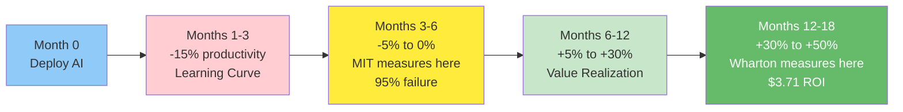

Companies spent [$37 billion on generative AI in 2025](https://menlovc.com/perspective/2025-the-state-of-generative-ai-in-the-enterprise/)—a 3.2x increase from $11.5 billion in 2024.

At the same time, [MIT reports](https://mitsloan.mit.edu/ideas-made-to-matter/productivity-paradox-ai-adoption-manufacturing-firms) that **95% of enterprise GenAI projects fail**.

But [Wharton's 2025 study](https://knowledge.wharton.upenn.edu/special-report/2025-ai-adoption-report/) found that GenAI returns **$3.71 for every dollar invested**, with 74% of leaders reporting positive outcomes.

So which is it? Are GenAI projects failing catastrophically, or are they printing money?

After digging through the research, I found something interesting: **both studies are correct**. They're just measuring different things at different times.

The answer reveals the most critical mistake companies make with GenAI—and how to avoid it.

## The measurement problem

Here's what's actually happening.

MIT measured GenAI projects at **6 months** using **profit-and-loss impact only**.

Wharton measured GenAI projects at **12-18 months** using **multiple value drivers** (productivity, quality, cost savings, revenue).

They found completely different results because they were looking at different points in the AI adoption curve.

Let me show you the curve.

## The J-curve nobody warned you about

When you deploy GenAI, productivity doesn't immediately go up.

It goes **down**.

[MIT Sloan's research](https://mitsloan.mit.edu/ideas-made-to-matter/productivity-paradox-ai-adoption-manufacturing-firms) documented what they call "the productivity paradox":

> "AI introduction frequently leads to a measurable but temporary decline in performance followed by stronger growth in output, revenue, and employment."

Here's the timeline:

**Months 0-3: The Learning Curve Dip (-15% productivity)**
- Employees learning new tools
- Making mistakes with prompts
- Figuring out what works
- Existing processes disrupted

**Months 3-6: Break-Even Zone (-5% to +5%)**
- Some workflows optimized
- Others still struggling
- **This is where MIT measured** → 95% "failure"

**Months 6-12: Value Realization (+5% to +30%)**
- Habits formed
- Processes redesigned
- Real productivity gains

**Months 12-18: Full Impact (+30% to +50%)**
- Compound effects kick in
- New capabilities enabled
- **This is where Wharton measured** → $3.71 ROI

MIT measured at the absolute worst point on the curve. Wharton measured after organizations had time to actually transform.

Both measurements are accurate. They're just telling different parts of the story.

## Why the first 6 months are brutal

The learning curve dip is real, and it hits harder than most companies expect.

[Research from established firms](https://mitsloan.mit.edu/ideas-made-to-matter/productivity-paradox-ai-adoption-manufacturing-firms) shows the dip is even worse for them:

> "The negative impact of AI adoption was most pronounced among established firms. Such organizations typically have long-standing routines, layered hierarchies, and legacy systems that can be difficult to unwind."

I've seen this firsthand. At a previous company, we rolled out GitHub Copilot to the engineering team. For the first month, velocity actually decreased. Developers were:
- Learning what Copilot was good at (and what it wasn't)
- Reviewing AI-generated code more carefully
- Arguing about whether to accept suggestions
- Dealing with bugs from blindly accepting code

It took 3 months before we saw net positive impact. By month 6, productivity was up 25%. But if we'd measured at month 2? We would have called it a failure.

This is why MIT found 95% failure at 6 months. They measured during the dip.

## The $37 billion question: where's the money going?

[Menlo Ventures tracked](https://menlovc.com/perspective/2025-the-state-of-generative-ai-in-the-enterprise/) where enterprise GenAI spending went in 2025:

**Total: $37B** (up from $11.5B in 2024, $1.7B in 2023)

**Breakdown**:
- **$19B on applications** (51% of market)
- **$18B on infrastructure** (49% of market)

**Top spending categories**:

| Category | 2025 Spending | % of Market |
|----------|--------------|-------------|
| Coding tools | $7.3B | 20% |
| Customer service | $5.2B | 14% |
| Marketing/content | $4.8B | 13% |
| Enterprise productivity | $3.9B | 11% |
| Sales enablement | $3.1B | 8% |
| Other applications | $12.6B | 34% |
| **Total** | **$37B** | **100%** |

The crazy part? **47% of GenAI deals reach production** vs 25% for traditional SaaS.

That's nearly double the conversion rate. GenAI isn't failing to ship—it's failing to show immediate ROI because companies are measuring too early.

## The 8 GenAI use cases that actually work

After going through all the research, I found 8 use cases with documented, repeatable ROI. Let me show you the numbers.

| Use Case | ROI / Impact | Market Size | Time to Value |
|----------|-------------|-------------|---------------|
| **Code Generation** | 55% faster completion | $7.3B (20% of market) | 1-3 months |
| **Customer Service** | $3.50 per $1 invested | $5.2B | 3-6 months |
| **Marketing/Content** | 20-30% campaign ROI boost | $4.8B | 1-2 months |
| **Legal Document Review** | 70-90% time savings | Part of $3.9B productivity | 2-4 months |
| **HR & Recruitment** | $3.29M annual value | Part of productivity | 3-6 months |
| **Sales Enablement** | $3.70 per $1 invested | $3.1B | 2-4 months |
| **Enterprise Productivity** | 40-60 min saved/employee/day | $3.9B | 1-3 months |
| **Data Analytics & BI** | 3.7x return per dollar | Part of productivity | 3-6 months |

Now let me break down each one:

### 1. Code Generation

**Market size**: [$7.3 billion in 2025](https://menlovc.com/perspective/2025-the-state-of-generative-ai-in-the-enterprise/) (20% of entire GenAI market)

**Adoption**: 50% of developers now use AI coding assistants

**ROI**: [55% faster task completion](https://github.blog/news-insights/research/research-quantifying-github-copilots-impact-in-the-enterprise/) (GitHub's study)

**The catch**: Initial productivity dip for first 30 days, then compound gains

**Real example**: One enterprise saw 30% faster feature delivery after 6 months with GitHub Copilot

This is the most proven GenAI use case. But even here, you need to measure beyond month 1.

### 2. Customer Service

**ROI**: [$3.50 return per $1 invested](https://knowledge.wharton.upenn.edu/special-report/2025-ai-adoption-report/)

**Impact**:
- 43% ticket deflection rate
- 30-50% cost reduction
- Customer satisfaction maintained or improved

**Real example**: [Klarna's AI assistant](https://www.klarna.com/international/press/klarna-ai-assistant-handles-two-thirds-of-customer-service-chats-in-its-first-month/) handles 2/3 of customer service chats, delivering $40M profit improvement

**Why it works**: High-volume, repetitive queries are perfect for GenAI

**Why it fails**: When companies don't redesign the workflow—they just bolt AI onto existing processes

### 3. Marketing & Content Creation

**ROI**: 20-30% higher campaign ROI

**Impact**:
- 450% increase in click-through rates (JP Morgan case study)
- 5-10x content production volume
- Faster A/B testing iterations

**The reality**: GenAI is great for first drafts, bad for finished work without human refinement

**Why it works**: Helps overcome blank page syndrome, accelerates iteration

**Why it fails**: Companies that use GenAI output without editing produce generic, low-quality content

### 4. Legal Document Review

**Adoption**: [77% of legal professionals](https://www.thomsonreuters.com/en-us/posts/legal/generative-ai-legal-profession/) use GenAI

**Impact**: 70-90% time savings on template-based tasks

**Use cases**:
- Contract review and comparison
- Legal research
- Document drafting (with lawyer review)

**The catch**: High-stakes documents still need human review. GenAI accelerates, doesn't replace.

### 5. HR & Recruitment

**Real ROI**: $3.29M annual value (Humanly.io case study)

**Impact**:
- 5x recruiter productivity
- 50% faster time-to-hire
- Better candidate matching

**Why it works**: Screening thousands of resumes is perfect for LLMs

**Why it fails**: Bias amplification (see: Amazon's recruiting tool disaster)

### 6. Sales Enablement

**ROI**: [$3.70 per dollar invested](https://knowledge.wharton.upenn.edu/special-report/2025-ai-adoption-report/)

**Impact**:
- 15-30% productivity gains
- 1.5 hours saved per week per rep
- Better email personalization

**Use cases**:
- Meeting summaries and follow-ups
- Proposal generation
- CRM data entry

**The catch**: Generic AI-written emails are obvious. Personalization requires human oversight.

### 7. Enterprise Productivity

**Impact** ([Wharton data](https://knowledge.wharton.upenn.edu/special-report/2025-ai-adoption-report/)):
- 40-60 minutes saved per employee per day
- 74% complete previously impossible tasks
- 82% of leaders use GenAI weekly (48% daily)

**Use cases**:
- Meeting notes and summaries
- Document drafting
- Email composition
- Research and synthesis

**Why it works**: Reduces cognitive load on low-value tasks

**Why it fails**: When organizations don't provide training or clear use case guidance

### 8. Data Analytics & BI

**ROI**: 3.7x return per dollar

**Impact**: [57% of finance leaders](https://knowledge.wharton.upenn.edu/special-report/2025-ai-adoption-report/) report GenAI exceeded expectations

**Use cases**:
- Natural language queries to databases
- Automated report generation
- Insight discovery

**Why it works**: Makes data accessible to non-technical users

**Why it fails**: When data quality is poor (garbage in, garbage out)

## Why 95% fail: the five killers

Based on the research, here's what causes GenAI projects to fail:

### 1. Poor Data Quality (43% cite as top barrier)

LLMs need context. If your data is messy, incomplete, or siloed, GenAI won't magically fix it.

The most common mistake: Companies deploy GenAI tools without cleaning up their data infrastructure first.

### 2. Build vs Buy Misalignment

[The data shows](https://menlovc.com/perspective/2025-the-state-of-generative-ai-in-the-enterprise/):
- **Internal builds: 33% success rate**
- **Vendor partnerships: 67% success rate**

Yet companies keep trying to build custom LLMs when they should be buying.

The shift is happening: 47% build (2024) → 24% build (2025). The market learned.

### 3. Misguided Investment (50%+ budgets in wrong areas)

Companies overspend on sales and marketing GenAI (lowest ROI) and underspend on back-office operations (highest ROI).

Why? Sales and marketing are visible. Compliance, HR, and operations are boring.

But boring is where GenAI delivers fastest ROI.

### 4. Unrealistic Timelines (expecting 6-month ROI)

MIT measured at 6 months and found 95% failure.

Wharton measured at 12-18 months and found 74% success.

The lesson? If you're measuring GenAI ROI at 6 months, you're measuring at the worst possible time.

Set 12-18 month timelines for full value realization.

### 5. No Workflow Integration

The companies succeeding with GenAI (like Klarna, Morgan Stanley, DBS) didn't bolt AI onto existing processes.

They redesigned workflows with GenAI as a core component.

The companies failing kept their old workflows and wondered why adding an AI tool didn't help.

## Why 5-26% succeed: the six enablers

What separates the winners from the 95%?

### 1. Vendor Partnerships Over DIY

67% success rate with vendors vs 33% with internal builds.

The winners recognized: we're good at our business, not at training LLMs. Let's partner with experts.

### 2. Back-Office Focus First

Highest ROI areas:
- Compliance and legal review
- HR operations
- Data analytics
- Internal productivity

Not the flashiest. But fastest path to ROI.

### 3. Workflow Integration (Not Bolt-On Tools)

Klarna didn't give agents an AI tool. They made AI the primary customer interface.

Morgan Stanley didn't add AI as a search option. They made it the default way to access research.

Integration > Addition

### 4. Domain Expert Empowerment

The companies succeeding aren't centrally deploying GenAI.

They're **empowering domain experts** (lawyers, analysts, developers) to use GenAI in their work.

This requires training, but it scales better than a central AI team trying to serve everyone.

### 5. 12-18 Month ROI Horizons

Winners set realistic timelines:
- Months 1-3: Learning and experimentation
- Months 3-6: Optimization and iteration
- Months 6-12: Value realization
- Months 12-18: Full impact

They don't panic at month 3 when productivity dips. They expect it.

### 6. Multiple Value Metrics

Winners don't just measure P&L impact. They track:
- Productivity gains (time saved)
- Quality improvements (error reduction)
- Employee satisfaction (reduced drudgery)
- Revenue enablement (new capabilities)
- Cost reduction (efficiency)

MIT measured P&L only → 95% failure.

Wharton measured multiple metrics → 74% success.

Measure what matters, not just what's easy to measure.

## GenAI vs Traditional ML: what's different?

Based on [the research](https://menlovc.com/perspective/2025-the-state-of-generative-ai-in-the-enterprise/), here's how GenAI compares to traditional ML:

**GenAI Advantages**:
- **2x faster production conversion** (47% vs 25%)
- Ship in 90 days (mid-market) vs 6-12 months (traditional ML)
- Pre-trained models reduce time-to-first-value
- No need for labeled training data

**GenAI Challenges**:
- Less deterministic (harder to validate)
- [48% of AI-generated code has security vulnerabilities](https://www.thesslstore.com/blog/48-of-ai-generated-code-contains-security-vulnerabilities/)
- Requires stronger change management
- Higher inference costs

The key insight: **GenAI is faster to deploy but harder to master**.

Traditional ML projects had long setup times but predictable outcomes. GenAI projects ship faster but require more organizational maturity to capture value.

## The market reality check

Some numbers that surprised me from the research:

**Market Momentum** ([Menlo Ventures](https://menlovc.com/perspective/2025-the-state-of-generative-ai-in-the-enterprise/)):
- **50+ products crossed $100M ARR**
- **10+ products at $1B+ ARR**
- **Anthropic revenue**: $10M (2022) → $1B (2024) → $9B projected (2025)
- **OpenAI enterprise users**: 150K (Jan 2024) → 1.5M (March 2025) = 900% growth in 14 months

**Build vs Buy Shift**:
- 2024: 47% build internally, 53% buy
- 2025: 24% build internally, 76% buy

The market learned fast: most companies aren't good at building LLMs. Partner with vendors, focus on your differentiation.

**Investment Reality**:
- [Global GenAI investment: $33.9B in 2024](https://hai.stanford.edu/ai-index/2025-ai-index-report) (+18.7% YoY)
- Enterprise spending on GenAI: $37B in 2025 (3.2x from 2024)

Despite the "95% failure rate" headlines, investment is accelerating. Why?

Because the 5% that succeed see transformative returns. And companies are learning what makes projects succeed.

## What this means for your GenAI strategy

Here's what I learned from reconciling these studies:

**1. Expect the J-curve**

Productivity will dip before it rises. Budget for:
- 3 months of learning curve
- 6 months to break even
- 12-18 months for full ROI

Don't measure at month 3 and panic.

**2. Partner, don't build**

Unless you're Google, OpenAI, or Anthropic, you probably shouldn't be training your own LLMs.

67% success rate with vendors vs 33% with internal builds.

Use vendor APIs. Focus your innovation on workflow integration and domain-specific applications.

**3. Start with boring, high-volume tasks**

Not sexy use cases. Boring ones:
- Document review
- Data entry
- Meeting summaries
- First-draft content

These deliver fast ROI with low risk.

**4. Measure multiple value drivers**

Don't just track P&L impact. Track:
- Time saved per employee
- Error reduction rates
- Employee satisfaction
- Quality improvements
- New capabilities enabled

Companies that measure only P&L find 95% failure. Companies that measure comprehensively find 74% success.

**5. Redesign workflows, don't retrofit**

Ask: "If we were designing this process today with GenAI, what would it look like?"

Don't ask: "Where can we add GenAI to our current process?"

The companies succeeding with GenAI (Klarna, Morgan Stanley, DBS) redesigned workflows. The companies failing bolted AI onto existing processes.

## The 2026 outlook

Based on the trends, here's what I'm watching:

**1. The failure rate will drop**

As companies learn the J-curve pattern and set realistic timelines, the "95% failure at 6 months" metric will improve.

We're already seeing this: [Wharton's 2025 study](https://knowledge.wharton.upenn.edu/special-report/2025-ai-adoption-report/) shows 74% success when measured properly.

**2. Use case maturity**

The 8 proven use cases (code, customer service, content, legal, HR, sales, productivity, analytics) will become table stakes.

Competitive advantage will shift to execution quality, not just adoption.

**3. Vendor consolidation**

50+ products at $100M+ ARR is too many. Expect consolidation.

The survivors will be those that integrate into workflows, not just provide API access.

**4. ROI pressure intensifies**

[61% of leaders feel more pressure](https://www.techrepublic.com/article/ai-adoption-trends-enterprise/) to prove GenAI ROI now vs a year ago.

The experimentation phase is over. CFOs want measurable returns.

Companies that can't show ROI by 2026 will cut GenAI budgets.

## The bottom line

MIT says 95% of GenAI projects fail.

Wharton says GenAI returns $3.71 per dollar.

Both are right.

**MIT measured at 6 months** (the productivity dip). **Wharton measured at 12-18 months** (after value realization).

The lesson isn't that GenAI doesn't work. It's that **you need to measure at the right time with the right metrics**.

Companies spending $37 billion on GenAI in 2025 aren't stupid. They're making a bet on transformation that takes 12-18 months to pay off.

The winners:
- Set realistic timelines (12-18 months)
- Partner with vendors (67% success rate)
- Start with boring, high-ROI use cases
- Redesign workflows, don't retrofit
- Measure multiple value drivers, not just P&L

The losers:
- Expect 6-month ROI
- Try to build everything internally
- Chase sexy use cases with low ROI
- Bolt AI onto existing processes
- Measure only P&L impact

The choice is yours.

---

## Coming up next

In Part 3, I'll cover something most companies are ignoring until it's too late: **AI Governance**. The EU AI Act is actively enforced as of February 2025. Penalties go up to €35 million or 7% of global revenue. And most companies have no idea if they're compliant.

**Read Part 3**: [AI Governance is No Longer Optional](./ai-governance-eu-ai-act-compliance-guide)

---

## Series Navigation

1. [Part 1: Why 94% of Companies Struggle with AI](./state-of-ai-2025-why-94-percent-fail)
2. **Part 2: The GenAI Paradox** ← You are here
3. [Part 3: AI Governance is No Longer Optional](./ai-governance-eu-ai-act-compliance-guide)
4. [Part 4: From MLOps to LLMOps](./mlops-to-llmops-modern-ai-infrastructure)
5. [Part 5: The Rise of the Chief AI Officer](./chief-ai-officer-rise-organizational-models)
6. [Part 6: Scaling AI - Why Technology Isn't the Bottleneck](./scaling-ai-organizational-barriers-not-technology)
7. [Part 7: AI Transparency and the Innovation Debate](./ai-transparency-innovation-debate-whats-next)
