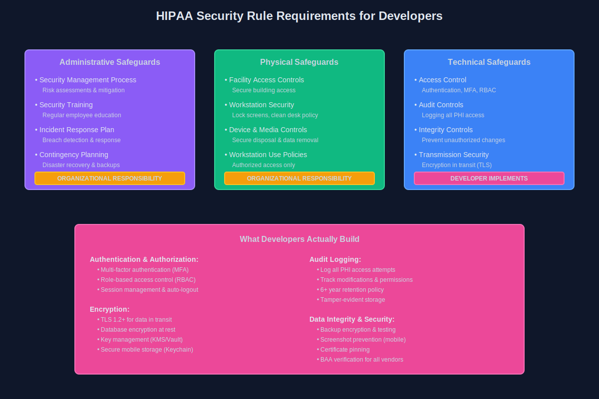
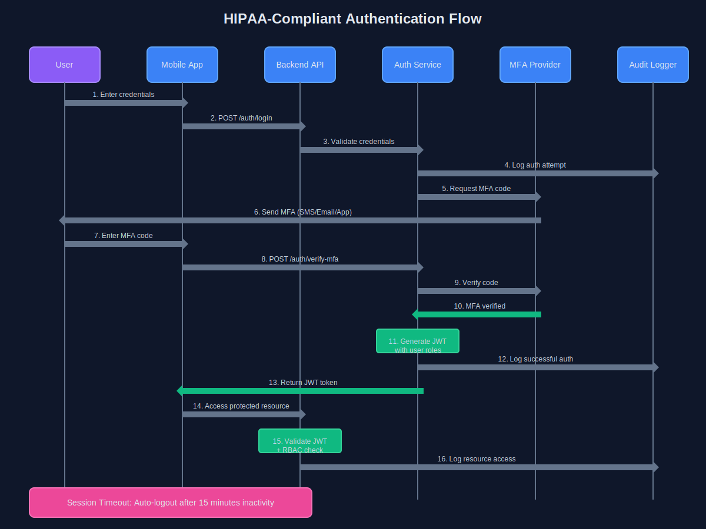
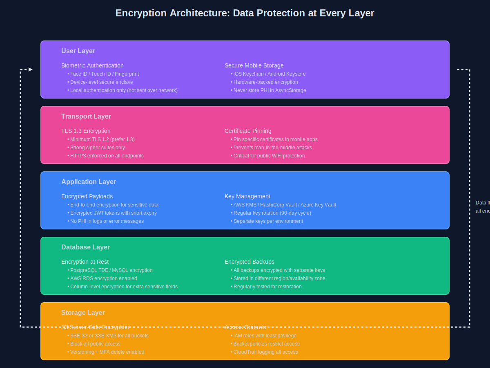
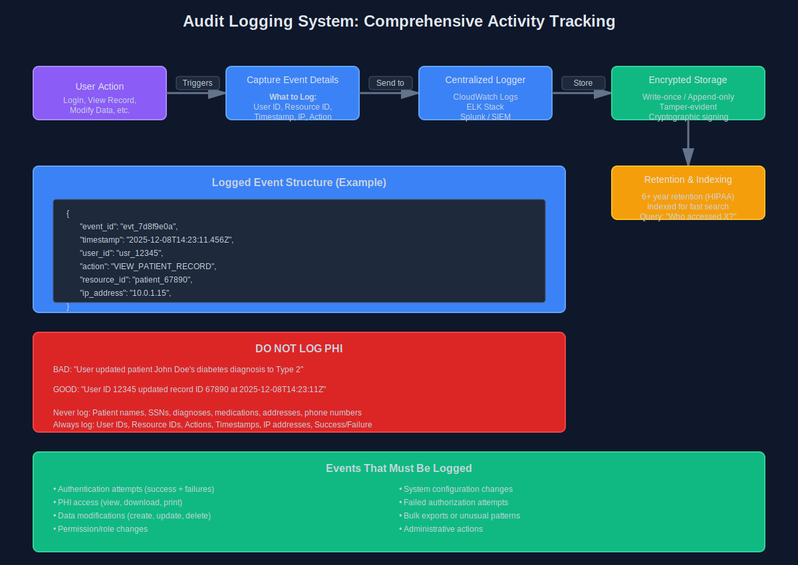

I've built systems for 100+ hospitals. I've also seen apps fail audits spectacularly.

Most HIPAA guides are written by lawyers. This one's written by someone who writes the code.

After seven years of building healthcare systems with full HIPAA, SOC2, and ISO 27001 compliance, I've learned what actually matters. Not the theory—the practical stuff that makes or breaks an audit.

## HIPAA for Developers: The 10-Minute Version

Here's what you need to know upfront.

**PHI (Protected Health Information)** is anything that can identify a patient AND relates to their health. Names, emails, device IDs tied to health records—all PHI. Even IP addresses can be PHI in the right context.

The **Security Rule** is what you care about as a developer. It covers technical safeguards—encryption, access controls, audit logs. The Privacy Rule is mostly organizational policy stuff.

**Technical vs Administrative Safeguards**: You implement the technical ones (encryption, MFA, audit logs). Your org handles administrative ones (training, policies, incident response plans). But guess what? If your code makes compliance impossible, that's on you.

**BAAs (Business Associate Agreements)**: Any vendor touching PHI needs one. AWS? BAA. Twilio? BAA. That cool new analytics SDK? Better have a BAA or it's not going in.



## Authentication & Access Control

This is where most apps start and where many fail.

**MFA is non-negotiable**. Not optional, not "coming soon." Every user accessing PHI needs multi-factor authentication. I've seen auditors reject apps on this alone.

**RBAC (Role-Based Access Control)** is your friend. Doctors see different data than nurses. Admins see different data than clinicians. Map your roles early and enforce them everywhere—API, database, UI.

**Session management matters**. Auto-logout after 15 minutes of inactivity is standard. Shorter for high-risk actions. And please, actually invalidate sessions on logout—don't just clear the client-side token.

For mobile apps, biometric auth (Face ID, Touch ID) is great for UX but still needs to back to a proper auth flow. Biometrics unlock the app; they don't replace authentication.



## Encryption: At Rest, In Transit, All the Time

If data isn't encrypted, you're already failing.

**In transit**: TLS 1.2 minimum. TLS 1.3 is better. Certificate pinning for mobile apps adds another layer. Configure your load balancers correctly—I've seen apps with perfect backend security undermined by an ALB serving HTTP.

**At rest**: Your database needs encryption. PostgreSQL has it built-in with `pgcrypto` or Transparent Data Encryption. AWS RDS makes this checkbox-simple. S3 buckets? SSE-S3 or SSE-KMS, always.

**Key management** is where it gets real. Don't hardcode keys (obviously). Use AWS KMS, HashiCorp Vault, or your cloud provider's key management. Rotate keys regularly. Have a process for compromised keys.

For mobile, use the platform's secure storage: Keychain on iOS, Keystore on Android. React Native has `react-native-keychain`. Never store PHI in AsyncStorage or SharedPreferences unencrypted.



## Audit Logging: Everything Except PHI

You need to log everything. Every access, every modification, every failed login attempt.

But here's the catch: **don't log PHI itself**. Log user IDs, resource IDs, actions, timestamps, IP addresses—but not the actual patient data.

Bad log: `User updated patient John Doe's diabetes diagnosis`

Good log: `User ID 12345 updated record ID 67890 at 2025-12-08T14:23:11Z from IP 10.0.1.15`

**What to log**: Authentication attempts, data access (who viewed what), modifications, permission changes, system configuration changes, failed authorization attempts.

**Retention**: Keep logs for at least six years. HIPAA requires this. Use CloudWatch Logs, ELK stack, or a SIEM solution. Make logs tamper-evident—write-once storage or cryptographic signing.

**Make logs searchable**. During an audit, you need to answer "who accessed this patient's record between these dates?" in minutes, not days.



## Database & Storage Security

Your database config matters more than you think.

**PostgreSQL**: Enable SSL connections. Set up proper user permissions—application users shouldn't have DROP TABLE privileges. Use row-level security for multi-tenant architectures. Enable audit logging with `pgaudit`.

**Backups**: Encrypted, tested, and stored in a separate region. I've seen companies pass every audit check except backup restoration. Test your disaster recovery plan.

**S3 policies**: Block public access (seriously, enable the account-level block). Use bucket policies to restrict access to specific IAM roles. Enable versioning and MFA delete for critical buckets. Server-side encryption mandatory.

**Connection strings**: Never in source code. Use environment variables or secrets management. Rotate database credentials periodically.

## Third-Party Integrations: The Risky Stuff

Third-party services are where compliance gets messy.

**Before integrating anything**, ask: Does it touch PHI? If yes, do they have a BAA? If no BAA, find another vendor or build it yourself.

I've had to rip out analytics tools, crash reporting SDKs, and customer support widgets because they couldn't sign BAAs. Plan for this.

**SDK risks**: Mobile SDKs are especially dangerous. Some collect device info, analytics, or crash logs by default. Read the docs. Configure them to disable automatic data collection. Or better yet, proxy their APIs through your own backend where you control the data.

**BAA checklist for vendors**:
- Will they sign a BAA?
- What data do they actually access?
- Where are they storing it?
- How are they encrypting it?
- What's their incident response plan?


## Mobile-Specific Concerns (React Native & Flutter)

Mobile apps have unique challenges.

**Secure storage**: Use `react-native-keychain` or Flutter's `flutter_secure_storage`. These use platform-native secure enclaves. Never store PHI in regular app storage.

**Screenshot prevention**: On iOS and Android, you can prevent screenshots in sensitive screens. Do it. Patients take screenshots; those images go to cloud photo backups you don't control.

```typescript
// React Native example
import { enableScreenShield } from 'react-native-screen-shield';
enableScreenShield();
```

**Jailbreak/root detection**: Detect compromised devices and either block access or log it aggressively. Libraries like `react-native-jailbreak-detect` help here.

**App backgrounding**: Clear sensitive data when the app goes to background. iOS shows app snapshots in the task switcher—make sure those don't contain PHI.

**Certificate pinning**: Prevents MITM attacks on your API. Critical for healthcare apps on public WiFi.

## The Quick Checklist

Before your audit, verify:

- [ ] MFA enabled for all users accessing PHI
- [ ] TLS 1.2+ for all data in transit
- [ ] Database and storage encrypted at rest
- [ ] Audit logs capturing all PHI access (without logging PHI itself)
- [ ] Role-based access control enforced
- [ ] Session timeouts configured (15 min or less)
- [ ] BAAs signed with all vendors touching PHI
- [ ] Backups encrypted and tested
- [ ] Mobile app using secure storage (Keychain/Keystore)
- [ ] Screenshot prevention on sensitive screens
- [ ] Key rotation process in place

## Final Thoughts

HIPAA compliance isn't a one-time checkbox. It's an ongoing process.

The audits aren't trying to catch you. They're verifying you're protecting patient data. If you've built the right systems, audits are tedious but passable.

Start with the big three: authentication, encryption, and audit logging. Get those right, and you're 80% there.

The rest is documentation, process, and making sure your team doesn't accidentally log PHI in an error message (yes, this happens).

Build secure systems. Protect patient data. Pass your audits.

---

*Aaron Dsilva is a Senior Full Stack Developer with 7 years of experience building healthcare systems. He's helped 100+ hospitals achieve HIPAA, SOC2, and ISO 27001 compliance while maintaining developer sanity.*
