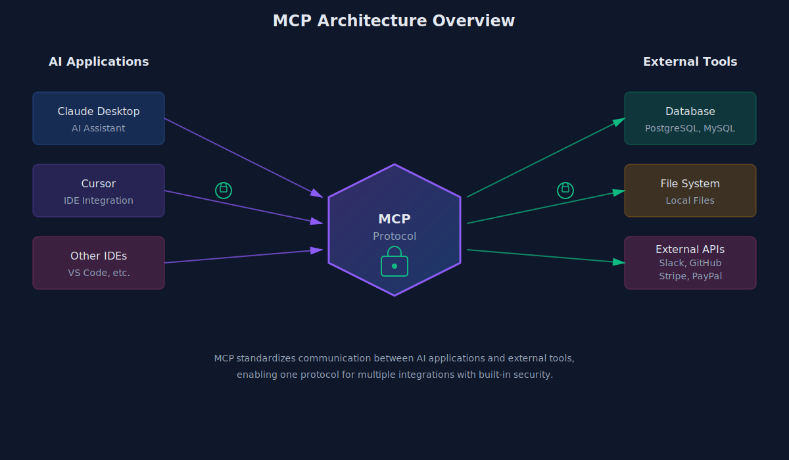
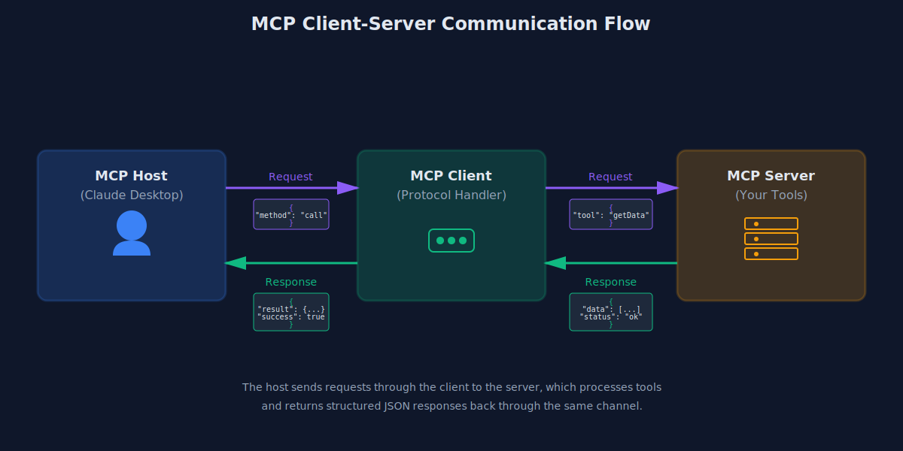
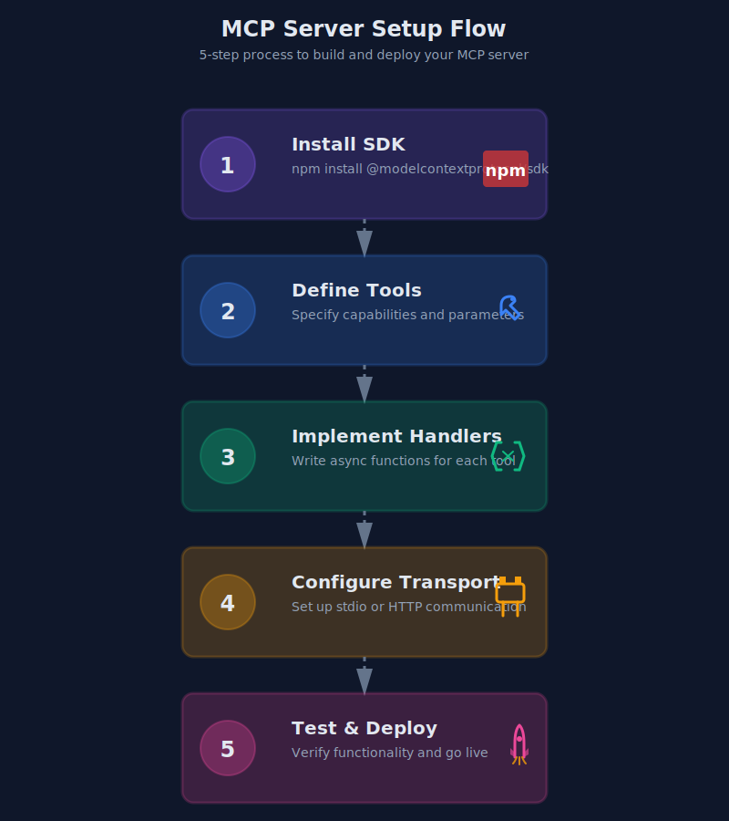
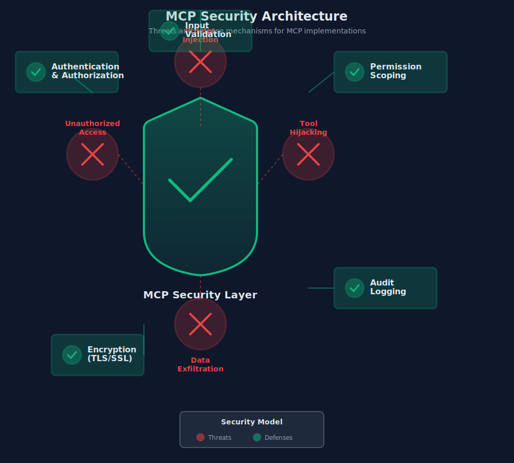

I kept seeing MCP everywhere. Twitter threads. Hacker News posts. Every AI announcement seemed to mention it.

For months, I nodded along pretending I understood why it mattered. Another protocol. Cool.

Then I actually built something with it. Now I get it.

## The problem MCP solves (in one sentence)

Connecting AI to your stuff is annoying, and MCP makes it less annoying.

That's it. That's the whole thing.

Before MCP, if you wanted Claude to query your database, you'd write custom code. Want it to read files? More custom code. Slack integration? You get the idea. Every tool needed its own glue.

MCP standardizes that glue. You build one server that exposes your tools, and any MCP-compatible AI can use them. Anthropic calls it "USB-C for AI applications." Honestly, that's a good analogy.

## Who's actually using this?

When Anthropic released MCP in November 2024, I figured it would be another standard that dies quietly.

It didn't.

OpenAI adopted it. Google DeepMind adopted it. Stripe, PayPal, Atlassian, Asana—all building MCP implementations. Block (the Square people) apparently has over 60 internal MCP servers now.

That's... a lot of adoption for something less than a year old.

## How it actually works

Three pieces:

**Hosts** — The AI app you're talking to. Claude Desktop, Cursor, whatever.

**Clients** — The connector inside the host that talks to servers.

**Servers** — Your stuff. Databases, files, APIs, custom tools. This is what you build.



The flow: Host asks server "what can you do?" Server says "I can query patients, fetch lab results, whatever." Host uses those tools when relevant.



Simple concept. The magic is in the standardization.

## I built a simple one. Here's what I learned.

I wanted to see how painful the setup actually is. Spoiler: not that bad.



TypeScript SDK. Maybe 50 lines for a basic server:

```typescript
import { McpServer } from "@modelcontextprotocol/sdk/server/mcp.js";

const server = new McpServer({
  name: "patient-lookup",
  version: "1.0.0"
});

server.tool(
  "get_active_patients",
  "Returns count of currently active patients",
  {},
  async () => {
    const count = await db.patients.count({ where: { active: true }});
    return { content: [{ type: "text", text: `${count} active patients` }] };
  }
);
```

Few things I noticed:

**Tool descriptions matter a lot.** The AI uses them to decide when to call your tool. Vague description = confused AI = wrong tool calls.

**Keep tools small.** One tool, one job. My first attempt was a "do everything" tool. Terrible idea.

**Error messages need to be clear.** When something breaks, the AI needs to understand why so it can tell the user (or try something else).

## The security stuff you need to know

I'm not going to pretend this is all sunshine.

April 2025, security researchers dropped a report highlighting real issues:

- **Prompt injection** — If your server returns user-controlled content, that content could manipulate the AI
- **Tool combination risks** — File read + network access = potential data exfiltration path
- **Tool shadowing** — Malicious servers impersonating legitimate ones



For healthcare stuff (my world), this means: treat MCP servers like any other API handling PHI. Auth. Encryption. Audit logs. The usual.

Don't expose MCP servers to untrusted networks. Don't enable random third-party servers without reviewing them. Basic hygiene, but worth stating.

## When I wouldn't use MCP

Not everything needs this.

**Simple API calls** — If you're just fetching data from one endpoint, a regular HTTP request is fine. MCP adds overhead you don't need.

**Latency-critical stuff** — The protocol adds round trips. For real-time applications, direct integrations are faster.

**Untrusted environments** — Given the security model, I wouldn't deploy MCP where I can't control who's connecting.

## Where I think this is going

MCP is one of those things that's more important than it looks.

The pattern it establishes—standardized tool discovery, consistent invocation, separation of AI logic from tool implementation—that's going to influence how AI development works regardless of whether MCP specifically wins.

Every company needs an "AI strategy" now. Building MCP servers is a concrete way to have one. That's partly why adoption has been so fast.

For me, the real value is less context-switching. I'm not writing five different integration patterns anymore. One protocol, many tools. That's genuinely useful.

## If you want to try it

1. Install Claude Desktop (has MCP built in)
2. Enable the filesystem server (comes included)
3. Try asking Claude to read/write files in a specific directory
4. Build your own server when you're ready

The [modelcontextprotocol.io](https://modelcontextprotocol.io) docs are decent. Python and TypeScript SDKs are the most mature.

---

*Aaron Dsilva is a Senior Full Stack Developer building AI-integrated healthcare systems. He works with RAG pipelines, LLM integrations, and loves when new standards actually solve real problems.*
