Five years ago, deploying AI meant:
- Buying $100K+ in GPU hardware
- Hiring ML engineers to train custom models
- Spending 6-12 months from idea to production
- Building everything from scratch

Today, you can:
- Call an API
- Deploy in 90 days
- Pay per token
- Use pre-trained models that beat custom ones

The infrastructure stack flipped completely. What used to take PhDs and millions of dollars now takes developers and thousands of dollars.

Let me show you what changed, how the modern stack works, and what it means for your AI strategy.

## The 2020 ML stack (what we're leaving behind)

Here's what AI infrastructure looked like before the LLM revolution:

**Infrastructure Layer**:
- On-premise GPUs ($50K-500K upfront)
- Or AWS/GCP compute (expensive, complex to configure)
- Specialized hardware knowledge required

**Framework Layer**:
- TensorFlow (dominant but complex)
- PyTorch (growing but immature)
- Custom CUDA code for optimization

**Model Layer**:
- Train your own models from scratch
- Months of experimentation
- Need large labeled datasets
- Constant tuning and iteration

**Data Layer**:
- Clean, structured, labeled data required
- Data engineers spend 80% of time on prep
- Dataset quality determines model quality

**Application Layer**:
- Custom application code
- Tight coupling between ML and app logic
- Hard to maintain and update

This worked. But it was slow, expensive, and required specialized talent.

Then came the LLM era.

## The 2025 LLM stack (what replaced it)

[The modern AI infrastructure market](https://hai.stanford.edu/ai-index/2025-ai-index-report) hit $87.6B in 2025, projected to reach $197.6B by 2030.

Here's the new stack:

**Infrastructure Layer**:
- Cloud APIs (pay per token, not per server)
- AWS Bedrock, Azure OpenAI, Google Vertex AI
- No hardware to manage

**Model Layer**:
- Pre-trained foundation models (GPT-4, Claude, Gemini, Llama)
- Fine-tuning optional, not required
- LoRA/QLoRA for efficient customization

**Orchestration Layer** (NEW):
- LangChain, LlamaIndex for chaining LLM calls
- Prompt management and versioning
- Tool calling and function execution

**Data Layer**:
- Unstructured data now usable (documents, code, conversations)
- RAG (Retrieval Augmented Generation) instead of fine-tuning
- Vector databases (Pinecone, Weaviate, Qdrant)

**Application Layer**:
- AI-native apps (copilots, agents, chatbots)
- Loose coupling via APIs
- Faster iteration and deployment

The key shift: **from training models to orchestrating them**.

```mermaid
graph TB
    subgraph 2020["2020 ML Stack"]
        A1["On-Premise GPUs<br/>$50K-500K"] --> A2["TensorFlow/PyTorch<br/>Complex Setup"]
        A2 --> A3["Train Custom Models<br/>6-12 months"]
        A3 --> A4["Labeled Datasets<br/>80% prep time"]
        A4 --> A5["Custom Apps<br/>Tight coupling"]
    end

    subgraph 2025["2025 LLM Stack"]
        B1["Cloud APIs<br/>Pay per token"] --> B2["Foundation Models<br/>GPT-4, Claude, Gemini"]
        B2 --> B3["LangChain/LlamaIndex<br/>Orchestration"]
        B3 --> B4["RAG + Vector DBs<br/>Unstructured data"]
        B4 --> B5["AI-Native Apps<br/>90 days to prod"]
    end

    style 2020 fill:#FFCDD2
    style 2025 fill:#C8E6C9
```

## Why everything changed: the pre-training paradigm

The fundamental insight that broke everything: **pre-train on massive data, then adapt for specific tasks**.

**2020 approach**:
- Start with small model
- Train on your specific dataset
- Optimize for your use case
- Deploy

**2025 approach**:
- Start with massive pre-trained model
- Add your context via prompts or RAG
- Fine-tune only if needed
- Deploy in days

The economics flipped:

| Metric | 2020 Custom Model | 2025 Pre-trained LLM |
|--------|------------------|---------------------|
| **Time to deploy** | 6-12 months | 30-90 days |
| **Upfront cost** | $100K-1M | $1K-50K |
| **Ongoing cost** | $10K/month (infra) | $500-5K/month (API) |
| **Team size** | 3-5 ML engineers | 1-2 developers |
| **Data requirements** | 100K+ labeled examples | Few-shot examples |

This is why [47% of GenAI projects reach production](https://menlovc.com/perspective/2025-the-state-of-generative-ai-in-the-enterprise/) vs 25% for traditional ML projects.

## Cloud provider showdown: AWS vs Azure vs Google

All three major clouds offer managed LLM services. I compared them for enterprise use.

| Feature | AWS Bedrock | Azure OpenAI | Google Vertex AI |
|---------|------------|--------------|------------------|
| **Key Models** | Claude, Llama, Titan | GPT-4, GPT-3.5 | Gemini, PaLM 2 |
| **Pricing** | $0.0004-$0.03 / 1K tokens | $0.0015-$0.12 / 1K tokens | $0.000125-$0.0125 / 1K tokens |
| **Cost Rank** | Medium | Highest | **Lowest** (30-50% cheaper) |
| **Model Variety** | **Highest** (multi-vendor) | Limited (OpenAI only) | Medium |
| **Enterprise Adoption** | High (AWS ecosystem) | **Highest** (Microsoft integration) | Growing |
| **Managed RAG** | ✅ Knowledge Bases | ✅ Azure AI Search | ✅ Vertex AI Search |
| **Unique Advantage** | Model flexibility | Only GPT-4 access | Best price/performance |
| **Best For** | AWS-native companies | Microsoft 365 users | Cost-sensitive projects |

### AWS Bedrock

**What it is**: Managed service for foundation models

**Available models**:
- Anthropic (Claude)
- Meta (Llama 2, 3)
- Cohere
- Stability AI
- Amazon Titan

**Pricing**: $0.0004-$0.03 per 1K tokens (varies by model)

**Pros**:
- Multi-model support (no vendor lock-in)
- Deep AWS ecosystem integration
- Knowledge Bases feature (managed RAG)
- Good for AWS-native companies

**Cons**:
- No OpenAI models
- Claude access but not exclusive
- More setup complexity than Azure

**Best for**: Companies already on AWS wanting model flexibility

### Azure OpenAI Service

**What it is**: Exclusive enterprise access to OpenAI models

**Available models**:
- GPT-4 (all variants)
- GPT-3.5-turbo
- DALL-E
- Whisper
- Text-to-speech

**Pricing**: $0.0015-$0.12 per 1K tokens

**Pros**:
- Only place to get OpenAI models in enterprise cloud
- Deep Microsoft 365 integration
- Azure AI Search (RAG built-in)
- Strong compliance and security

**Cons**:
- OpenAI lock-in
- Typically most expensive
- Limited model choice

**Best for**: Companies locked into Microsoft ecosystem or requiring GPT-4

### Google Vertex AI

**What it is**: Google's AI platform with Gemini models

**Available models**:
- Gemini (Google's LLM family)
- PaLM 2
- Open models (Llama, etc.)

**Pricing**: $0.000125-$0.0125 per 1K tokens (typically cheapest)

**Pros**:
- Lowest cost per token
- Gemini 2.0 with native multimodality
- Vertex AI Search (managed RAG)
- Strong for Google Cloud users

**Cons**:
- Smaller model selection
- Less enterprise penetration
- Gemini not yet proven at GPT-4 scale

**Best for**: Cost-sensitive projects, Google Cloud native companies

### The verdict

**If you need GPT-4**: Azure OpenAI (it's the only option)

**If you want model flexibility**: AWS Bedrock (most choice)

**If cost matters most**: Google Vertex AI (30-50% cheaper)

**My recommendation**: Start with the cloud you're already on. Switching clouds for AI isn't worth the operational overhead.

## The cost reality: cloud vs on-premise

The cloud vs on-premise debate changed with LLMs.

### Cloud (API-based)

**Training a Llama 3.1 405B model on AWS**: $483 million ([source](https://www.anyscale.com/blog/how-much-does-it-cost-to-train-llama-3-405b-on-aws))

Obviously, you don't train from scratch. You use pre-trained models.

**Inference costs** (what you actually pay):
- H100 GPU on AWS: $0.58-$8.54/hour depending on instance
- API calls: $0.0004-0.03 per 1K tokens
- Typical enterprise: $500-5K/month for moderate usage

**Pros**:
- Pay for what you use
- No upfront investment
- Scale up/down instantly
- Provider manages infrastructure

**Cons**:
- High-volume gets expensive
- Vendor lock-in risk
- Data leaves your premises

### On-Premise (Self-Hosted)

**Initial investment**:
- 8x H100 GPUs: $200K-300K
- Networking, power, cooling: $50K-100K
- Total: $250K-400K upfront

**Ongoing costs**:
- Power: $20K-40K/year
- Maintenance: $30K-50K/year
- Staffing: $200K+/year (ML Ops engineers)

**TCO analysis** ([industry data](https://www.databricks.com/blog/announcing-databricks-mosaic-ai-training)):
- **Cloud**: Higher OpEx, lower CapEx, easier to start
- **On-premise**: 35% lower TCO over 5 years, 70% lower OpEx

**Tipping point**: If you're spending >$50K/month on cloud AI, on-premise starts making financial sense.

**Pros**:
- Data stays in-house
- Cheaper at scale
- Full control

**Cons**:
- Huge upfront cost
- Operational complexity
- Slower to scale

### Hybrid (The Winner)

Most enterprises I talk to are going hybrid:
- **Development/experimentation**: Cloud APIs (fast iteration)
- **Production high-volume**: On-premise (cost optimization)
- **Regulatory/sensitive data**: On-premise (compliance)
- **New models**: Cloud (test before committing)

Companies are seeing **60-80% infrastructure cost reduction** with hybrid strategies.

## The LLMOps challenge: why it's harder than MLOps

LLMOps introduced new problems that didn't exist in traditional MLOps.

### Challenge 1: Prompt Engineering (Non-Determinism)

**Traditional ML**: Same input → Same output (deterministic)

**LLMs**: Same prompt → Different output each time (probabilistic)

This breaks traditional testing:
- Can't do unit tests on output content
- Need semantic similarity evaluation
- Must test statistically (not individually)

**The solution**: Prompt versioning, eval datasets, A/B testing

### Challenge 2: Fine-Tuning Economics

**Traditional ML fine-tuning**: $5K-20K per model

**LLM fine-tuning**: $50K+ for full fine-tuning (due to model size)

**The breakthrough**: LoRA and QLoRA techniques reduce fine-tuning cost to ~$1,500 while maintaining 95%+ of full fine-tuning quality.

**The reality**: Most companies don't need fine-tuning. RAG works for 80% of use cases.

### Challenge 3: RAG Complexity

**RAG** (Retrieval Augmented Generation): Instead of fine-tuning, retrieve relevant context and add to prompt.

**Why it's hard**:
- Chunking strategy (how to split documents)
- Embedding model selection
- Vector database tuning
- Relevance ranking
- Context window management

**The payoff**: Faster updates, cheaper than fine-tuning, better for knowledge bases

### Challenge 4: Evaluation Without "Right Answers"

**Traditional ML**: Compare output to labeled data, measure accuracy

**LLMs**: No single "right answer" for most tasks

**How to evaluate**:
- BLEU/ROUGE scores (inadequate for quality)
- LLM-as-judge (use GPT-4 to evaluate outputs)
- Human evaluation (expensive but necessary)
- Task-specific metrics (accuracy for classification, relevance for search)

### Challenge 5: Cost Monitoring

**Traditional ML**: Fixed inference cost per request

**LLMs**: Variable cost based on:
- Prompt length (input tokens)
- Response length (output tokens)
- Model chosen (GPT-4 vs GPT-3.5)
- Caching (repeat queries)

Companies are seeing wild variance: $100/month to $100K/month depending on usage patterns.

**The solution**: Token tracking, caching strategies, model routing (cheap models for simple queries)

## The LLMOps toolkit (what actually works in production)

After talking to teams running LLMs in production, here are the tools that matter:

### Orchestration: LangChain vs LlamaIndex

**LangChain** (most popular):
- Chain LLM calls together
- Memory management
- Agent frameworks
- 100K+ GitHub stars

**LlamaIndex** (data-focused):
- Specialized for RAG
- Better for document Q&A
- Simpler API for common use cases

**My take**: Start with LangChain for general use, LlamaIndex if your primary use case is document Q&A.

### Model Serving: vLLM vs TensorRT-LLM

**vLLM** ([24x throughput improvement](https://docs.vllm.ai/en/latest/)):
- Optimized inference serving
- PagedAttention for memory efficiency
- Best for on-premise deployments

**TensorRT-LLM** (NVIDIA):
- Peak performance on NVIDIA GPUs
- More complex setup
- Best for high-scale production

**For most**: Cloud APIs are simpler. Use these only if self-hosting for cost/compliance reasons.

### Vector Databases: The RAG Backbone

**Pinecone** (managed, easiest):
- Fully managed
- Good free tier
- Simple API
- $0.096/GB/month

**Weaviate** (open-source, flexible):
- Self-hostable
- Hybrid search (vector + keyword)
- Free if self-hosted

**Qdrant** (performance):
- Fastest for high-dimensional vectors
- Good for large-scale
- Rust-based (efficient)

**Milvus** (enterprise):
- Most features
- Complex but powerful
- Best for large teams

**My recommendation**: Start with Pinecone (managed, simple). Move to Weaviate or Qdrant if you need self-hosting or specific features.

### Observability: LangSmith vs Weights & Biases

**LangSmith** (LangChain native):
- Trace every LLM call
- Prompt versioning
- Human feedback collection
- Tight integration if using LangChain

**Weights & Biases (W&B) Weave**:
- Broader ML tooling
- Good if you have traditional ML too
- More complex setup

**Phoenix** (Arize AI):
- Open-source
- Self-hostable
- Good for cost-conscious teams

**The reality**: You NEED observability. LLMs fail in silent, subtle ways. Without tracing, you won't know why.

## The infrastructure cost explosion nobody talks about

AI infrastructure spending will hit **$450+ billion by 2026** ([source](https://www.databricks.com/blog/announcing-databricks-mosaic-ai-training)).

The bottleneck isn't compute. It's **power**.

### The Power Problem

**H100 GPU power draw**: 700W per GPU
**GB300 GPU power draw**: 163kW per rack (2025)
**Rubin architecture**: 300kW per rack (2026)
**Rubin Ultra**: 600kW per rack (2027)

Data centers are hitting physical limits:
- **Power density**: Racks drawing more power than buildings were designed for
- **Cooling**: Traditional air cooling can't handle it
- **Grid capacity**: Data centers need substation-level power

**The fix**: Liquid cooling, 800V DC power architecture, purpose-built "AI factories"

**What this means for you**: Cloud AI costs will stay high. On-premise is complex. Hybrid is the pragmatic answer.

### Inference Will Dominate Spending

Right now, training gets the headlines. But [inference will be 80-90% of AI compute spend by 2027](https://www.databricks.com/blog/announcing-databricks-mosaic-ai-training).

Why? Every customer query hits inference. Training happens once.

**The implication**: Optimize inference first. Use smaller models where possible. Cache aggressively.

## What changed from 2020 to 2025: the three big shifts

Looking back, three fundamental changes redefined AI infrastructure:

### 1. Framework Consolidation (PyTorch Won)

**2020**: TensorFlow vs PyTorch was a real debate

**2025**: PyTorch has 78% market share. TensorFlow is legacy.

**Why it matters**: Tool standardization. Easier hiring. Better ecosystem.

### 2. Training Paradigm Shift

**2020**: Scale model parameters (bigger = better)

**2025**: Post-training optimization matters more than pre-training scale

**The insight**: Techniques like RLHF (Reinforcement Learning from Human Feedback) and Constitutional AI improved model quality more than just adding parameters.

**Example**: Llama 3.3 70B matches GPT-4 performance. It's not about size anymore.

### 3. Democratization (From PhD to Developer)

**2020**: Needed ML PhD + 5 years experience

**2025**: Full-stack developers build production AI

**What enabled it**:
- Pre-trained models
- High-level frameworks (LangChain)
- Managed services (Bedrock, Azure OpenAI)
- Better documentation and tutorials

**The result**: 10x more people building AI products.

## Your infrastructure decision tree

Here's how to choose your AI infrastructure strategy:

### If you're just starting:

**Use cloud APIs** (AWS Bedrock, Azure OpenAI, or Google Vertex)

**Why**:
- Zero upfront cost
- Fast time to value
- Learn what you actually need before committing

**Budget**: $1K-10K/month

### If you're scaling (>$50K/month spend):

**Evaluate hybrid**:
- Cloud for experimentation and bursty workloads
- On-premise for high-volume production inference

**Budget**: $250K-500K upfront, $20K-50K/month ongoing

### If you're regulated (healthcare, finance):

**On-premise or private cloud**:
- Data never leaves your control
- Full audit trail
- Compliance-first

**Budget**: $500K-2M upfront, $50K-100K/month ongoing

### If you're cost-optimizing:

**Multi-cloud + open-source models**:
- Run Llama or Mistral on your own infrastructure
- Use cheap models (GPT-3.5) for simple tasks
- Reserve expensive models (GPT-4) for complex queries

**Savings**: 60-80% vs single-cloud strategy

## The 2026 outlook: what I'm watching

A few trends that will matter:

### 1. Open Models Catching Up

[Llama 3.3 70B](https://ai.meta.com/blog/llama-3-3-70b/) and DeepSeek-R1 match GPT-4 on many tasks.

**What changes**: Leverage shifts from "who has the best model" to "who integrates AI best into workflows."

### 2. Inference Optimization Wars

With inference dominating costs, optimization techniques matter:
- Quantization (reducing model precision)
- Speculative decoding (faster generation)
- Flash Attention (memory efficiency)

**What changes**: Cost per token will drop 50-80% by end of 2026.

### 3. Edge AI Growth

Running LLMs on-device (phones, IoT) instead of cloud.

**Why it matters**: Zero latency, data privacy, offline capability

**Example**: Apple Intelligence runs locally. Microsoft Phi models designed for edge.

### 4. Specialized AI Chips

NVIDIA dominates, but alternatives emerging:
- Google TPUs (cost advantage for Google Cloud)
- AWS Trainium (optimized for AWS)
- Groq (extreme inference speed)

**What changes**: Cloud providers will offer better price/performance on their own chips.

## The bottom line

AI infrastructure flipped from "train everything" to "orchestrate pre-trained models."

**2020**: $100K+ in GPUs, 6-12 months, ML PhDs required

**2025**: API calls, 30-90 days, developers can do it

The practical takeaways:

1. **Start with cloud APIs** unless you have specific reasons not to
2. **Use RAG instead of fine-tuning** for 80% of use cases
3. **Optimize for inference costs**, not training
4. **Go hybrid** once you hit $50K/month spend
5. **Invest in LLMOps tools** (observability, evaluation, monitoring)

The infrastructure got democratized. The barrier isn't technology anymore.

It's organizational capability—which is what Part 6 will cover.

---

## Coming up next

In Part 5, I'll cover the fastest-growing executive role in tech: the Chief AI Officer. 40% of Fortune 500 companies will have a CAIO by 2026. Organizations with CAIOs see 10% higher ROI on AI spend. And centralized operating models deliver 36% better returns than decentralized ones. Here's what the data shows about structuring AI organizations.

**Read Part 5**: [The Rise of the Chief AI Officer](./chief-ai-officer-rise-organizational-models)

---

## Series Navigation

1. [Part 1: Why 94% of Companies Struggle with AI](./state-of-ai-2025-why-94-percent-fail)
2. [Part 2: The GenAI Paradox](./genai-paradox-37b-spent-95-percent-fail)
3. [Part 3: AI Governance is No Longer Optional](./ai-governance-eu-ai-act-compliance-guide)
4. **Part 4: From MLOps to LLMOps** ← You are here
5. [Part 5: The Rise of the Chief AI Officer](./chief-ai-officer-rise-organizational-models)
6. [Part 6: Scaling AI - Why Technology Isn't the Bottleneck](./scaling-ai-organizational-barriers-not-technology)
7. [Part 7: AI Transparency and the Innovation Debate](./ai-transparency-innovation-debate-whats-next)
