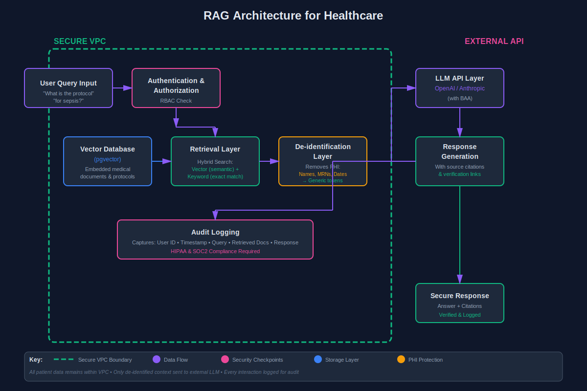
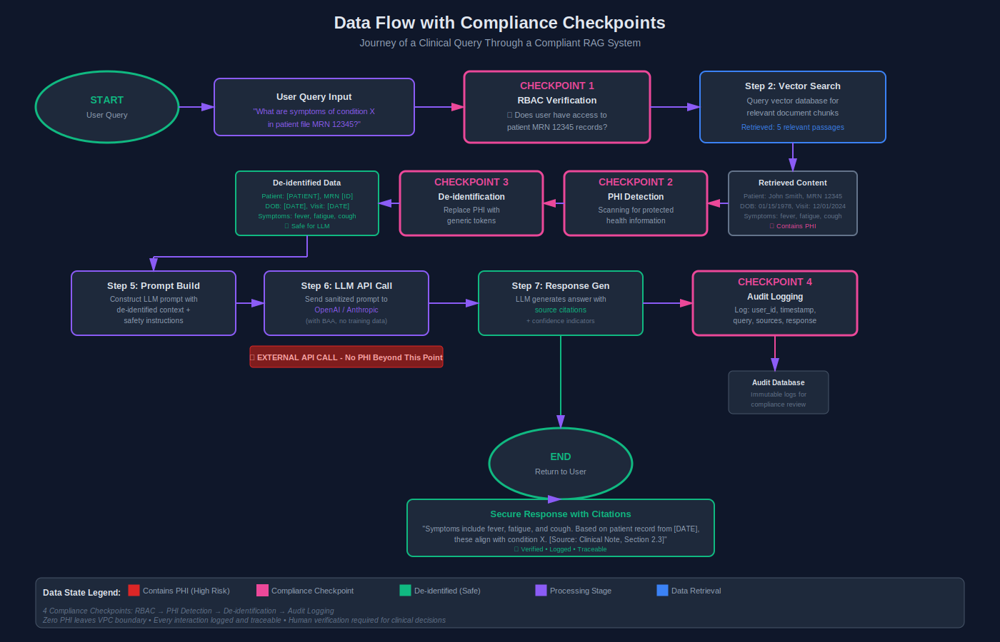
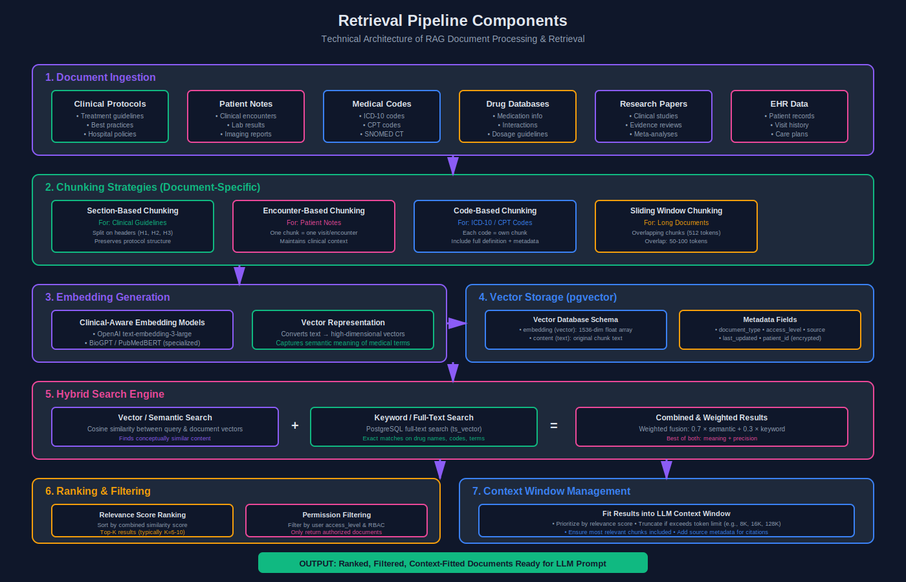
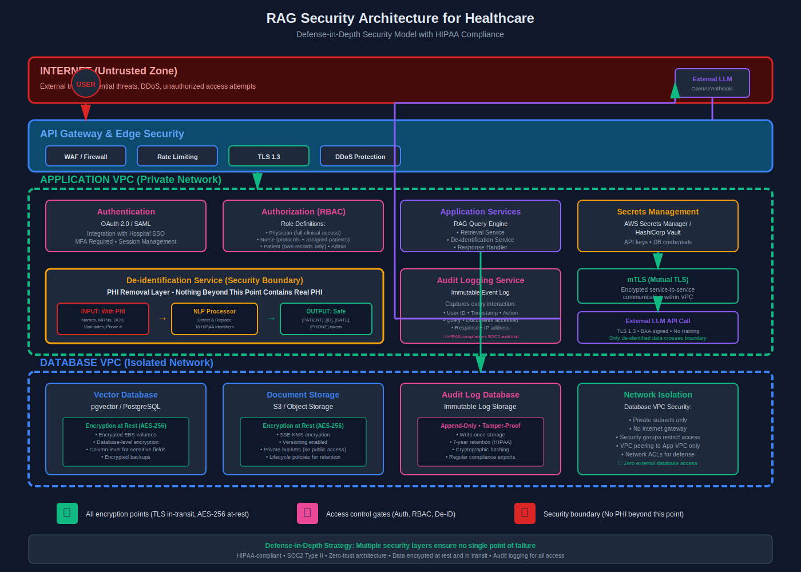

# RAG in Healthcare: How to Build AI Features Without Violating Every Compliance Framework

Everyone wants AI in their healthcare app. Few want to explain to auditors why patient data ended up somewhere it shouldn't.

I've spent the last couple years implementing AI features in healthcare systems, and the conversation always starts the same way: "Can we add ChatGPT to help doctors search patient records?" Sure. Right after we get a Business Associate Agreement from OpenAI, implement proper de-identification, set up audit logging, and convince your security team that yes, we actually know what we're doing.

Here's what I've learned building RAG pipelines that don't get you sued.

## RAG 101 for Healthcare: Why This Approach Actually Works

Retrieval-Augmented Generation is just a fancy way of saying "search your docs, then ask an LLM to answer questions about them." You're not fine-tuning models on patient data. You're not sending entire medical records to OpenAI's training pipeline.

The data stays in your vector database. The LLM only sees what you explicitly send in the prompt.

This matters in healthcare because fine-tuning means your patient data becomes part of the model. Even with vendor promises, that's a compliance nightmare. RAG keeps PHI in your infrastructure. The LLM is just reading comprehension, not memorization.

The core loop: user asks a question, you find relevant documents from your secure database, you construct a prompt with those docs, the LLM generates an answer. At no point does patient data train anything.

## Compliance-First Architecture: What Can Actually Leave Your VPC

Before you write any code, you need to classify your data. Not all healthcare data is created equal.

PHI (Protected Health Information) cannot hit third-party LLM APIs without explicit de-identification. Period. Clinical protocols, drug interaction databases, medical coding guidelines? Usually fine. Patient names, MRNs, visit dates? Absolutely not.

I built a clinical documentation search tool where we embedded the documents, stored vectors in a self-hosted pgvector instance, and only sent de-identified snippets to the LLM. The retrieval layer never left our VPC. The generation layer only saw "a 45-year-old patient with hypertension" instead of "John Smith, MRN 12345."

Your vector database needs to be in your infrastructure. I've used pgvector (Postgres extension), which works great if you're already on Postgres. Weaviate and Qdrant can be self-hosted. Pinecone and similar managed services are fine for non-PHI content, but read their BAAs carefully.

The rule: if you can't explain to an auditor exactly where every piece of data lives and who has access, don't build it.

## Building the Retrieval Layer: Chunking Medical Documents

Medical documents are not blog posts. You can't just split on paragraph breaks and call it a day.

I learned this the hard way when our first RAG prototype for clinical protocols kept returning half-sentences. Chunking matters. A lot.

For clinical guidelines, I chunk on section headers. For patient notes, I preserve the entire encounter context. For medical coding documentation, each code gets its own chunk with its full definition.

Embeddings for clinical text need to understand medical terminology. I've had good results with general-purpose models like OpenAI's text-embedding-3-large, but for specialized medical content, you might want BioGPT or clinical-specific embeddings.

Hybrid search (vector + keyword) is critical in healthcare. Sometimes you need exact matches on drug names or ICD codes. Pure semantic search will confidently tell you "acetaminophen" when you asked for "warfarin." Not great.

I use pgvector's cosine similarity for semantic search, combined with PostgreSQL's full-text search for exact matches. Weight them appropriately for your use case.

## Generation Layer Safely: The LLM Provider Problem

Here's the part that makes compliance officers nervous: sending anything to an external LLM API.

If you're using OpenAI, Anthropic, or similar, you need a Business Associate Agreement. Most major providers offer them now, but you have to ask. And you have to configure your API usage to opt out of training data collection.

Prompt engineering in healthcare is different. You can't just say "answer this question." You need to be explicit about uncertainty. My prompts always include: "If the provided context doesn't contain enough information to answer accurately, say so. Do not speculate on medical matters."

Hallucinations are bad in any domain. In healthcare, they're potentially lethal.

I add source citations to every response. The LLM must reference which document section it's using. This lets clinicians verify the answer against source material. Trust but verify isn't just good practice, it's required.

Temperature settings matter. I run medical Q&A at 0.1-0.3. Higher temperatures increase creativity, which is the opposite of what you want when answering "what's the correct dosage for this medication?"

## Security and Access Control: Who Queries What

Your RAG system needs the same access controls as your EHR.

I implement role-based access at the retrieval layer. Nurses can query nursing protocols but not physician-only clinical guidelines. Patients can search their own records but not others'. This happens before anything hits the vector database.

Audit logging is non-negotiable. Every query, every response, every document retrieved gets logged with user ID, timestamp, and context. SOC2 and HIPAA auditors will ask for these logs. You will be very glad you have them.

Rate limiting isn't just for preventing abuse. It's for catching compromised accounts. If a user suddenly runs 1000 queries in a minute, something's wrong.

## Real Use Cases I've Built

Clinical documentation search: Doctors query patient notes, lab results, imaging reports. We embed everything, de-identify for the LLM prompt, return answers with source citations. Cut documentation review time significantly.

Patient intake processing: RAG over internal clinical protocols to auto-suggest appropriate care pathways based on symptoms. Still requires human review, but it gives clinicians a head start.

Medical coding assistant: Search ICD-10 and CPT code databases. This one's great because coding databases aren't PHI. No de-identification needed. Just straight RAG over publicly available medical codes.

Protocol lookup: "What's our hospital's protocol for sepsis management?" RAG over internal clinical guidelines. Faster than Ctrl+F through PDF hell.

## What Can Go Wrong: Failure Modes Nobody Talks About

The "confident but wrong" problem is real. LLMs will confidently cite guidelines that don't exist. I've seen it hallucinate drug interactions, invent dosage recommendations, and create plausible-sounding but completely false medical facts.

Mitigation: source citations, human review, conservative prompts. Never deploy RAG as the sole source of truth for clinical decisions.

Data leakage happens when your chunking strategy accidentally puts PHI in "safe" documents. Example: a clinical guideline that includes a sample patient case with real data. Your de-identification layer better catch that.

Embedding drift is subtle. Your vector database is static, but medical knowledge updates constantly. You need a strategy for re-embedding when guidelines change. I run monthly re-indexing jobs for clinical protocols.

Context window limitations mean you can't always include all relevant documents. You have to prioritize. I rank by relevance score and recency, but sometimes the 5th-ranked document has the critical detail. There's no perfect solution.

## Start Small, Scale Carefully

Don't start by RAG-enabling your entire EHR. Start with non-PHI content.

I built my first healthcare RAG system over public clinical guidelines. No patient data, no BAAs, just proving the architecture works. Once that was solid, we added de-identified patient data. Then we tackled access controls and audit logging.

The checklist before you ship:
- Data classification documented
- Vector database in your infrastructure (or vendor with BAA)
- De-identification pipeline tested and validated
- LLM provider BAA signed
- Role-based access controls implemented
- Audit logging enabled
- Source citation in every response
- Human review process defined
- Incident response plan for hallucinations

RAG in healthcare is absolutely doable. Just don't skip the compliance stuff because you're excited about the technology. The auditors won't care how cool your embeddings are if patient data ended up in an S3 bucket somewhere.

Build it right, build it compliant, and build it with the assumption that you'll have to defend every architectural decision to someone who's never heard of vector databases.
