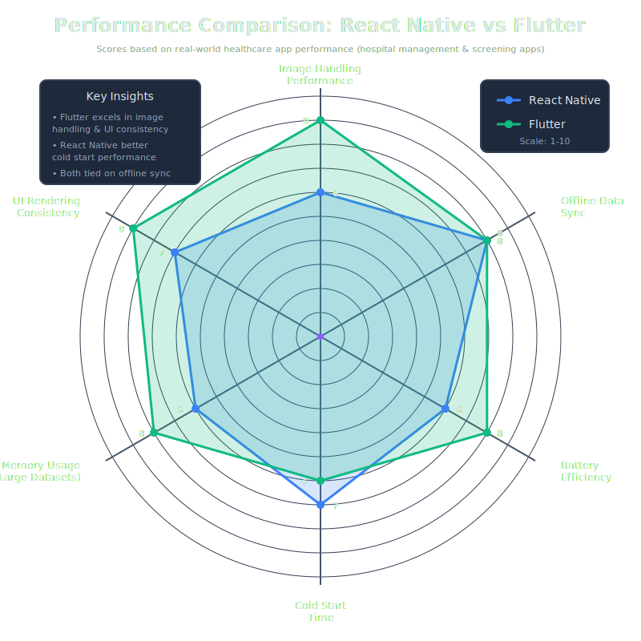
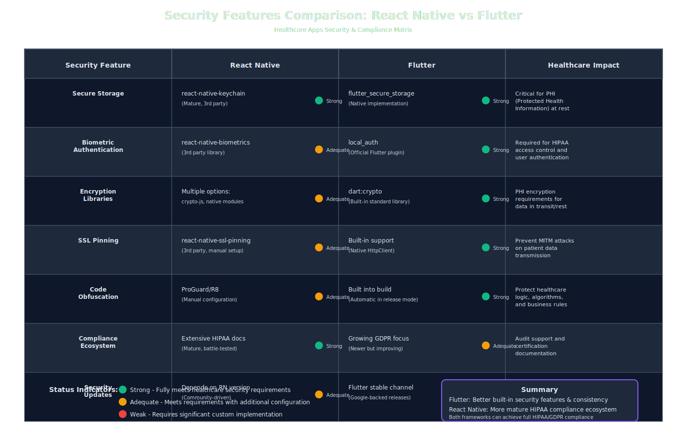
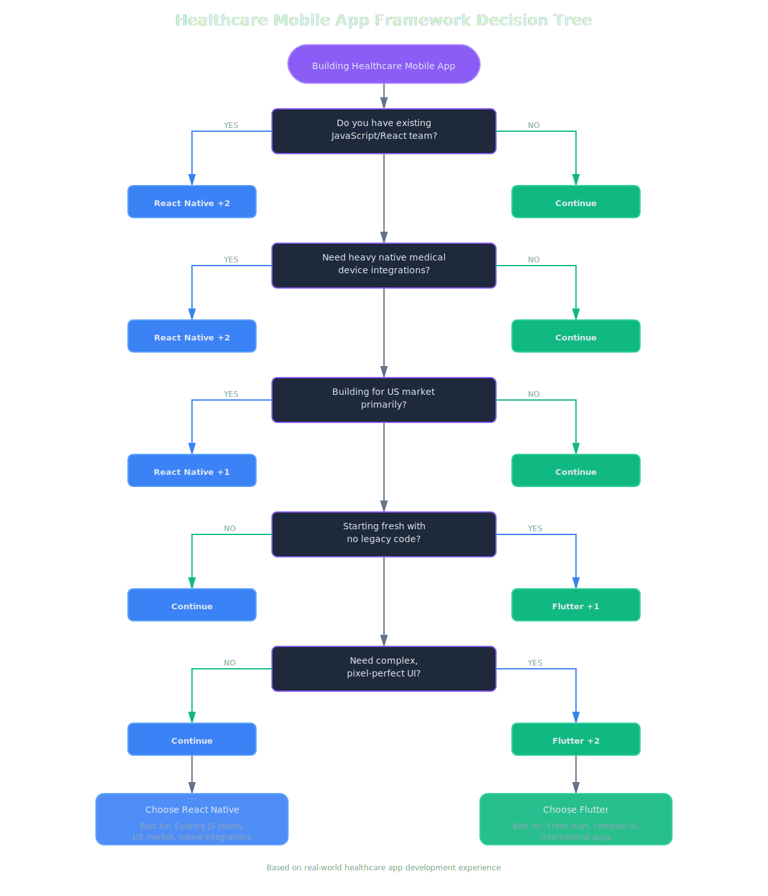

I've shipped healthcare apps in both. Here's what nobody tells you in comparison articles.

Most React Native vs Flutter posts are written by people who've only shipped one, or worse, neither. I've built a hospital management app serving 100+ US hospitals in React Native (HIPAA compliant) and a breast cancer screening app for the UK market in Flutter (GDPR compliant, multi-language). Here's what actually matters when you're dealing with real patient data.

## Quick Answer (For the Impatient)

**Pick React Native if:** You have a JavaScript team, need heavy integration with existing native modules, or are building for the US market where React Native developer density is higher.

**Pick Flutter if:** You're starting fresh, need pixel-perfect UI control, or are shipping to multiple countries with complex localization needs.

**Honest truth:** For 70% of healthcare apps, the framework choice matters less than your team's expertise and your integration requirements. The other 30%? That's where it gets interesting.

## Performance in Healthcare (Where It Actually Matters)

I learned this the hard way: performance in healthcare apps isn't about benchmark scores. It's about handling a 50MB DICOM image on a 3-year-old iPad that's been through hospital sterilization 500 times.

In my hospital management app (React Native), image handling was the first bottleneck. We were displaying X-rays and CT scans. React Native's bridge became an issue when passing large binary data between JavaScript and native code. We ended up writing a custom native module that kept images entirely on the native side and just passed handles to JavaScript.

Flutter handles this better out of the box. The Dart-to-native compilation means you're not serializing massive data across a bridge. For the UK screening app, we could display mammogram images without custom native code. The performance was predictably smooth.

**Offline capabilities:** Both handle offline well, but differently. React Native with Realm or WatermelonDB gave us rock-solid offline sync for hospital data. Flutter's Hive and Drift are similarly capable. The difference? React Native has more battle-tested healthcare-specific offline libraries because it's been around longer.

**Battery life:** Flutter edges ahead here. The compiled nature means less CPU churn. In clinical settings where devices run 12-hour shifts, this matters. Our hospital app had complaints about battery drain that we traced back to JavaScript garbage collection patterns.

## Security & Compliance (Where Lawyers Get Involved)

Both can be HIPAA and GDPR compliant, but the paths differ.

**React Native** has mature libraries for secure storage (react-native-keychain), encryption (crypto-js, though we used native modules), and biometrics (react-native-biometrics). The ecosystem is well-documented for compliance because so many fintech and healthtech companies have walked this path.

**Flutter's** approach feels more cohesive. The `flutter_secure_storage` package, `local_auth` for biometrics, and built-in encryption libraries feel like they were designed to work together. For the UK screening app, implementing biometric authentication took maybe an hour versus the half-day it took in React Native.

Here's the thing: HIPAA compliance is about process more than technology. Both frameworks can do everything you need. But React Native has more consultants, more compliance documentation, and more "we've been audited" third-party libraries. If you're in the US market and facing your first HIPAA audit, that ecosystem maturity reduces risk.

## Development Experience (The Daily Reality)

**Learning curve:** If your team knows JavaScript, React Native is a weekend to competence. Flutter requires learning Dart. It's not hard (Dart is lovely), but it's real friction. For the UK project, I brought on two devs who'd never touched Dart. They were productive in a week, but React Native would've been day one.

**Hot reload:** Flutter's hot reload is witchcraft. It's consistently faster and more reliable than React Native's. When you're tweaking complex UI (like medical forms with conditional logic), this compounds into hours saved per week.

**Debugging:** React Native debugging is... JavaScript debugging. You know what you're getting. Flutter's DevTools are excellent, but the stack traces when something goes wrong in production are harder to parse. In healthcare, where bugs can affect patient care, debuggability matters enormously.

## Healthcare Ecosystem (The Make-or-Break Factor)

This is where React Native currently wins, and it's not close.

**HL7 FHIR:** Both have FHIR client libraries, but React Native's are more mature. The hospital management app integrated with Epic, Cerner, and Meditech systems. Every integration required FHIR. The React Native libraries had been battle-tested by dozens of healthcare companies.

**Bluetooth medical devices:** We needed to connect to patient monitors, glucometers, and pulse oximeters. React Native's BLE libraries (react-native-ble-plx) have been used with every major medical device. Flutter's `flutter_blue` works, but documentation for specific devices is sparse. We spent weeks figuring out edge cases that React Native developers had already documented.

**Native modules:** When you inevitably need something custom (we needed SDK integration for medical imaging), React Native's native module system is more documented. More Stack Overflow answers. More healthcare-specific examples.

## Real Projects: My Case Studies

**The UK screening app (Flutter):** We chose Flutter because we needed identical UI across iOS and Android, support for 8 languages with RTL text (Arabic, Urdu), and we were building from scratch with no legacy integrations. Flutter's widget system made complex, localized UI manageable. The breast cancer screening flow had dozens of conditional questions that needed to look and feel identical everywhere. Flutter delivered.

**The US hospital app (React Native):** We inherited an iOS app that needed Android parity, had existing integrations with Epic's FHIR endpoints, and needed to integrate a proprietary medical imaging SDK that only had iOS and Android native libraries. React Native let us reuse the business logic, wrap the native SDKs cleanly, and tap into the mature healthcare-specific npm ecosystem. The JavaScript team could contribute to mobile without learning a new language.

## Long-Term (The Bet You're Really Making)

**Maintainability:** Flutter feels more maintainable. The type safety, null safety, and clearer separation of concerns mean less spaghetti code over time. Our React Native hospital app has areas that are honestly frightening to touch after three years and four developer rotations.

**Finding developers:** In the US, React Native developers are easier to find and generally less expensive. Flutter's growing, but React Native's been around longer. For healthcare companies outside major tech hubs, this matters.

**Framework stability:** React Native's had some turbulent years (the great architecture overhaul, Facebook's wavering commitment). Flutter has Google's clear support and faster evolution. But React Native's new architecture is solid now, and the community is strong enough to survive even if Meta stepped back.

## My Current Default

If I'm starting a new healthcare app today? I pick based on this decision tree:

- **Existing JavaScript team + US market + heavy native integrations** = React Native
- **Fresh start + international + complex UI + long-term maintainability matters** = Flutter
- **Tight budget + need developers quickly in US** = React Native
- **Performance-critical + image-heavy + need predictable behavior** = Flutter

Personally? I'm leaning Flutter for new projects. The development experience is better, the performance is more predictable, and the code I write today will be more maintainable in three years. But I wouldn't rewrite the hospital app. React Native is serving 100+ hospitals just fine, and the ecosystem advantage for healthcare integrations is real.

The unsexy truth: both are good enough. Your choice should depend more on your team, your integrations, and your market than on framework benchmarks.
