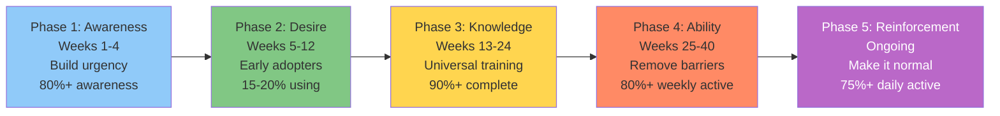

[92% of organizations say culture and change management are their primary barrier](https://sloanreview.mit.edu/projects/the-emerging-agentic-enterprise-how-leaders-must-navigate-a-new-age-of-ai/) to becoming AI-driven.

Not technology. Not budget. Not talent.

**Culture**.

And here's the part that surprised me: [45% of CEOs report their employees are resistant or even hostile to AI](https://www.hrdive.com/news/employers-employees-resistant-hostile-to-AI/749730/).

Think about that. You can buy the best AI models. You can hire data scientists. You can build platforms.

But if your employees won't use it—or worse, actively resist it—none of that matters.

[McKinsey's research shows](https://www.mckinsey.com/capabilities/quantumblack/our-insights/the-state-of-ai) that workflow redesign is **3x more predictive of AI success** than technology choice.

The bottleneck isn't technical. It's organizational.

Let me break down why this happens and what to do about it.

## The stat that made me rethink everything

I kept seeing AI projects succeed technically but fail organizationally.

Then I found this from [McKinsey](https://www.mckinsey.com/capabilities/quantumblack/our-insights/the-state-of-ai):

> "Half of those AI high performers intend to use AI to transform their businesses, and most are redesigning workflows. High performers are also nearly **three times as likely** as others to say their organizations have fundamentally redesigned individual workflows."

**3x more likely.**

Not "use better AI models." Not "hire more data scientists."

**Redesign workflows.**

And here's what [MIT found](https://sloanreview.mit.edu/projects/the-emerging-agentic-enterprise-how-leaders-must-navigate-a-new-age-of-ai/):

> "Ninety-two percent of survey respondents said they feel that cultural and change management challenges are the primary barrier to becoming data- and AI-driven. This suggests that any technology alone is insufficient."

**92%**.

The technology works. The problem is getting organizations to actually change how they work.

## Why employees resist AI (and it's not what you think)

Let's talk about the resistance problem.

[45% of CEOs say their employees are resistant or hostile to AI](https://www.hrdive.com/news/employers-employees-resistant-hostile-to-AI/749730/).

But when you dig into the research, the reasons are more complex than "people fear job loss."

### The five types of resistance

From [multiple surveys](https://www.beautiful.ai/blog/2025-ai-workplace-impact-report) in 2025:

| Resistance Type | % Affected | Root Cause | Solution |
|----------------|-----------|------------|----------|
| **Job Security Fear** | 64% | Fear AI makes them less valuable/replaceable | Position as "AI + Human" not "AI vs Human" |
| **Skills Anxiety** | 44% | Don't know how to use AI for their job | Role-specific training, not generic |
| **Trust Issues** | 40% | Inconsistent AI outputs create doubt | Clear guidance on when to trust AI |
| **Change Fatigue** | 39% | History of failed tool rollouts | Prove ROI before mandating adoption |
| **Social Conformity** | 37% | Peers don't use it, so neither will I | Build critical mass with early adopters |

Key insight: These aren't refusals—they're symptoms of bad change management.

### The surprising finding

Despite all this resistance, [65% of employees say they're excited about using AI at work](https://www.gartner.com/en/newsroom/press-releases/2025-12-16-gartner-hr-survey-finds-65-percent-of-employees-are-excited-to-use-ai-at-work).

**65% excited, 45% resistant.**

How is that possible?

The answer: **It depends on how AI is introduced**.

When AI is:
- Mandatory without explanation → Resistance
- Poorly integrated into workflows → Resistance
- Positioned as "replacement" → Resistance
- Introduced with training and support → Excitement

The resistance isn't to AI itself. It's to **bad change management**.

## The productivity paradox (aka the J-curve nobody warned you about)

Here's what actually happens when you deploy AI.

[MIT Sloan documented this](https://mitsloan.mit.edu/ideas-made-to-matter/productivity-paradox-ai-adoption-manufacturing-firms):

> "AI introduction frequently leads to a measurable but temporary decline in performance followed by stronger growth in output, revenue, and employment."

Productivity **goes down** before it goes up.

**The timeline**:
- **Months 0-3**: Productivity drops 10-15% (learning curve)
- **Months 3-6**: Slow recovery to baseline
- **Months 6-12**: Productivity gains emerge (20-30% improvement)
- **Months 12-18**: Full impact realized (30-50% improvement)

And here's the killer:

> "The negative impact of AI adoption was most pronounced among **established firms**. Such organizations typically have long-standing routines, layered hierarchies, and legacy systems that can be difficult to unwind."

Established companies struggle more than startups because they have more organizational inertia.

### Why the dip happens

During the learning curve:
- Employees figuring out new tools
- Making mistakes with AI outputs
- Double-checking everything (trust not established)
- Existing workflows disrupted
- Team communication patterns change

It's **necessary** learning, but it looks like failure if you measure too early.

This is why MIT found 95% failure at 6 months (measured during the dip) while Wharton found 74% success at 12-18 months (measured after recovery).

## What leadership gets wrong

[MIT Sloan found something damning](https://mitsloan.mit.edu/ideas-made-to-matter/productivity-paradox-ai-adoption-manufacturing-firms):

> "Leaders seem to have little interest in identifying the barriers that prevent their organizations from becoming more data-driven, never mind allocating technical resources or personnel to break down the barriers."

Translation: Leaders sponsor AI pilots but don't address organizational barriers.

### The five leadership mistakes

**1. Sponsoring pilots without committing to transformation**
- Launch 10 pilots
- "Let's see what works"
- None get resources to scale
- Result: Pilot purgatory

**2. Measuring activities instead of outcomes**
- Track: Number of AI pilots launched
- Track: Employees trained
- Track: AI tools purchased
- Don't track: Business impact, workflow changes, EBIT improvement

**3. Adding AI to existing processes instead of redesigning**
- "Let's give our support agents an AI tool"
- Agents ignore it (doesn't fit their workflow)
- Conclusion: "AI doesn't work for us"

**4. Expecting immediate ROI (6-month timelines)**
- Deploy AI in Q1
- Measure impact in Q2
- See productivity dip (the J-curve)
- Kill the project

**5. No change management investment**
- Spend $500K on AI technology
- Spend $0 on training, communication, workflow redesign
- Wonder why adoption fails

### What McKinsey actually found

[The research is clear](https://www.mckinsey.com/capabilities/quantumblack/our-insights/the-state-of-ai):

> "The biggest barrier to success is leadership... Higher-impact vertical, or function-specific, use cases seldom make it out of the pilot phase because of organizational and cultural barriers—not technical ones."

**The barriers are organizational**:
- Workflow integration
- Change management
- Governance
- Decision rights
- Resource allocation

**Not technical**:
- Model accuracy
- Infrastructure
- Data quality

The technology is the easy part now.

## The workflow redesign imperative

Here's the most important finding from all the research.

High performers are [3x more likely to fundamentally redesign workflows](https://www.mckinsey.com/capabilities/quantumblack/our-insights/the-state-of-ai).

Not "add AI to existing workflows." **Redesign the workflow**.

### What this actually means

**Bad approach**: Add AI to existing process
- Current process: Customer calls → Agent searches knowledge base → Agent drafts response → Supervisor reviews → Send to customer
- Add AI: Give agent an AI suggestion tool
- Result: 5-10% efficiency gain, low adoption

**Good approach**: Redesign process with AI at core
- New process: Customer contacts → AI agent handles tier 1 → Complex cases escalate to human with AI copilot → Human approves/edits → Send
- Result: 43% ticket deflection, 30-50% cost reduction

See the difference?

The bad approach treats AI as an add-on. The good approach treats AI as a core component.

### Why redesign matters

[McKinsey put it this way](https://www.mckinsey.com/capabilities/quantumblack/our-insights/the-state-of-ai):

> "This intentional redesigning of workflows has one of the strongest contributions to achieving meaningful business impact of all the factors tested."

Stronger than:
- Choice of AI model
- Size of AI team
- Amount of training data
- Infrastructure spend

**Workflow redesign trumps everything else.**

### How to actually redesign workflows

The framework high performers use:

**Step 1: Map the current workflow**
- Document every step
- Identify decision points
- Note pain points and bottlenecks
- Measure time and cost per step

**Step 2: Identify what AI could enable (not just automate)**
- Don't ask: "What can we automate?"
- Ask: "What becomes possible with AI?"
- Focus on enabling new capabilities, not just efficiency

**Step 3: Redesign from scratch**
- If you were designing this workflow today with AI, what would it look like?
- Where is AI the primary interface vs. supportive tool?
- Where do humans add unique value?

**Step 4: Define new roles and responsibilities**
- What do employees do differently?
- What skills do they need?
- Who makes decisions now?
- What gets escalated vs. auto-handled?

**Step 5: Implement with change management**
- Train employees on new workflow (not just AI tool)
- Pilot with volunteers
- Iterate based on feedback
- Scale gradually

## The reskilling reality: 59% need upskilling by 2030

[World Economic Forum's 2025 report](https://www.weforum.org/stories/2025/01/future-of-jobs-report-2025-jobs-of-the-future-and-the-skills-you-need-to-get-them/) dropped a stat that stopped me:

**59 out of 100 workers globally will require reskilling or upskilling by 2030 due to AI.**

That's 3.5 billion people.

And here's the scary part: **11 of those 100 are unlikely to receive the training they need**.

That's over 750 million workers at medium-term risk of redundancy.

### What skills matter

The [WEF study shows](https://www.weforum.org/stories/2025/01/future-of-jobs-report-2025-jobs-of-the-future-and-the-skills-you-need-to-get-them/) it's not just technical skills:

**Top skills for 2030**:
1. Analytical thinking
2. Creative thinking
3. AI and big data (technical)
4. Leadership and social influence
5. Resilience, flexibility, and agility
6. Curiosity and lifelong learning
7. Technological literacy
8. Empathy and active listening

Notice: Only 2 of 8 are purely technical.

The rest are **human skills** that complement AI.

### What actually works: IBM and Google programs

**IBM SkillsBuild** results:
- [Over 80% feel more professionally ready](https://www.ibm.com/think/insights/ai-upskilling) after completing
- Pilot enterprises report double-digit increases in employee upskilling
- Measurable reductions in external training costs

**Google Career Certificates**:
- [1 million+ graduates globally](https://grow.google/employers/)
- [70%+ report positive career outcomes](https://grow.google/employers/) within 6 months (new job, promotion, or raise)

**The pattern**: Structured programs with credentials work better than ad-hoc training.

### The business case for reskilling

**Cost to reskill existing employee**: $2,000-$10,000

**Cost to hire new AI-skilled employee**:
- Salary: $150,000-$300,000
- Recruiting: $30,000-$50,000
- Onboarding: 3-6 months lost productivity

**Plus**: You keep institutional knowledge with reskilling.

**ROI**: 3-5x return on reskilling vs. external hiring.

## The change management framework that works

Based on [MIT](https://sloanreview.mit.edu/projects/the-emerging-agentic-enterprise-how-leaders-must-navigate-a-new-age-of-ai/), [McKinsey](https://www.mckinsey.com/capabilities/quantumblack/our-insights/the-state-of-ai), and Prosci methodologies, here's what actually works:

### Phase 1: Awareness (Weeks 1-4)

**Goal**: Build urgency and understanding

**Actions**:
- CEO/CAIO communicates AI strategy
- Emphasize "AI + Human" not "AI vs Human"
- Town halls with Q&A (address job security directly)
- Showcase pilot successes

**Success metric**: 80%+ employee awareness of AI strategy

### Phase 2: Desire (Weeks 5-12)

**Goal**: Shift from "I have to" to "I want to"

**Actions**:
- Early adopter program (recruit 10-15% enthusiasts)
- Co-design workflows with employees (they own the solution)
- Incentivize AI skill development (tie to performance reviews)
- Celebrate wins publicly

**Success metric**: 15-20% actively using AI tools

### Phase 3: Knowledge (Weeks 13-24)

**Goal**: Universal AI literacy

**Actions**:
- **Level 1 (all employees)**: AI literacy, prompt engineering basics (4 hours)
- **Level 2 (power users)**: Advanced techniques, domain-specific tools (20 hours)
- **Level 3 (specialists)**: Technical deep dive, fine-tuning, evaluation (100+ hours)

**Success metric**: 90%+ complete Level 1 training

### Phase 4: Ability (Weeks 25-40)

**Goal**: Remove barriers, provide tools

**Actions**:
- Universal access to AI tools
- Embed AI into existing workflows (not separate tools)
- Train managers to coach AI adoption
- Update SOPs and documentation

**Success metric**: 80%+ weekly active users

### Phase 5: Reinforcement (Ongoing)

**Goal**: Make AI the new normal

**Actions**:
- Monthly innovation showcases
- AI community of practice
- Track productivity gains per team
- Celebrate milestones

**Success metric**: 75%+ daily active users

## Real company examples: what worked

### DBS Bank: Cultural Transformation Precedes Technology

CEO Piyush Gupta's approach:
- Trained all 28,000 employees in agile and data analytics
- Championed "28,000-person startup" mindset
- Redesigned every customer journey with AI at core
- Built "fail-fast" culture

**Result**: $1B+ in value from 1,500+ AI models

**Key insight**: "Cultural transformation precedes technological transformation"

### Klarna: Workflow Redesign, Not Technology Add-On

They didn't add AI to customer service. They redesigned customer service around AI:
- AI handles 65% of volume (tier 1)
- Humans handle complex cases with full context
- Roles changed: From "answer questions" to "relationship building"

**Result**: $40M profit improvement, 12-18x ROI

### General Mills: Worker Co-Design

They involved factory workers in designing AI solutions for quality control:
- Workers identified pain points
- Co-designed AI applications
- Saw tangible benefits (reduced waste, easier jobs)

**Result**: $50M+ waste reduction, high worker buy-in

**Key lesson**: When workers design the solution, they become champions not resistors.

## What I learned from the research

After going through all the studies, case studies, and frameworks, here are my takeaways:

**1. The 92% barrier is real**

Culture and change management beat technology every time. You can't tech your way out of an organizational problem.

**2. The 3x workflow redesign multiplier**

High performers fundamentally redesign workflows. It's **3x more predictive of success** than technology choice.

You need to change how work gets done, not just add AI tools.

**3. The J-curve is inevitable**

Productivity will dip before it rises. Budget for 12-18 months for full impact. Don't measure at month 3 and panic.

**4. Employee resistance is addressable**

65% are excited about AI (when introduced well). The 45% resistance comes from bad change management, not inherent opposition.

**5. Reskilling beats hiring**

3-5x ROI on reskilling existing employees vs. external hires. Plus you keep institutional knowledge.

## Your action plan

If you're struggling to scale AI:

**Stop doing**:
- [ ] Launching more AI pilots without scaling existing ones
- [ ] Adding AI to existing processes without redesign
- [ ] Measuring at 3-6 months (the productivity dip)
- [ ] Expecting technology alone to drive change

**Start doing**:
- [ ] Fundamentally redesign workflows (3x multiplier)
- [ ] Invest in change management (budget 30-50% of AI spend)
- [ ] Set 12-18 month ROI timelines
- [ ] Train employees at 3 levels (literacy, power users, specialists)
- [ ] Involve employees in workflow co-design
- [ ] Measure outcomes (EBIT impact) not activities (pilots launched)

**The framework**:
1. **Awareness** (weeks 1-4): Communicate strategy, address fears
2. **Desire** (weeks 5-12): Early adopters, co-design, incentives
3. **Knowledge** (weeks 13-24): Training at 3 levels
4. **Ability** (weeks 25-40): Tools, integration, manager support
5. **Reinforcement** (ongoing): Community, recognition, measurement

## The bottom line

The technology isn't your bottleneck.

Your organization is.

**92% of companies cite culture and change management** as their primary barrier to AI success.

**45% of employees are resistant or hostile**—not to AI itself, but to how it's being introduced.

**Workflow redesign is 3x more predictive** of success than technology choice.

The companies winning at AI:
- Redesign workflows fundamentally (not just add AI)
- Invest in change management (30-50% of AI budget)
- Set realistic timelines (12-18 months for full ROI)
- Reskill employees (not replace them)
- Involve workers in co-design (champions not resistors)

The losers:
- Bolt AI onto existing processes
- Spend 100% on technology, 0% on change management
- Expect 6-month ROI
- "Train" with a 30-minute video
- Top-down mandates

The choice is yours.

You can buy the best AI. But if you don't fix organizational barriers, you'll join the 63% stuck in pilot purgatory.

Or you can build organizational capability first. And join the 6% capturing real value.

---

## Coming up next

In Part 7 (the final part), I'll cover AI transparency and the innovation debate. Anthropic's mechanistic interpretability breakthrough was named MIT Technology Review's breakthrough of 2026. But is AI innovation slowing down or just maturing? Expert predictions range from "AGI in 2026" (Dario Amodei) to "decades away" (Gary Marcus). Here's what the data actually shows.

**Read Part 7**: [AI Transparency and the Innovation Debate](./ai-transparency-innovation-debate-whats-next)

---

## Series Navigation

1. [Part 1: Why 94% of Companies Struggle with AI](./state-of-ai-2025-why-94-percent-fail)
2. [Part 2: The GenAI Paradox](./genai-paradox-37b-spent-95-percent-fail)
3. [Part 3: AI Governance is No Longer Optional](./ai-governance-eu-ai-act-compliance-guide)
4. [Part 4: From MLOps to LLMOps](./mlops-to-llmops-modern-ai-infrastructure)
5. [Part 5: The Rise of the Chief AI Officer](./chief-ai-officer-rise-organizational-models)
6. **Part 6: Scaling AI - Why Technology Isn't the Bottleneck** ← You are here
7. [Part 7: AI Transparency and the Innovation Debate](./ai-transparency-innovation-debate-whats-next)
