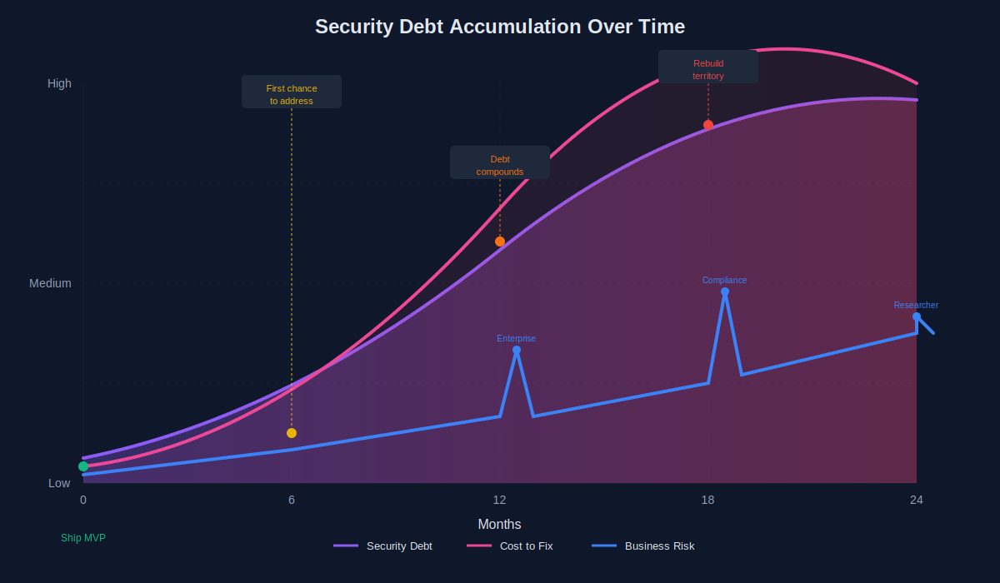
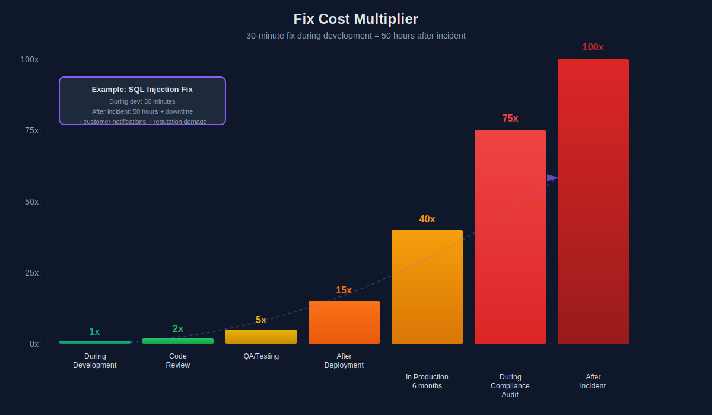
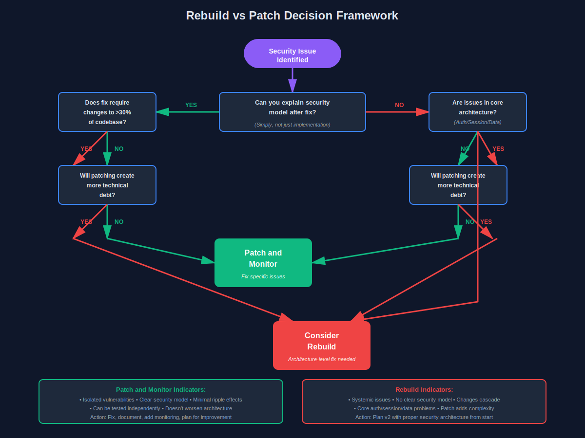

I fix other people's security mistakes for a living. Here's what keeps showing up.

I've been hired to "fix a few security issues" more times than I can count. It's never a few issues. Last month, a client called about some "minor authentication problems" in their healthcare app. Two weeks into the audit, we'd found hardcoded AWS credentials in 47 commits, PHI in error messages, and SQL injection vulnerabilities that would make a CS101 student wince.

This is what happens when security becomes a "we'll add it later" problem.

## The Four Disaster Scenarios I See Repeatedly

**The "Move Fast" Startup**

They shipped fast, got users, raised funding. Now they're scaling and someone actually read the security section of their SOC 2 requirements. The codebase is held together with API keys in environment variables that 12 different people have access to. Nobody knows which keys are actually in use. The authentication system was copied from a tutorial and never updated.

**The "Developer Left" Company**

The founding engineer built everything, hardcoded their personal OAuth tokens for third-party services, then left. Nobody knows how the payment processing works. The production database password is in a screenshot in Slack from 2022. They found out during a security questionnaire from an enterprise customer.

**The "We Passed Audit" Organization**

They got their compliance certification two years ago and assume they're fine. The audit checked boxes: "Do you have password requirements? Yes." What it didn't catch: password reset tokens that never expire, session management that lets you stay logged in for 90 days, and user enumeration on every form.

**The "It's Internal" App**

It started as an internal tool, so security wasn't a priority. Then they added a partner portal. Then customer access. Then mobile apps. The security model is still "if you have the URL, you can access it." I've seen production admin panels that were literally just checking `if (req.user.email.includes('company.com'))`.

## Real Vulnerabilities I've Found (Names Changed)

**Hardcoded Credentials in Git History**

A company had rotated their database password three times because of "suspicious activity." The issue? Every single password was still in git history, going back 18 months. Along with Stripe keys, SendGrid tokens, and someone's personal GitHub access token. Cost to fix: rebuilding the entire git history and rotating every credential they'd ever used.

**SQL Injection in 2024**

Yes, really. String concatenation in a Node.js app copied between three different projects. The developer knew about parameterized queries but thought it "didn't matter for internal admin stuff." It was behind authentication, but the authentication could be bypassed with SQL injection in the login form. Perfect circle of security theater.

**PHI in Error Messages**

A healthcare platform was logging full patient records in error messages. Not just in application logs, but in their error tracking service that their entire engineering team had access to. They'd been doing this for two years. The fix required rebuilding their entire logging infrastructure and notifying regulators.

**Unprotected Admin Endpoints**

The API had proper authentication on user-facing endpoints. Admin endpoints were "protected" by not being documented. Anyone who found `/api/admin/users` could list all users, modify permissions, or delete accounts. They found out when a security researcher sent a polite email with proof.

**API Keys in Mobile Bundles**

Every user's mobile app had the master API key bundled in the JavaScript. When I pointed this out, they said "but it's minified." `strings your-app.js` is not stopped by minification. They had to rebuild their entire API authentication system.

## The True Cost Breakdown

**Developer Time to Fix Properly**

That SQL injection? It wasn't in one place. Pattern-matched across the codebase: 89 instances. Each needed to be fixed, tested, and verified. What would have taken 30 seconds per feature during development became three weeks of dedicated engineering time.

**Business Disruption**

You can't fix authentication while the app runs normally. Security patches mean scheduled downtime, invalidated user sessions, mobile apps needing forced updates. I've seen companies email every customer to reset passwords because the reset system itself was compromised.

**The v1 to v2 Rebuild Reality**

Sometimes patching isn't enough. I've recommended full rebuilds four times in my career. Each time security was so fundamentally broken that fixing it meant changing how every component worked. The companies that did the rebuild are still in business. The ones that tried patching spent 2x as long and ended up rebuilding anyway.

## When Patching Isn't Enough

There's a moment in every bad audit where you realize you're not fixing bugs, you're fixing architecture.

Your authentication is stateless JWT tokens that never expire and can't be invalidated. You can't add session management without changing every API endpoint. That's not a patch.

Your authorization is scattered across 50 files with no consistent pattern. Some routes check `req.user.role === 'admin'`, some check `req.user.isAdmin`, some check nothing. You need a centralized authorization layer.

Your database has user data mixed with operational data in ways that make access controls impossible.

**How to evaluate:** Can you clearly explain the security model after the fix? Not the implementation—the model. If you can't explain it simply, you're not fixing it, you're adding duct tape.

## How to Not Be This Client

**Security Basics That Take Minimal Extra Time**

Use authentication libraries. Passport, NextAuth, Flask-Login, Django auth. Takes the same time as bad custom auth, but you get session management, password hashing, and CSRF protection for free.

Parameterize queries. Every ORM does this by default: `db.query('SELECT * FROM users WHERE id = ?', [userId])`. That question mark saves you from SQL injection.

Don't put secrets in code. Use a secrets manager or at minimum, a `.gitignore`'d `.env` file.

**Code Review Checklist**

Before merging any PR touching auth, authorization, or data access:

- Can I access this without being logged in?
- Can I access someone else's data by changing an ID in the URL?
- Are we logging any sensitive data in this error message?
- Is this input validated before we use it in a query?

Four questions. Catches most issues.

**Security in CI/CD**

Add `npm audit` or `pip-audit` to your pipeline. 30 seconds to run. Catches known vulnerabilities in dependencies.

Run static analysis. ESLint and Pylint have security plugins. They catch `eval()` usage, hardcoded secrets, and injection patterns.

## When to Call for Help

**Signs You Need an Audit**

You're handling payments, healthcare data, or anything regulations care about. Just do the audit. Cheaper than the fine.

You're signing an enterprise customer requiring security review. Find the issues before they do.

Someone on your team said "I'm not sure if this is secure" and nobody knew the answer.

**Red Flags in Your Codebase**

Searching "password" returns 47 files and most aren't in your auth system.

Your authentication middleware is 50+ lines with multiple try-catch blocks.

You have different auth schemes for different parts of the app. Sessions here, JWTs there, API keys somewhere else.

Nobody can explain how admin permissions work.

## The Bottom Line

You don't have to be perfect. You just have to be intentional. Add security as you build, not after you realize you needed it.

The companies I work with aren't bad at engineering. They're good engineers who shipped fast and assumed they'd fix security later. The problem is "later" arrives as an emergency, not a scheduled task.

---

*Aaron Dsilva rebuilds broken v1 systems into secure, scalable v2s. He's seen what goes wrong and helps teams fix it before it becomes a crisis.*
