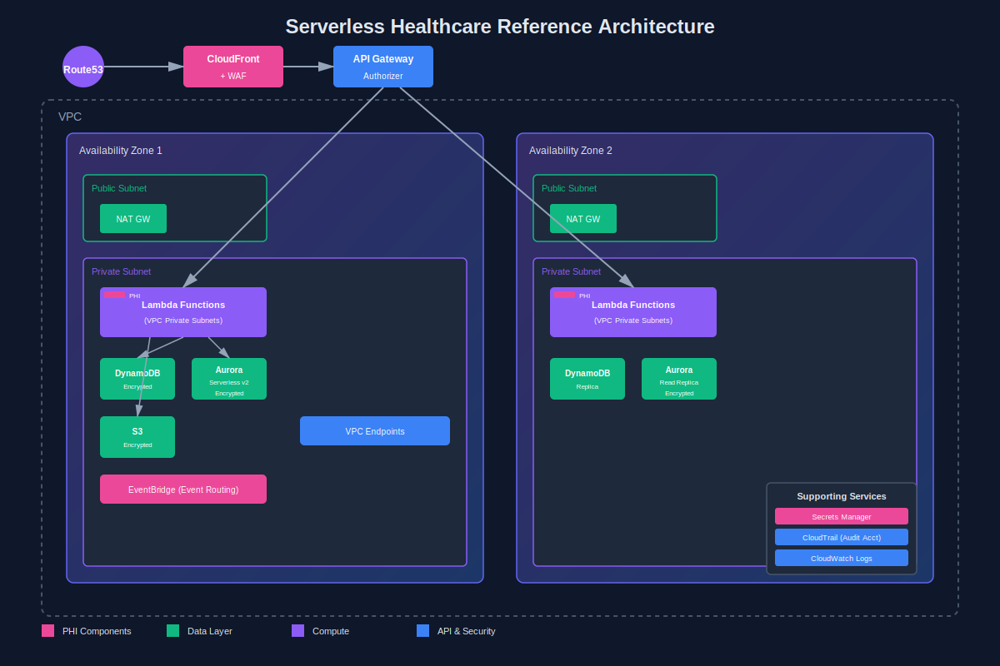
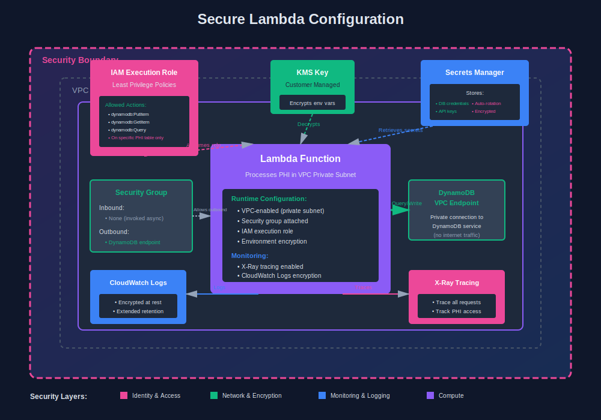
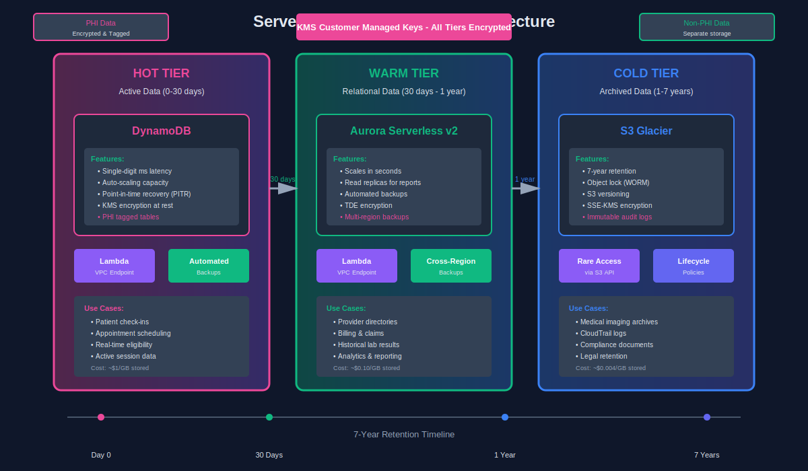
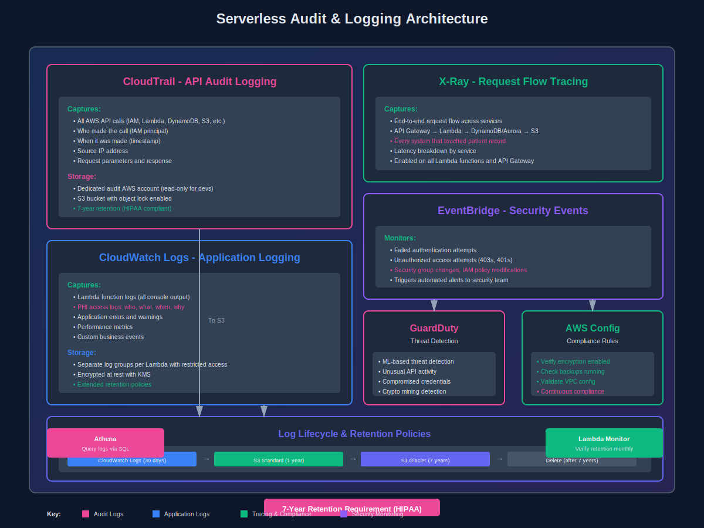

Serverless sounds great until an auditor asks "where does the patient data actually live?" Here's how to answer confidently.

I manage AWS infrastructure for healthcare systems serving 100+ hospitals. When I first proposed serverless, our compliance team looked at me like I'd suggested storing patient records in a public S3 bucket. Three years and multiple successful audits later, here's what actually works.

## Serverless Healthcare Architecture Overview

The basic pattern is Lambda + API Gateway + DynamoDB for most transactional workloads. Think patient check-ins, appointment scheduling, real-time eligibility checks. Aurora Serverless v2 handles the relational stuff like provider directories and billing.

This architecture fits healthcare because most operations are spiky. 8 AM Monday morning? Hundreds of concurrent check-ins. 2 AM Wednesday? Crickets. You're not paying for idle capacity, and you're not scrambling to scale during flu season.

The cost model makes sense when you're HIPAA compliant by default. You're already encrypting everything, logging everything, and restricting everything. Serverless forces you into these patterns anyway. No more "we'll add encryption later" technical debt.

But here's the thing: compliance comes first, serverless second. If the architecture can't prove data residency or maintain audit trails, it doesn't matter how cheap it is.

## Lambda Security for PHI

Yes, you need VPC configuration. I know Lambda technically doesn't "need" it, but try explaining to an auditor why your function processing patient records has unrestricted internet access. Put it in a VPC with private subnets.

Your Lambda execution role should follow strict least privilege. If it's processing lab results, it gets DynamoDB access to the lab results table. Nothing else. No wildcard policies, no "we'll lock it down later." I've seen teams fail audits over this exact issue.

Secrets Manager, not environment variables. Database credentials, API keys, encryption keys—they all go in Secrets Manager with automatic rotation enabled. Environment variables are visible in the console and CloudTrail logs. That's a finding waiting to happen.

Encryption in transit and at rest isn't optional. Every Lambda that touches PHI needs TLS 1.2+ for all external connections. Use AWS SDK v3's built-in encryption for data at rest. Tag every resource with data classification so you can prove which functions handle PHI.

## API Gateway as Security Front Door

Cognito or custom authorizers—pick one and implement it properly. For B2B integrations, I prefer custom authorizers with mutual TLS. For patient portals, Cognito User Pools with MFA enabled.

Request validation happens at API Gateway, not Lambda. Define JSON schemas for every endpoint. Invalid requests get rejected before they cost you a Lambda invocation or touch your data layer. This also creates a clean audit trail of malformed access attempts.

Rate limiting isn't just for DDOS protection. In healthcare, it's about preventing data scraping and ensuring fair resource allocation. We set per-client quotas at the API Gateway level.

AWS WAF sits in front of API Gateway. SQL injection, XSS, known bad IPs—block them before they reach your application. Healthcare systems are constant targets. We see thousands of blocked attempts monthly.

Private API endpoints for internal services. If your Lambda is only called by other AWS services, use a private API Gateway endpoint. No public internet exposure, no exceptions. This was a requirement from our last SOC2 audit.

## Data Layer Security

DynamoDB encryption at rest is mandatory, using AWS managed keys or customer managed KMS keys. We use customer managed keys for PHI tables so we can demonstrate key rotation and access control. Enable point-in-time recovery on every table—auditors will ask for your backup strategy.

S3 bucket policies that actually work: Block all public access at the bucket level. Enable versioning and object lock for medical imaging and documents. Set lifecycle policies to move old data to Glacier for cost savings while maintaining required retention periods.

Aurora Serverless v2 for relational data needing complex queries. The v1 scaling was too slow—patients don't wait 30 seconds for a page load. V2 scales in seconds and supports read replicas for reporting workloads.

Tag everything with data classification, application, and environment. We have automated compliance checks that verify PHI tables have correct encryption, backup, and access logging settings. If someone creates a new table without proper tags, it gets flagged within minutes.

## Audit Logging

CloudTrail is non-negotiable. Log all API calls to a separate audit account that developers can't access. We keep CloudTrail logs for 7 years in S3 with object lock enabled. This covers HIPAA's 6-year retention requirement plus one year buffer.

CloudWatch Logs for application-level auditing. Every PHI access gets logged with who, what, when, and why. We built a Lambda layer that automatically logs this for every function. Logs go to a separate CloudWatch Logs group with restricted access and extended retention.

X-Ray tracing for request flow analysis. When an auditor asks "show me every system that touched this patient record," X-Ray provides the answer. Enable it on all Lambda functions and API Gateway stages. The performance overhead is minimal, the audit value is massive.

The 6-year retention requirement means you need a retention policy and automated verification. We use S3 Lifecycle policies to transition CloudWatch Logs to S3, then to Glacier. Monthly Lambda functions verify retention compliance and alert if anything's wrong.

## Event-Driven Healthcare Patterns

Patient registration triggers a workflow: create EHR record, schedule onboarding appointment, send welcome email. We use EventBridge to coordinate across multiple Lambda functions. Each function does one thing, handles errors gracefully, and logs every action.

Appointment scheduling with Step Functions for complex multi-step workflows. Check provider availability, verify insurance, create appointment, send confirmation, add to provider calendar. If any step fails, automatic rollback logic kicks in.

Lab results processing is fully asynchronous. Labs upload to S3, triggers Lambda that parses the file, validates data, stores in DynamoDB, and publishes to EventBridge. Downstream consumers handle notifications, EHR updates, and provider alerts independently.

Notifications require special PHI handling. We never send patient details via email or SMS. Instead: "You have a new lab result available" with a secure link. The notification Lambda has zero access to PHI tables—it only knows "patient X has a result ready."

## DR & High Availability

Multi-region for critical services. We run active-passive across us-east-1 and us-west-2. Route53 health checks automatically fail over. Most services recover within 5 minutes.

Backup procedures include DynamoDB point-in-time recovery, RDS automated backups to separate regions, and S3 cross-region replication for documents. We test restores monthly and full DR failover annually. Auditors want proof, not promises.

RTO and RPO depend on the service. Patient portal can tolerate 15 minutes downtime (RTO) and 1 minute data loss (RPO). ER systems need 1 minute RTO and zero RPO. Serverless makes this easier—functions are already distributed across availability zones.

## Audit Prep Checklist

**Documentation auditors expect:** architecture diagrams, data flow diagrams, network diagrams, access control matrix, encryption strategy, backup procedures, incident response plan. Keep them updated.

**Evidence automation using AWS Config rules** that continuously verify compliance. Is encryption enabled? Are backups running? We show auditors the Config dashboard—it answers most questions immediately.

**Common auditor questions:** "How do you restrict PHI access?" (IAM policies, VPC, encryption). "How do you detect unauthorized access?" (CloudTrail, GuardDuty, CloudWatch alarms). "Show me your DR capability" (runbooks, test results). Have answers ready.

The key: demonstrate continuous compliance, not point-in-time compliance. Automated daily checks alert on any drift. Auditors love this because it shows you care 365 days a year.

## Conclusion

Serverless works for healthcare when you design for compliance from day one. It's not cheaper if you bolt on security afterward.

When to go serverless: transactional workloads with variable load, event-driven workflows, APIs that need automatic scaling.

When to use containers: long-running processing tasks, complex dependencies, workloads needing more than 15 minutes execution time.

Three years in, I'd make the same choice. Audit findings are down, development velocity is up, infrastructure costs are 40% lower than the VM-based architecture we replaced.

---

*Aaron Dsilva manages AWS serverless infrastructure for healthcare systems serving 100+ hospitals. He's passed multiple HIPAA and SOC2 audits with serverless architectures.*
