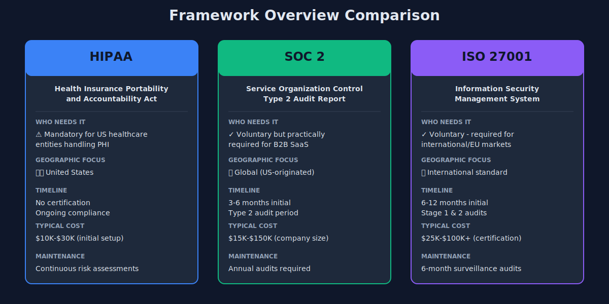
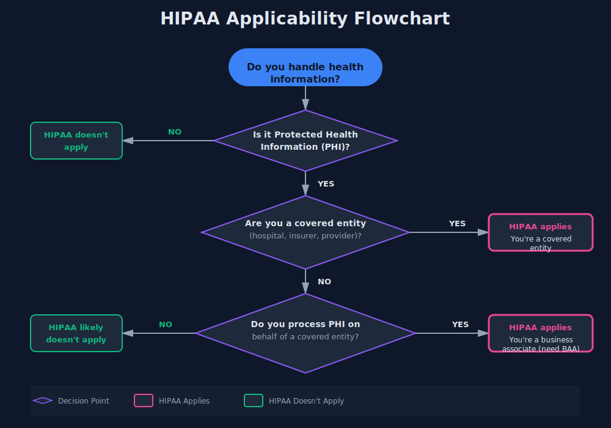
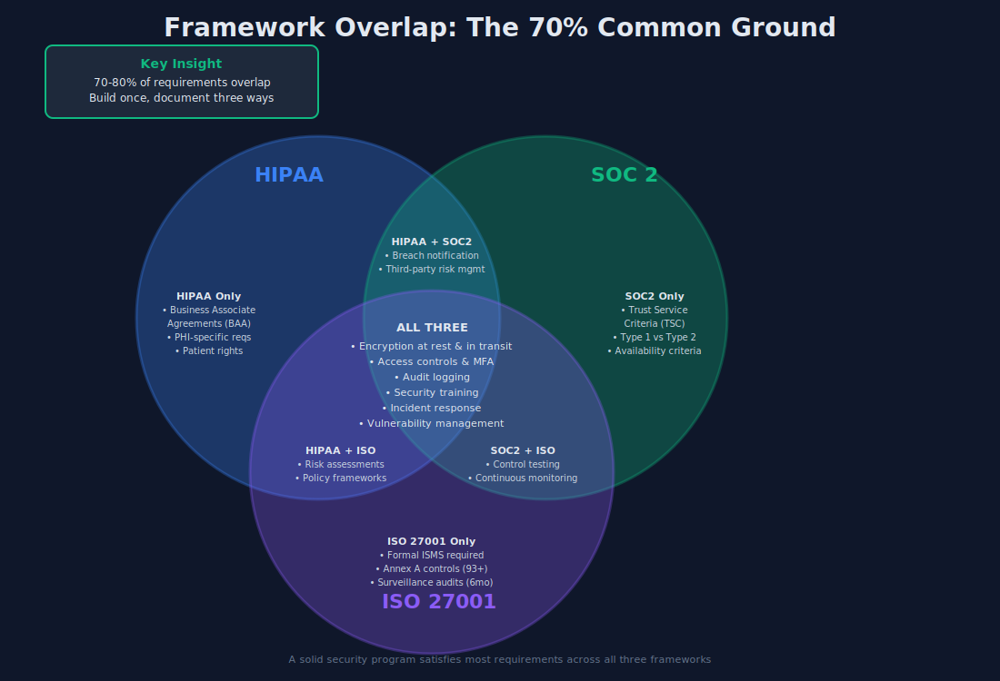
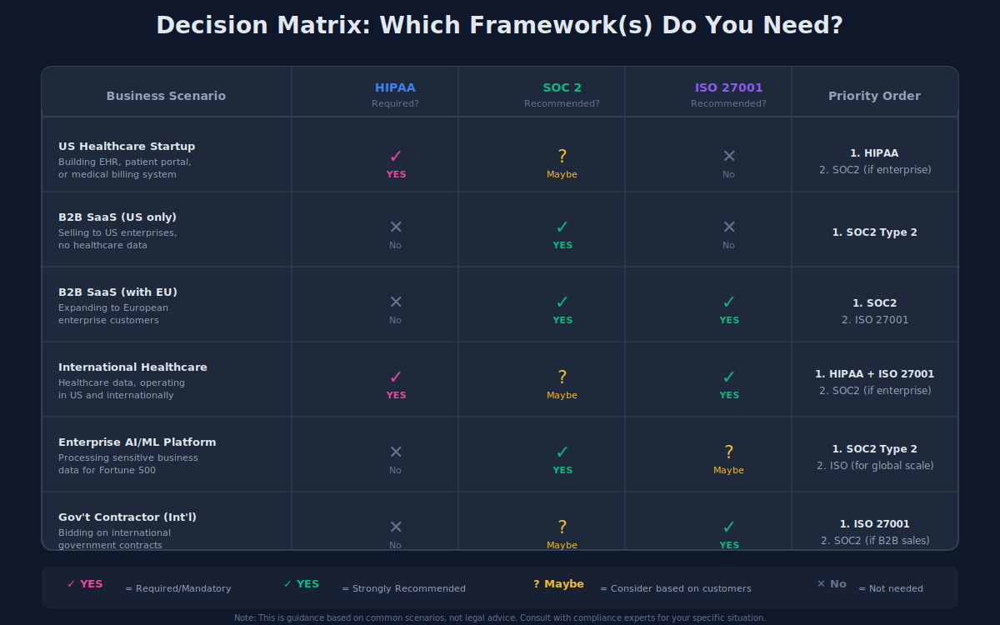

# SOC2 vs HIPAA vs ISO 27001: A Developer's Guide to Not Losing Your Mind

A client once asked if they needed SOC2, HIPAA, and ISO 27001 compliance. Short answer: probably not all three.

The compliance alphabet soup is genuinely confusing. I've built healthcare apps for US markets (HIPAA), European enterprises (ISO 27001), and SaaS products for Fortune 500s (SOC2). Let me cut through the consultant speak and give you the developer's perspective.

## The 60-Second Overview

Here's what you actually need to know. HIPAA is mandatory if you touch US healthcare data—it's a law, not optional. SOC2 is what enterprise clients ask for when vetting vendors—it's voluntary but practically required for B2B SaaS sales. ISO 27001 is the international standard that matters for global markets and European enterprises.

They all care about similar things—encryption, access controls, audit logs—but they come from different worlds with different requirements.

## HIPAA: The One You Can't Skip (If You're in Healthcare)

HIPAA applies if you're a "covered entity" (hospitals, insurers, healthcare providers) or a "business associate" (anyone who processes PHI for them). If you're building an EHR, medical billing system, or patient portal, you're in.

What developers actually need to care about: encryption at rest and in transit, audit logs for all PHI access, access controls with role-based permissions, and breach notification procedures. The BAA (Business Associate Agreement) your legal team signs is binding—you're legally liable for your subprocessors too.

Real penalties exist. Violations range from $100 to $50,000 per record, with annual maximums hitting $1.5 million per violation type. I've seen startups get fined for storing unencrypted patient data in S3 buckets. Don't be that startup.

The technical requirements are actually reasonable. Use industry-standard encryption (AES-256), implement proper authentication (MFA for admin access), maintain comprehensive audit trails, and have an incident response plan. It's security best practices with legal teeth.

## SOC2: The Enterprise Sales Requirement

SOC2 isn't legally required for anyone, but try selling to enterprise clients without it. It's the security questionnaire in certification form. When Salesforce or Goldman Sachs asks if you're SOC2 compliant, "we follow best practices" doesn't cut it.

Type 1 is a point-in-time audit—did you have controls in place on audit day? Type 2 covers 3-6 months and proves your controls work consistently. Enterprise buyers want Type 2.

The framework uses five Trust Service Criteria: Security (mandatory), Availability, Processing Integrity, Confidentiality, and Privacy. Most companies start with Security-only, then add others based on what they're selling. If you're a SaaS product, you probably need Availability too.

Timeline and cost reality: expect 3-6 months for first certification and $15,000-$50,000 for smaller companies, $50,000-$150,000 for mid-size. You'll need an auditor, probably some tooling (Vanta, Drata, Secureframe), and dedicated person-hours for evidence collection.

## ISO 27001: The International Passport

ISO 27001 matters most for international expansion. European enterprises often require it. UK government contracts want it. If you're selling globally, especially to regulated industries outside the US, this is your ticket.

Unlike SOC2's trust services approach, ISO 27001 is a full Information Security Management System (ISMS). You document your security policies, implement 93+ controls from Annex A (though you can exclude irrelevant ones), and maintain continuous improvement processes.

The certification process is formal: stage 1 audit reviews your documentation, stage 2 audit tests implementation, then surveillance audits every 6 months and recertification every 3 years. It's more rigorous than SOC2.

Costs run higher: $25,000-$100,000 for initial certification depending on company size, plus ongoing surveillance audit costs. The documentation burden is real—you're maintaining an entire ISMS, not just collecting evidence for an audit.

## The Overlap (Here's the Good News)

These frameworks aren't completely different universes. A solid security program hits 70-80% of all three.

Encryption, access controls, incident response, vulnerability management, and employee security training satisfy requirements across HIPAA, SOC2, and ISO 27001. Build it once, document it three ways.

The real differences are in documentation style and audit rigor. HIPAA wants policies and procedures proven through implementation. SOC2 wants control descriptions and testing evidence. ISO 27001 wants a formal ISMS with continuous improvement metrics.

If you're building for multiple frameworks, start with ISO 27001's structure—it's the most comprehensive. Then map down to SOC2 and HIPAA. It's easier than building SOC2 first and trying to scale up to ISO 27001.

## Your Decision Framework

Here's how to think about what you actually need.

**US-only healthcare:** HIPAA is mandatory. Stop there unless enterprise clients demand SOC2.

**B2B SaaS selling to enterprises:** SOC2 Type 2 with Security and Availability. Add ISO 27001 when you're closing deals in Europe or facing requirements from international customers.

**International markets from day one:** ISO 27001. You can map it to SOC2 requirements when US enterprise sales heat up.

**Healthcare + enterprise + international:** You need all three. The good news is your ISO 27001 ISMS becomes the foundation, HIPAA adds healthcare-specific requirements, and SOC2 becomes a subset of what you're already doing.

## Implementation Priority: Where to Start

Don't try to boil the ocean. Start with core security fundamentals that satisfy multiple frameworks: encryption (at rest and in transit), access controls with MFA, comprehensive logging, regular security training, vulnerability management, and incident response procedures.

Pick your primary framework based on business need. If you're in healthcare, HIPAA drives everything. If you're in enterprise SaaS, start with SOC2. If you're international-first, go ISO 27001.

Build a unified compliance program, not three separate initiatives. Use a single policy management system, one set of security tools, and one audit log infrastructure. Document once, reference in multiple frameworks.

## Cost & Timeline Reality Check

Let me set realistic expectations because consultants won't.

**HIPAA:** $10,000-$30,000 for gap assessment and implementation if you're starting from scratch. 2-4 months for basic compliance. You don't get "certified" in HIPAA (it's a law, not a certification), but you should do an independent risk assessment.

**SOC2:** $15,000-$150,000 depending on company size and complexity. 3-6 months minimum from decision to report. Budget for annual audits—this isn't one-and-done.

**ISO 27001:** $25,000-$100,000+ for certification, higher for larger organizations. 6-12 months for initial certification. Factor in ongoing surveillance audits and recertification every 3 years.

DIY is possible for HIPAA and SOC2 if you have security expertise in-house and use compliance automation tools. ISO 27001 typically needs consultants for first-time certification—the documentation requirements and formal audit process are more complex.

## The Bottom Line

You probably don't need all three frameworks. Figure out what your customers require, start with one solid security foundation, and expand when business needs dictate.

The overlap between frameworks is your friend. Build one strong security program with good documentation, and you're 70% of the way to any of these certifications.

And if a consultant tries to sell you on all three certifications before you've closed your first enterprise deal? They're optimizing for their billable hours, not your business reality.
