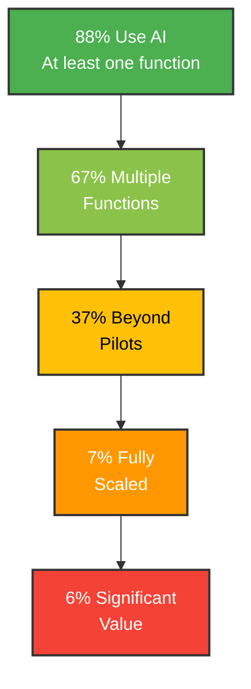

import BarChart from '../../components/BarChart';

88% of companies use AI now.

Only 6% capture significant business value from it.

I spent the last month going through every major AI report from 2025—[McKinsey](https://www.mckinsey.com/capabilities/quantumblack/our-insights/the-state-of-ai), [Stanford](https://hai.stanford.edu/ai-index/2025-ai-index-report), [MIT](https://sloanreview.mit.edu/projects/the-emerging-agentic-enterprise-how-leaders-must-navigate-a-new-age-of-ai/), [Wharton](https://knowledge.wharton.upenn.edu/special-report/2025-ai-adoption-report/). I wanted to understand this gap. Why are so many organizations failing at something that's supposed to be transformative?

The answer surprised me. It's not a technology problem. Frontier models are accessible to everyone. It's not a budget problem—AI investment hit [$1.5 trillion in 2025](https://hai.stanford.edu/news/ai-index-2025-state-of-ai-in-10-charts).

The companies winning at AI aren't using better models. They're doing something completely different with how work gets done.

Let me show you what I found.

## The adoption gap nobody talks about

Here's the funnel from [McKinsey's State of AI 2025](https://www.mckinsey.com/capabilities/quantumblack/our-insights/the-state-of-ai) (they surveyed 1,993 executives across 105 countries):

- **88%** use AI in at least one business function
- **67%** use AI in multiple functions
- **37%** moved beyond pilots in at least one use case
- **7%** scaled AI across their organization
- **6%** capture significant EBIT impact

Look at that drop-off. From 88% adoption to 6% seeing real business value.

This isn't a typical technology curve. Usually, early adopters capture outsized returns. Here, widespread adoption is producing minimal results for most companies.

I kept asking: what are the 6% doing differently?

## The three things high performers do

[McKinsey's data](https://www.mckinsey.com/capabilities/quantumblack/our-insights/the-state-of-ai) shows three clear patterns.

### 1. They redesign workflows (not just deploy AI)

High performers are **3x more likely** to fundamentally redesign workflows than other organizations.

This hit me hard because I've done this wrong before. At a previous company, we deployed an AI tool for customer support. We trained the team, gave them access, and... nothing changed. Tickets still took the same time. The AI sat there, mostly unused.

Why? We added AI *to* the existing process. We didn't redesign the process *around* AI.

High performers do it differently. They ask: "If we had AI from day one, how would we design this workflow?"

McKinsey puts it this way:

> "This intentional redesigning of workflows has one of the strongest contributions to achieving meaningful business impact of all the factors tested."

### 2. They transform, not optimize

Half of high performers intend to use AI to **transform their businesses**, not just make things 10% faster.

The others? They're using AI for incremental improvements. A bit more efficiency here. Slightly better recommendations there.

High performers are asking different questions:
- Not "How do we do this faster?" but "What becomes possible?"
- Not "Can AI help customer service?" but "What if customers never needed to contact us?"
- Not "Can we automate this report?" but "What if we make decisions in real-time?"

### 3. They measure what actually matters

39% of all organizations report AI impacts EBIT. But for most, it's **less than 5%**.

High performers? They're seeing **20-30% EBIT improvements**.

The difference isn't just bigger numbers. It's measuring different things. Most companies track:
- Number of AI pilots launched
- Employees trained on AI
- AI tools purchased

High performers track:
- Workflows fundamentally redesigned
- Business processes that couldn't exist without AI
- Revenue from AI-native products

See the difference?

### High Performers vs Others: By The Numbers

| Metric | High Performers (6%) | Others (94%) | Difference |
|--------|---------------------|--------------|------------|
| Redesign workflows | 75% | 25% | **3x** |
| Transform business intent | 50% | 15% | **3.3x** |
| EBIT impact >20% | 39% | 8% | **4.9x** |
| Fully scaled AI | 21% | 3% | **7x** |

<BarChart
  client:load
  data={[
    { label: 'Redesign Workflows', value: 75, color: '#4CAF50' },
    { label: 'Transform Business Intent', value: 50, color: '#8BC34A' },
    { label: 'EBIT Impact >20%', value: 39, color: '#FFC107' },
    { label: 'Fully Scaled AI', value: 21, color: '#FF9800' }
  ]}
/>

The gap isn't incremental. High performers are operating in a completely different paradigm.

## Pilot purgatory: where 63% are stuck

Here's the stat that made me realize how widespread this problem is: [63% of organizations remain in pilot or experiment mode](https://www.mckinsey.com/capabilities/quantumblack/our-insights/the-state-of-ai).

They've proven AI works technically. They've shown ROI in controlled settings. They just can't scale it.

I call this "pilot purgatory." You launch a pilot. It succeeds. Everyone's excited. Then... nothing. It never becomes part of how the company actually works.

### Why pilots fail to scale

[Research shows](https://digitalstrategy-ai.com/2025/11/23/ai-mckinsey-report-2025/) five barriers:

**1. No workflow integration**
The AI was built as a standalone demo. It's not embedded in the actual tools people use every day.

**2. Technology fragmentation**
Each pilot uses different tools, platforms, and models. There's no standardization. No one knows how to maintain it.

**3. Governance vacuum**
No clear decision rights. No risk management framework. No compliance process. So legal says "we need to review this" and the pilot dies.

**4. Change management gap**
Tech teams deliver working solutions. Business users don't adopt them. Everyone blames each other.

**5. Leadership uncertainty**
Executives sponsor pilots to "explore AI." But they don't commit to actual transformation. So pilots stay pilots.

The underlying pattern? These are organizational problems, not technical ones.

## What McKinsey found: leadership is the bottleneck

Here's the quote that stopped me:

> "The biggest barrier to success is leadership... Higher-impact vertical, or function-specific, use cases seldom make it out of the pilot phase because of organizational and cultural barriers—not technical ones."
> — [McKinsey State of AI 2025](https://www.mckinsey.com/capabilities/quantumblack/our-insights/the-state-of-ai)

Not technology. Not data quality. Not talent shortage.

Leadership.

Specifically, leaders who:
- Sponsor pilots but don't commit to transformation
- Expect AI to fit into existing processes without change
- Measure outputs (number of pilots) instead of outcomes (business impact)
- Don't address organizational barriers to scaling

## The numbers tell the story

Let me lay out the full picture from the research:

**Investment & Spending** ([Stanford AI Index 2025](https://hai.stanford.edu/ai-index/2025-ai-index-report)):
- Global AI investment: **$252.3 billion in 2024** (+44.5% YoY)
- U.S. private AI investment: **$109.1 billion** (12x China's $9.3B)
- GenAI investment: **$33.9 billion globally** (+18.7% from 2023)

**Business Adoption** ([Stanford](https://hai.stanford.edu/ai-index/2025-ai-index-report), [McKinsey](https://www.mckinsey.com/capabilities/quantumblack/our-insights/the-state-of-ai)):
- **78% of organizations** used AI in 2024 (up from 55% in 2023)
- **88%** use AI in at least one function (2025)
- But only **26%** have deployed AI solutions at scale ([MIT Sloan](https://sloanreview.mit.edu/projects/the-emerging-agentic-enterprise-how-leaders-must-navigate-a-new-age-of-ai/))

**The Failure Rate**:
- **80%+ of AI projects fail** to deliver expected value
- **95% of GenAI pilot projects fail** within 6 months (MIT study)
- **46% of POCs are abandoned** before reaching production

**What High Performers Achieve**:
- **1.7x revenue growth** vs laggards ([McKinsey](https://www.mckinsey.com/capabilities/quantumblack/our-insights/the-state-of-ai))
- **3.6x total shareholder return**
- **39%** report meaningful EBIT impact (vs 8% for others)

The gap isn't narrowing. It's widening.

## Five companies that got it right (and five that didn't)

Let me show you what this looks like in practice.

### Success: Klarna

[Klarna deployed an AI assistant](https://www.klarna.com/international/press/klarna-ai-assistant-handles-two-thirds-of-customer-service-chats-in-its-first-month/) that now handles two-thirds of customer service chats.

But here's what matters: they didn't just add AI to their existing support process. They redesigned the entire customer service workflow:
- AI handles tier 1 inquiries (65% of volume)
- Complex cases get escalated to humans with full context
- Humans focus on relationship-building and complex problem-solving

**Results**:
- **$40 million profit improvement** in first year
- **12-18x ROI**
- Customer satisfaction scores improved

The key? Workflow redesign. Not "let's give agents an AI tool." But "let's rethink customer service with AI as the primary interface."

### Success: DBS Bank

[DBS transformed](https://www.dbs.com/) from a traditional bank to what they call a "28,000-person startup."

They deployed **1,500+ AI models** across the organization. But the technology was just one part. They:
- Trained all 28,000 employees in agile and data analytics
- Redesigned every customer journey with AI at the core
- Built a "fail-fast" culture that encouraged experimentation
- Made workflow redesign a requirement for AI projects

**Result**: Over **$1 billion in value creation** from AI.

CEO Piyush Gupta's insight: "Cultural transformation precedes technological transformation."

### Success: Morgan Stanley

[Morgan Stanley gave 16,000 financial advisors](https://www.morganstanley.com/press-releases/morgan-stanley-launches-ai-assistant-to-unlock-insights-from-intellectual-capital) an AI assistant trained on 100,000+ internal documents.

But they didn't just drop the tool on people. They:
- Integrated it directly into advisors' daily workflow
- Made it the default way to access firm research
- Redesigned how research is created and distributed
- Measured adoption through business outcomes, not usage stats

**Results**:
- **98% advisor adoption** (almost unheard of for enterprise tools)
- **4x improvement** in document access speed
- Advisors can now answer complex client questions in real-time

The pattern again: integrate into workflow, measure outcomes, redesign processes.

### Failure: IBM Watson for Oncology

[IBM Watson for Oncology was discontinued](https://spectrum.ieee.org/how-ibm-watson-overpromised-and-underdelivered-on-ai-health-care) after it was found giving **unsafe and incorrect treatment recommendations**.

What went wrong?
- Built in isolation from actual clinical workflows
- Didn't integrate with existing hospital systems
- No change management for oncologists
- Measured technical accuracy, not clinical utility
- Leadership pushed for flashy demos over real clinical value

Cost: **Hundreds of millions** in development, **zero** lasting impact.

### Failure: Amazon AI Recruiting Tool

[Amazon scrapped an AI recruiting tool](https://www.reuters.com/article/us-amazon-com-jobs-automation-insight-idUSKCN1MK08G/) that showed gender bias, downranking resumes with "women's" in them (like "women's chess club").

The technical problem? The model learned from biased historical data.

But the organizational problem was worse:
- No governance framework for AI ethics
- Built without HR workflow integration
- No pilot testing with actual recruiters
- Measured efficiency, not fairness

The tool was technically successful (it worked fast). It was organizationally disastrous.

### Failure: Air Canada Chatbot

[Air Canada's chatbot gave incorrect refund information](https://www.theguardian.com/world/2024/feb/16/air-canada-chatbot-lawsuit) to a customer. The customer followed that advice. Air Canada tried to deny the refund.

A tribunal ruled: **Air Canada is responsible for its chatbot's statements**.

The problem? The chatbot wasn't integrated into Air Canada's actual refund policy systems. It was trained on general information but couldn't access authoritative data.

Cost: Legal liability, reputation damage, and proof that bolting AI onto existing processes doesn't work.

## The pattern in every failure

Look at those failures again. Notice anything?

None of them failed because the AI wasn't good enough. They failed because:
- No workflow integration
- No change management
- No governance
- Leaders measured the wrong things
- AI was added to existing processes instead of redesigning the process

These are the exact same barriers McKinsey found keeping 63% of companies stuck in pilot purgatory.

## What this means for you

If you're deploying AI in your organization (or thinking about it), here's what I learned from this research:

**1. Stop launching more pilots**

If you have more than 3 active AI pilots and none have scaled, you don't have a technology problem. You have an organizational problem.

Fix that first.

**2. Redesign workflows before deploying AI**

Don't ask "Where can we add AI to our current processes?"

Ask "If we were designing this process today with AI available, what would it look like?"

High performers are 3x more likely to fundamentally redesign workflows. That's not a coincidence.

**3. Measure outcomes, not activities**

Stop tracking:
- Number of AI pilots
- Employees trained
- AI tools purchased

Start tracking:
- Workflows fundamentally redesigned
- EBIT impact from AI
- Processes that couldn't exist without AI

**4. Commit to transformation, not experimentation**

Pilots are for learning. At some point, you need to commit.

The 6% of high performers? Half of them intend to **transform their business** with AI, not just optimize it.

That requires executive commitment, not just sponsorship.

**5. Solve for organizational barriers**

The technical part is actually the easy part now. The hard parts are:
- Getting people to change how they work
- Integrating AI into existing systems
- Building governance frameworks
- Making decisions about risk and compliance

If you're not addressing these, your pilots will stay pilots.

## The framework high performers use

Based on [McKinsey's research](https://www.mckinsey.com/capabilities/quantumblack/our-insights/the-state-of-ai), here's what the 6% do differently:

### Phase 1: Strategic clarity (before any pilots)

Define:
- Are we optimizing or transforming?
- What business outcomes matter? (not "AI adoption")
- What are we willing to change? (workflows, roles, processes)
- How will we measure success?

High performers answer these questions before launching pilots. Others launch pilots and hope to figure it out later.

### Phase 2: Workflow redesign (not technology selection)

For each use case:
- Map the current workflow
- Identify what AI could enable (not just automate)
- Redesign the workflow with AI as a core component
- Define new roles and responsibilities

Only then do you select technology.

Most companies do this backwards. They pick a tool, then try to fit it into existing workflows.

### Phase 3: Platform thinking (not point solutions)

High performers build AI platforms:
- Standardized tooling across use cases
- Shared governance frameworks
- Reusable components
- Consistent measurement

This lets them scale from 1 successful use case to 10, then 100.

Companies stuck in pilot purgatory have 50 different point solutions that can't scale.

### Phase 4: Organizational enablement (not just technical training)

They invest in:
- Change management (getting people to adopt new workflows)
- Leadership alignment (executives commit to transformation)
- Governance (clear decision rights and risk management)
- Continuous improvement (not "deploy and forget")

Notice: these are all organizational capabilities, not technical ones.

## Is your organization stuck in pilot purgatory?

Here's a quick self-assessment:

Check all that apply:
- [ ] We have 5+ AI pilots but no scaled deployments
- [ ] Different teams use different AI tools/platforms
- [ ] No clear AI governance or decision rights
- [ ] Pilots succeed technically but don't get business adoption
- [ ] No one's job responsibilities have fundamentally changed due to AI
- [ ] We can't measure AI's impact on EBIT

**Scoring**:
- **0-1 checked**: You're on track to scale
- **2-3 checked**: Pilot purgatory risk—address organizational barriers now
- **4-6 checked**: Stuck in pilot purgatory—need systematic intervention

If you checked 4+, you don't need more AI pilots. You need to fix organizational capability gaps.

## What I'm watching in 2026

A few trends from the research that I think will matter:

**1. The 6% gap will widen**

High performers are pulling away faster. They're:
- Capturing network effects from their AI platforms
- Building institutional muscle that's hard to replicate
- Using AI to accelerate their AI capabilities

The "wait and see" strategy is increasingly expensive.

**2. Regulatory compliance becomes table stakes**

The [EU AI Act](https://artificialintelligenceact.eu/) is now actively enforced. U.S. regulations are coming.

Companies that built governance frameworks early will have an advantage. Those that treated it as a "later problem" are now scrambling.

**3. Agentic AI will expose organizational weakness**

[23% of organizations are scaling AI agents](https://www.mckinsey.com/capabilities/quantumblack/our-insights/the-state-of-ai). Another 39% are experimenting.

Agents are harder to bolt onto existing workflows. They require rethinking processes more fundamentally.

Companies that haven't solved workflow redesign and governance will struggle even more with agents.

## The bottom line

88% of companies use AI. Only 6% see significant value.

After going through all this research, the pattern is clear:

**The companies winning at AI aren't using better technology. They're fundamentally redesigning how work gets done.**

They're:
- 3x more likely to redesign workflows
- Measuring business outcomes, not AI adoption metrics
- Treating AI as transformation, not optimization
- Building organizational capabilities, not just technical ones

The gap between them and everyone else is widening.

The good news? The barriers are organizational, not technical. That means they're solvable.

You just have to solve the right problems.

---

## Coming up next

In Part 2, I'll dive into the Generative AI paradox: MIT reports a 95% failure rate while Wharton finds a $3.71 return per dollar invested. How is that possible? The answer reveals the critical mistake most companies make when measuring AI ROI—and how to avoid it.

**Read Part 2**: [The GenAI Paradox: $37B Spent, 95% Failure Rate](./genai-paradox-37b-spent-95-percent-fail)

---

## Series Navigation

1. **Part 1: Why 94% of Companies Struggle with AI** ← You are here
2. [Part 2: The GenAI Paradox](./genai-paradox-37b-spent-95-percent-fail)
3. [Part 3: AI Governance is No Longer Optional](./ai-governance-eu-ai-act-compliance-guide)
4. [Part 4: From MLOps to LLMOps](./mlops-to-llmops-modern-ai-infrastructure)
5. [Part 5: The Rise of the Chief AI Officer](./chief-ai-officer-rise-organizational-models)
6. [Part 6: Scaling AI - Why Technology Isn't the Bottleneck](./scaling-ai-organizational-barriers-not-technology)
7. [Part 7: AI Transparency and the Innovation Debate](./ai-transparency-innovation-debate-whats-next)

---
