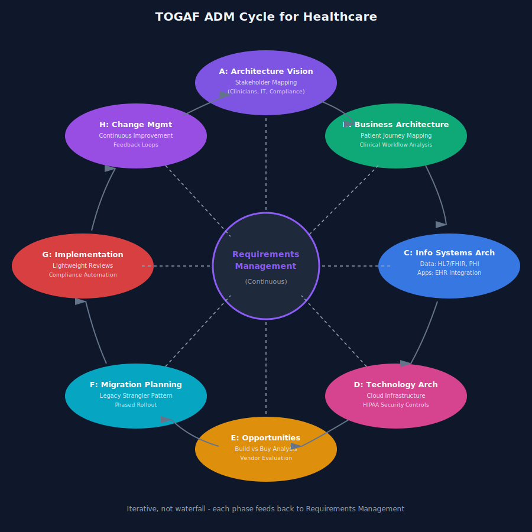
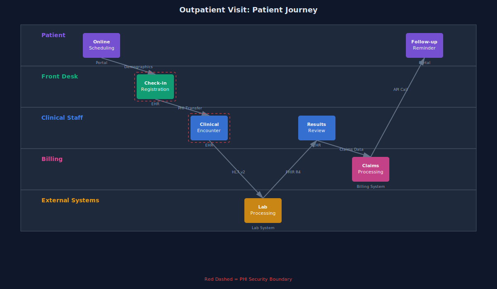
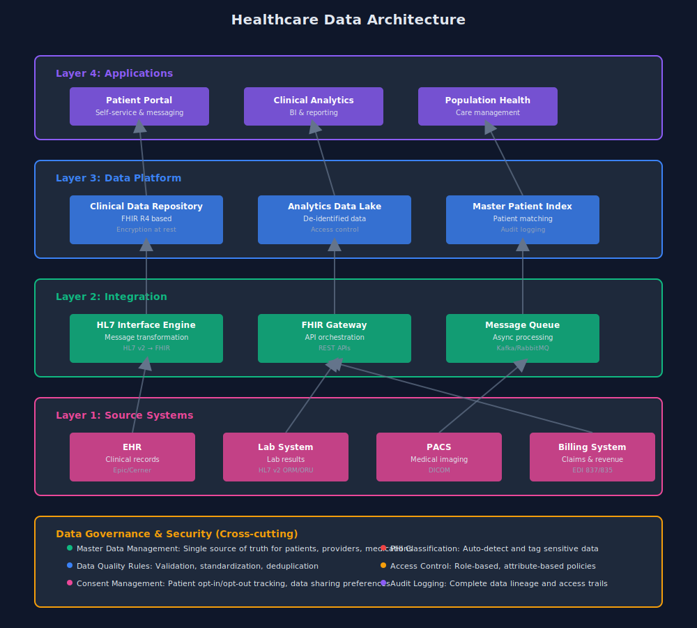
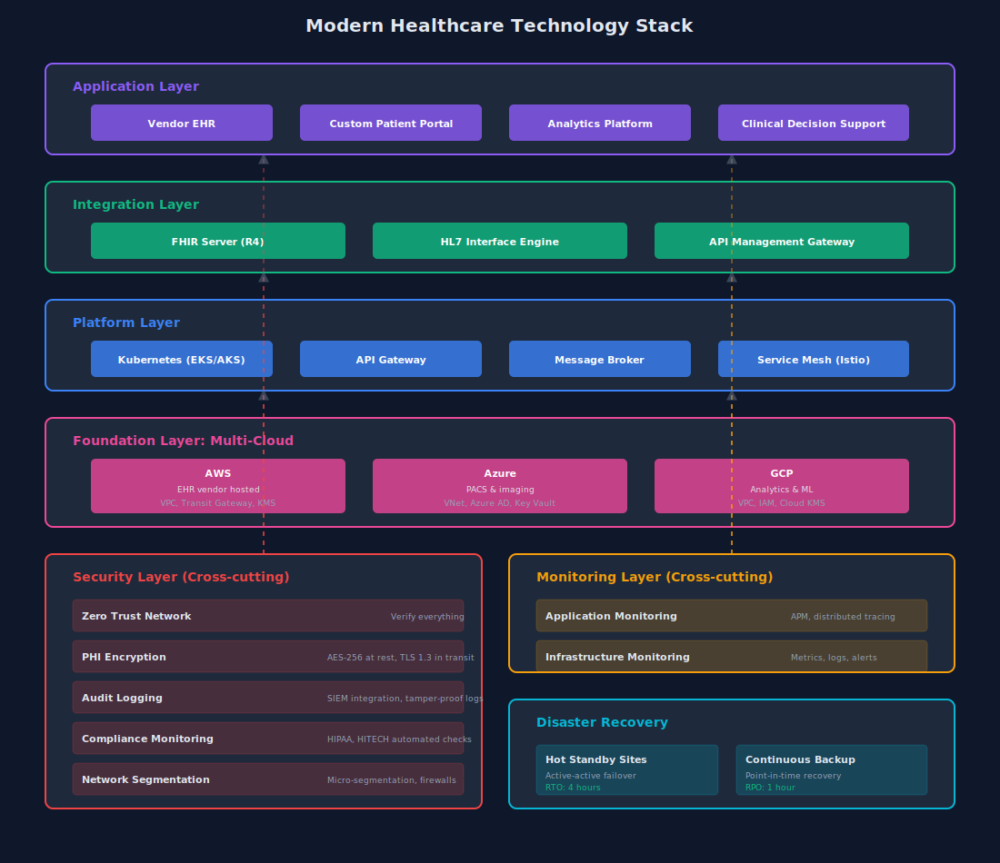

# TOGAF Without the Bureaucracy: Enterprise Architecture for Healthcare That Actually Ships

TOGAF gets a bad rap. Mention it in a room of engineers and watch eyes glaze over. People think massive documents, endless stakeholder meetings, and diagrams that are obsolete before you finish drawing them.

It doesn't have to be that way.

I've used TOGAF to architect systems across 100+ hospitals. The key? Use what works, skip what doesn't, and remember that shipping working software beats perfect documentation every time.

## TOGAF in 10 Minutes

TOGAF's core is the Architecture Development Method (ADM) - a cycle that moves from vision to implementation. Think of it as: understand the business, design the solution, build it, govern it. That's it.

The cycle has phases: Architecture Vision, Business Architecture, Information Systems Architecture (data + applications), Technology Architecture, and Implementation Governance. You don't need to do them all. You definitely don't need to produce every artifact the spec mentions.

Healthcare benefits from TOGAF because we deal with complex stakeholders, strict compliance requirements, and systems that can't afford to fail. A lightweight framework helps navigate this without reinventing the wheel every time.

TOGAF 10 (the latest version) finally embraces agile practices and admits you don't need to be waterfall about this. Use it iteratively. Build MVPs. Iterate based on feedback.

## Architecture Vision: Who Actually Matters

Start by mapping stakeholders. In healthcare, this gets complicated fast.

You've got clinicians who need systems that don't slow them down during patient care. IT teams managing legacy infrastructure held together with prayers and COBOL. Compliance officers who need to sleep at night knowing we're HIPAA-compliant. And increasingly, patients who expect the same digital experience they get everywhere else.

I set architectural principles early: "Patient safety over feature velocity," "Security by default, not afterthought," "APIs first, UIs second." These become decision filters when you're choosing between options at 2am.

Compliance isn't a checkbox at the end. In healthcare, it's the driver. HIPAA, HITECH, state regulations - these shape your architecture before you write a line of code.

## Business Architecture: Patient Journeys, Not Org Charts

Business architecture in healthcare means understanding clinical workflows, not just drawing org charts.

Map the patient journey: scheduling, registration, clinical encounter, billing, follow-up. Each step involves different systems, different data, different people. Your architecture needs to support this flow, not fight it.

I focus on integration points. Where does the EHR hand off to the lab system? How does radiology send results back? What happens when a patient sees a specialist outside your network?

Clinical workflow integration is non-negotiable. A beautiful architecture that adds 2 minutes to every patient encounter will be worked around or ignored.

## Data Architecture: HL7, FHIR, and the Reality Between

Healthcare data is messy. You're dealing with HL7 v2 messages from the 90s, HL7 v3 that nobody really uses, and FHIR as the promised land we're all trying to reach.

Your data architecture needs to handle all of it.

I classify data by sensitivity and regulatory requirements: PHI that needs audit trails and encryption at rest, de-identified data for analytics, public data for patient portals. Each tier gets different controls.

Master data management matters more in healthcare than anywhere else. When you're matching patients across systems, the stakes are higher than duplicate shopping cart entries. One algorithm for patient matching, one source of truth for providers, one medication database.

FHIR is the future, but pragmatism is the present. Build translation layers. Support both old and new standards. Plan for a world where they coexist for the next decade.

## Application Architecture: Build vs Buy (Hint: Usually Buy)

Healthcare has mature vendor products for core functions. Don't build an EHR. Don't build a billing system. Don't build practice management software.

Do build integration layers, patient-facing experiences, analytics platforms, and workflows that are specific to your organization.

Your application portfolio should have clear boundaries. EHR owns clinical documentation. Your custom portal provides the patient experience. Integration middleware orchestrates between them.

Integration patterns matter: event-driven for real-time clinical alerts, batch for billing, REST APIs for portal interactions, FHIR for interoperability. Choose based on requirements, not what's trendy.

Legacy modernization in healthcare is never a big bang. You strangle the old system slowly. Build new features on new platforms. Integrate using APIs or message brokers. Move functionality piece by piece.

## Technology Architecture: Cloud with Healthcare Reality

Multi-cloud is reality in healthcare, not by choice. Your EHR vendor runs on AWS. Your PACS is Azure. Your data lake is GCP. Your architecture needs to work across all three.

Security isn't bolted on. It's baked into every layer. Encryption in transit and at rest. Network segmentation. Zero trust architecture. Audit logging for everything that touches PHI.

Disaster recovery requirements in healthcare are measured in minutes, not hours. RTO of 4 hours for critical systems is generous. RPO of 1 hour for clinical data is the baseline. Architect accordingly.

Infrastructure decisions follow data residency and compliance requirements. Some states require patient data stay in-state. Some countries require data sovereignty. Your reference architecture needs to support these variants.

## Implementation Governance: Light Touch, Real Teeth

Governance that slows shipping is governance that gets ignored.

I run architecture review boards as working sessions, not presentation theaters. Show me the design, walk through the trade-offs, identify risks. 30 minutes, in and out.

Standards matter for integration points and data models. Everything else can be team choice. Use the FHIR profiles we agreed on. Encrypt PHI with our standard tools. Beyond that, pick the right tool for the job.

Track technical debt explicitly. Every shortcut gets documented with a plan to fix it. Some debt is acceptable. Untracked debt is dangerous.

Compliance checks are automated. Security scanning in CI/CD. Automated PHI detection. Policy-as-code for infrastructure. Catch issues before they reach production.

## Real Example: 30-Hospital System Modernization

I led the architecture for a hospital system consolidating 30 acquired hospitals. Each had different EHRs, different IT infrastructure, different clinical workflows.

TOGAF's ADM gave us structure. We started with architecture vision: "single patient view across all facilities, preserve clinical workflows, 18-month timeline."

Business architecture identified 12 core clinical processes that needed to work the same everywhere. We documented current state vs target state for each.

Data architecture focused on patient matching and unified clinical data repository. We built a FHIR-based integration layer that normalized data from three different EHR vendors.

Application architecture was ruthlessly pragmatic: standardize on one EHR for new implementations, build translation layers for existing systems we couldn't migrate yet, custom patient portal that unified the experience.

We went live in 16 months. Not because we documented everything perfectly, but because TOGAF gave us a shared language and decision framework.

## Quick-Start Checklist

Want to use TOGAF without the overhead? Start here:

1. Architecture Vision (2 pages): What problem are you solving? Who are the stakeholders? What are the principles?

2. Data Flow Diagrams: Show me how data moves between systems. Include security boundaries.

3. Integration Patterns: Document your standard patterns for system integration. APIs, messages, files.

4. Security Controls: What's your baseline for handling PHI? Encryption, access control, audit logging.

5. Decision Records: Document significant decisions and trade-offs. You'll thank yourself later.

Skip the 200-page Architecture Definition Document. Skip the detailed process flows for everything. Skip the exhaustive current-state documentation.

Go deep on integration points, data models, and security controls. Stay light everywhere else.

Build iteratively. Review monthly. Update the architecture based on what you learn building the real system.

TOGAF is a tool, not a religion. Use what helps you ship better healthcare software. Skip the rest.
