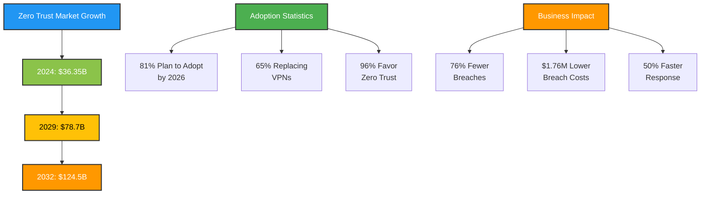
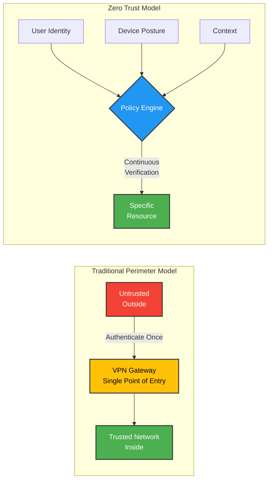

Perimeter security is dead.

I know that sounds dramatic. But [81% of organizations agree](https://www.cio.com/article/3962906/why-81-of-organizations-plan-to-adopt-zero-trust-by-2026.html). They're planning to adopt Zero Trust security by 2026.

And [65% are actively planning to replace their VPNs](https://hodeitek.com/blog/cybersecurity/why-65-of-companies-plan-to-replace-vpns-with-zero-trust-by-2025/) this year. Not upgrade them. Replace them entirely.

This isn't a trend. It's a revolution.

I spent the last month analyzing how five organizations, from the Pentagon to hospitals to SaaS platforms, deployed Zero Trust in 2025 and early 2026. I wanted to understand: what actually works when you're securing everything without trusting anything?

The answer surprised me. It's not about the technology. Every organization used different vendors, different platforms, different approaches.

What made them succeed was how they treated Zero Trust: not as a security project, but as organizational transformation.

Let me show you what I found.

## The numbers that tell the story

Before we dive into the case studies, let's talk about why this matters.

**Organizations with mature Zero Trust deployments see**:
- [76% reduction in successful breaches](https://www.cio.com/article/3962906/why-81-of-organizations-plan-to-adopt-zero-trust-by-2026.html)
- [$1.76 million lower average breach costs](https://www.ibm.com/reports/data-breach)
- 50% faster detection and response times
- 38% lower breach costs compared to those without Zero Trust

**The market is exploding**:
- Zero Trust security market: [$36.35 billion in 2024](https://www.grandviewresearch.com/industry-analysis/zero-trust-security-market-report)
- Projected to reach: **$78.7 billion by 2029** (16.6% CAGR)
- Expected: **$124.5 billion by 2032**

**The VPN exodus is accelerating**:
- [65% of companies](https://hodeitek.com/blog/cybersecurity/why-65-of-companies-plan-to-replace-vpns-with-zero-trust-by-2025/) plan to replace VPNs with Zero Trust by 2025
- [56% of organizations](https://www.zscaler.com/blogs/security-research/threatlabz-2025-vpn-report-why-81-organizations-plan-adopt-zero-trust-2026) reported VPN-exploited breaches in 2024
- [96% of security professionals](https://www.cio.com/article/3962906/why-81-of-organizations-plan-to-adopt-zero-trust-by-2026.html) favor a Zero Trust approach

This isn't theoretical. These are real savings, real improvements, real transformation.

But here's what I wanted to know: how do you actually do it?

## The shift from perimeter to identity

Traditional security was built on a simple idea: build a strong wall around your network. Everything inside the wall is trusted. Everything outside is not.

VPNs, firewalls, network segmentation: they all assume there's an "inside" and "outside."

That model is broken.

Why? Because:
- Your employees work from anywhere
- Your data lives in six different clouds
- Your applications are SaaS
- Your partners need access to specific systems
- Your devices connect from coffee shops, airports, home offices

There is no perimeter anymore.

**Zero Trust starts with a different assumption: Trust nothing, verify everything.**

Instead of asking "Are you on the right network?", Zero Trust asks:
- Who are you?
- What device are you using?
- Is it secure and compliant?
- What are you trying to access?
- Should you be allowed to do that?
- What's the context (location, time, behavior)?

Every time. For every request. Continuously.

This is the fundamental shift. And it's why every organization I studied, from government to healthcare to SaaS, saw dramatic improvements.

## Five organizations that got it right

I selected these five case studies because they represent different industries, different challenges, and different approaches to Zero Trust.

But they all succeeded for similar reasons.

### 1. The Pentagon's $977M transformation: security at unprecedented scale

**Organization**: U.S. Department of Defense
**Challenge**: Secure the largest network in the world after SolarWinds breach
**Approach**: Platform-based, phased implementation across all DoD components
**Timeline**: 2022 strategy to 2027 target level to 2032 advanced level

The DoD isn't just implementing Zero Trust. They're building a blueprint for enterprise-scale transformation.

**What they got right**:
- Started with outcomes, not technology (91 measurable capability outcomes)
- Built a platform that scales across all DoD components
- Phased approach with clear milestones
- Measured outcomes, not activities
- Executive mandate from the Secretary of Defense

**Key results**:
- $14.5 billion cybersecurity budget (FY2025)
- $977 million specifically for Zero Trust transition
- 152 activities across 45 capabilities and 7 pillars
- Implementation framework released January 2026

**What you can learn**: Zero Trust at scale requires organizational transformation, not just technology deployment. The DoD treated this as a business transformation program with executive accountability.

[Read the full DoD case study →](/blog/zero-trust-dod-case-study-2026)

### 2. Clarity AI: securing a global remote workforce without VPNs

**Organization**: Clarity AI (SaaS company)
**Challenge**: Fully remote team across continents with no office, no traditional perimeter
**Approach**: Identity-based access with Zero Trust Network Access (ZTNA)
**Timeline**: 6 months, from evaluation to full deployment

Clarity AI proved you don't need offices or VPNs to secure a distributed workforce.

**What they got right**:
- Identity as the foundation: SSO + MFA for everything
- Application-level access, not network access
- Device posture checks before granting access
- Least privilege by default
- Made security invisible to users

**Key results**:
- 95% attack surface reduction
- 60% reduction in access-related support tickets
- 95% faster access provisioning
- 30% improvement in global latency (direct connections vs. VPN backhaul)
- Developer preference: 9:1 in favor of Zero Trust over VPN

**What you can learn**: Zero Trust can improve both security and productivity. When you stop forcing everyone through VPN bottlenecks and enable direct, secure access, people work better.

[Read the full Clarity AI case study →](/blog/zero-trust-clarity-ai-remote-workforce)

### 3. German manufacturer: linking security to productivity gains

**Organization**: Mid-size German manufacturer (anonymized)
**Challenge**: Industry 4.0 transformation requiring OT/IT convergence
**Approach**: Zero Trust as digital workspace transformation, not security project
**Timeline**: 18 months, including identity, segmentation, endpoints, and OT visibility

This manufacturer did something unexpected: they positioned Zero Trust as a productivity initiative that happened to improve security.

**What they got right**:
- Started with identity, not network redesign
- Overlay approach (ran Zero Trust parallel to VPN, then migrated)
- Made OT security visible without disrupting production
- Measured business outcomes (supplier onboarding time, production deployment speed)
- Framed it as business enablement, not security restriction

**Key results**:
- 34% remote work productivity increase
- Supplier onboarding: 3 weeks to 1 day
- 78% faster incident response
- 60% faster new production line deployment
- ROI: 135% in year one

**What you can learn**: Security doesn't have to fight productivity. When Zero Trust removes friction (VPN headaches, complex access provisioning), business leaders become advocates.

[Read the full manufacturing case study →](/blog/zero-trust-manufacturing-digital-transformation)

### 4. Main Line Health: enterprise deployment in 3 weeks during crisis

**Organization**: Main Line Health (50,000-user healthcare system)
**Challenge**: 293 ransomware attacks on healthcare in Q1-Q3 2025, new HIPAA requirements
**Approach**: Identity-based microsegmentation with automated policy enforcement
**Timeline**: Hours at first site, blocking rules active on day 2, full rollout in 3 weeks

Main Line Health deployed enterprise Zero Trust faster than most organizations run a pilot.

**What they got right**:
- Automated discovery: catalogued 100,000+ devices without manual inventory
- Identity-based microsegmentation: no network infrastructure changes
- Policies that follow devices, not tied to IP or network location
- Started with visibility, moved to enforcement progressively
- Integrated with existing security stack: Armis + Elisity

**Key results**:
- Deployed in 3 weeks (industry average is 12-18 months)
- 99% device visibility and coverage
- Zero network downtime
- CIO 100 Award (2025) and CSO 50 Award (2024)
- Positioned for HIPAA 2025 compliance: network segmentation now required

**What you can learn**: You don't need 18 months to deploy Zero Trust. With the right architecture (identity-based microsegmentation), you can deploy in weeks without network redesign.

[Read the full Main Line Health case study →](/blog/zero-trust-healthcare-hipaa-compliance)

### 5. Datavault AI: 100-city nationwide deployment for SaaS platforms

**Organization**: Datavault AI
**Challenge**: Deploy quantum-ready Zero Trust across 100 U.S. cities for SaaS at scale
**Approach**: Distributed edge architecture with quantum-resistant encryption
**Timeline**: January 2026 announcement; 33 top cities beginning immediate integration

Datavault AI is building the blueprint for how SaaS platforms will secure themselves in the post-VPN era.

**What they got right**:
- Distributed architecture (100 edge nodes for low latency)
- Quantum-ready encryption from day one (not a retrofit)
- Multiple communication layers (fiber, SATCOM, wireless mesh)
- Edge compute integration
- Geographic distribution for compliance and resilience

**Key results**:
- 100 city locations with $100M+ annual addressable market each
- Quantum-resistant security: ready before quantum threats mature
- Single-digit millisecond latency: security verification invisible to users
- Data sovereignty compliance built-in
- No single point of failure

**What you can learn**: For SaaS platforms at scale, distributed Zero Trust architecture enables both security and performance. Edge-based enforcement eliminates the latency objection.

[Read the full Datavault AI case study →](/blog/zero-trust-saas-platform-nationwide-deployment)

## The patterns across all five implementations

After analyzing these deployments, five common patterns emerged:

### 1. They started with identity, not network

Every successful implementation began with establishing identity as the foundation:
- Single sign-on (SSO) across all systems
- Multi-factor authentication (MFA) mandatory
- Identity lifecycle management: automatic provisioning/deprovisioning
- Device identities, not just users

Network redesign came later, or never happened at all.

### 2. They built platforms, not point solutions

None of these organizations deployed 50 different Zero Trust products and hoped they'd work together.

They built integrated platforms with:
- Standardized identity providers
- Unified policy engines
- Centralized logging and analytics
- Reusable components

This matches what I found in [my research on AI transformation](./state-of-ai-2025-why-94-percent-fail): high performers build platforms, not point solutions.

### 3. They phased the transformation

No one tried to switch everything overnight:
- DoD: Discovery to Foundation to Advanced (2022-2032)
- Clarity AI: IT team to pilot group to engineering to everyone (6 months)
- German manufacturer: Identity to segmentation to endpoints to OT (18 months)
- Main Line Health: One site to validate to enterprise (3 weeks)
- Datavault AI: 33 top cities to progressive rollout (ongoing)

Phased approaches let you learn, adjust, and build confidence.

### 4. They measured outcomes, not activities

Traditional metrics these organizations rejected:
- Number of Zero Trust tools deployed
- Percentage of users trained
- Policies created
- Compliance checklists completed

What they actually measured:
- Business impact (breach costs avoided, productivity gains)
- Security outcomes (unauthorized access blocked, lateral movement prevented)
- Operational efficiency (time to provision access, incident response time)
- User experience (satisfaction scores, support ticket volume)

### 5. They treated it as organizational transformation

None of these was "just a security project."

They involved:
- Executive sponsorship and accountability
- Cross-functional collaboration (security, IT, business)
- Workflow redesign
- Change management
- Training and communication
- Cultural shifts

The organizations that succeeded understood: Zero Trust changes how work gets done.

## What makes Zero Trust work (or fail)

Let me synthesize what I learned across all five case studies.

### Success factors

**Strong identity foundation**
You can't verify "who" if identity systems are unreliable. SSO, MFA, and identity lifecycle management aren't optional. They're foundational.

**Platform thinking**
Integration is built in, not bolted on. Reusable components that scale from one to 1,000 deployments.

**Phased rollout**
Start small, prove value, expand. Don't try to transform everything on day one.

**Outcome measurement**
Track business impact and security outcomes, not deployment metrics.

**Executive commitment**
Real accountability, clear deadlines, organizational authority to drive change.

**User-centric design**
If Zero Trust makes work harder, users find workarounds. Make security invisible.

### Failure patterns

**Technology-first approach**
Buy tools, deploy them, hope they work together. (Spoiler: they don't.)

**No executive mandate**
Security team gets a budget but no organizational authority. Initiative dies in pilot phase.

**Big bang transformation**
Try to do everything at once. Overwhelm the organization. Stall and abandon.

**Pilot purgatory**
Successful pilots that never scale because there's no platform thinking.

**Activity metrics**
Measure deployments, not outcomes. Declare success based on tools bought, not security improved.

**Ignoring users**
Make security so painful that people find workarounds, defeating the entire purpose.

```mermaid
graph TB
    subgraph "Success Factors"
        S1["Strong Identity<br/>Foundation"]
        S2["Platform<br/>Thinking"]
        S3["Phased<br/>Rollout"]
        S4["Outcome<br/>Measurement"]
        S5["Executive<br/>Commitment"]
        S6["User-Centric<br/>Design"]
    end

    subgraph "Failure Patterns"
        F1["Technology-First<br/>Approach"]
        F2["No Executive<br/>Mandate"]
        F3["Big Bang<br/>Transformation"]
        F4["Pilot<br/>Purgatory"]
        F5["Activity<br/>Metrics"]
        F6["Ignoring<br/>Users"]
    end

    S1 --> G["Zero Trust<br/>Success"]
    S2 --> G
    S3 --> G
    S4 --> G
    S5 --> G
    S6 --> G

    F1 --> H["Zero Trust<br/>Failure"]
    F2 --> H
    F3 --> H
    F4 --> H
    F5 --> H
    F6 --> H

    style G fill:#4CAF50,stroke:#333,stroke-width:3px,color:#fff
    style H fill:#F44336,stroke:#333,stroke-width:3px,color:#fff
    style S1 fill:#8BC34A,stroke:#333,stroke-width:2px,color:#fff
    style S2 fill:#8BC34A,stroke:#333,stroke-width:2px,color:#fff
    style S3 fill:#8BC34A,stroke:#333,stroke-width:2px,color:#fff
    style S4 fill:#8BC34A,stroke:#333,stroke-width:2px,color:#fff
    style S5 fill:#8BC34A,stroke:#333,stroke-width:2px,color:#fff
    style S6 fill:#8BC34A,stroke:#333,stroke-width:2px,color:#fff
    style F1 fill:#FF9800,stroke:#333,stroke-width:2px,color:#fff
    style F2 fill:#FF9800,stroke:#333,stroke-width:2px,color:#fff
    style F3 fill:#FF9800,stroke:#333,stroke-width:2px,color:#fff
    style F4 fill:#FF9800,stroke:#333,stroke-width:2px,color:#fff
    style F5 fill:#FF9800,stroke:#333,stroke-width:2px,color:#fff
    style F6 fill:#FF9800,stroke:#333,stroke-width:2px,color:#fff
```

## Industry comparison: different challenges, same principles

One thing that struck me: these five organizations operate in completely different industries with completely different requirements.

Yet the principles that made them succeed were remarkably consistent.

| Organization | Industry | Primary Driver | Key Challenge | Deployment Time | Result |
|--------------|----------|---------------|---------------|-----------------|--------|
| **DoD** | Government | Post-breach transformation | Scale: largest network globally | 5 years (phased) | Comprehensive framework |
| **Clarity AI** | SaaS/Tech | Remote workforce | No traditional perimeter | 6 months | Eliminated VPN entirely |
| **German Manufacturer** | Manufacturing | Industry 4.0 and OT security | Legacy OT devices | 18 months | 135% ROI year 1 |
| **Main Line Health** | Healthcare | Ransomware crisis and HIPAA | Medical device security | 3 weeks | CIO 100 Award |
| **Datavault AI** | SaaS Platform | Market opportunity | Geographic scale | Ongoing (2026) | 100-city deployment |

Different timelines. Different budgets. Different technologies.

But the same core principles:
- Identity-based access control
- Continuous verification
- Least privilege
- Microsegmentation
- Platform thinking
- Phased rollout
- Outcome measurement

## What this means for your organization

After studying these implementations, here's what I'd recommend:

### If you're in government or defense

Look at the DoD's framework. It's public, comprehensive, and battle-tested.

Key resources:
- [DoD Zero Trust Strategy](https://dodcio.defense.gov/Portals/0/Documents/Library/DoD-ZTStrategy.pdf)
- [NSA Implementation Guidelines (Jan 2026)](https://www.globalsecurity.org/security/library/news/2026/01/sec-260114-nsa-css01.htm)
- [CISA Zero Trust Maturity Model v2.0](https://www.cisa.gov/sites/default/files/2025-04/2025_0129_cisa_zero_trust_architecture_implementation.pdf)

Don't reinvent the wheel. The DoD spent $977M building the playbook. Use it.

### If you have a distributed workforce

Clarity AI's approach shows what's possible: secure global access without VPN complexity.

Focus on:
- Strong identity foundation (SSO + MFA)
- Zero Trust Network Access (ZTNA) replacing VPN
- Application-level access
- Device posture verification
- User experience (make security invisible)

Your employees will thank you. So will your security team.

### If you're in manufacturing or critical infrastructure

The German manufacturer's case study proves security can enable productivity.

Key lessons:
- Start with identity, not network redesign
- Make OT security visible without disruption
- Position as business enablement
- Measure productivity gains, not just security metrics
- Phase the rollout (don't disrupt production)

When security removes friction, business leaders become advocates.

### If you're in healthcare

Main Line Health showed you can deploy enterprise Zero Trust in weeks, not years.

Critical requirements:
- Automated discovery (you can't manually inventory 100,000 devices)
- Identity-based microsegmentation (works with legacy medical devices)
- No network infrastructure changes (can't afford downtime)
- HIPAA compliance built-in (2025 requirements are stricter)

Don't wait for a ransomware attack to force your hand. Deploy proactively.

### If you're building SaaS platforms

Datavault AI's distributed architecture is the future of cloud security.

Design principles:
- Distributed edge nodes (low latency, high resilience)
- Quantum-ready encryption (build it in now, not retrofit later)
- Geographic distribution (compliance, performance, redundancy)
- Platform thinking from day one

VPNs are dying. Zero Trust is the replacement. Build for it.

## The bottom line

Perimeter security is dead. Zero Trust is the replacement.

But Zero Trust isn't a product you buy. It's an architectural model you implement.

The five organizations I studied, from the Pentagon to hospitals to SaaS platforms, prove it works:
- 76% fewer breaches
- $1.76M lower average breach costs
- Faster incident response
- Better user experience
- Competitive advantage

The gap isn't technology. The gap is execution.

What separates success from failure:
- **Identity foundation** before network redesign
- **Platform thinking** instead of point solutions
- **Phased rollout**, not big bang transformation
- **Outcome measurement**, not activity tracking
- **Organizational transformation**, not just technology deployment

If you're planning Zero Trust implementation, you now have five real-world playbooks to follow.

The question isn't whether to implement Zero Trust anymore.

It's: will you do it proactively (like these organizations) or reactively after a breach?

Your choice.

---

## Explore the full case studies

Each case study includes detailed implementation timelines, technology stacks, lessons learned, and results:

### Government & Defense
**[Inside the Pentagon's $977M Zero Trust Transformation →](/blog/zero-trust-dod-case-study-2026)**
The DoD's blueprint for enterprise-scale security transformation. 152 activities, 7 pillars, and the framework every government agency is following.

### Remote Workforce Security
**[How Clarity AI Secured a Global Remote Workforce Without VPNs →](/blog/zero-trust-clarity-ai-remote-workforce)**
Fully remote team across continents. No office. No VPN. Here's how identity-based access made security invisible while improving productivity.

### Manufacturing & Industry 4.0
**[From Factory Floor to Cloud: Linking Security to Productivity →](/blog/zero-trust-manufacturing-digital-transformation)**
How a German manufacturer positioned Zero Trust as digital transformation and achieved 135% ROI in year one. Security that enables, not blocks.

### Healthcare & HIPAA Compliance
**[How Main Line Health Deployed Zero Trust in 3 Weeks During a Ransomware Crisis →](/blog/zero-trust-healthcare-hipaa-compliance)**
293 ransomware attacks hit healthcare in Q1-Q3 2025. Main Line Health deployed enterprise Zero Trust in 3 weeks. Won CIO 100 Award. Here's their playbook.

### SaaS Platform Security
**[Datavault AI's Plan to Deploy Zero Trust Across 100 U.S. Cities →](/blog/zero-trust-saas-platform-nationwide-deployment)**
With 65% of companies ditching VPNs, here's what cloud-native security looks like at scale. Quantum-ready architecture across 100 cities.

---

## Key statistics and sources

All statistics in this article are sourced from:

**Market Research & Adoption**:
- [CIO: Why 81% of Organizations Plan to Adopt Zero Trust by 2026](https://www.cio.com/article/3962906/why-81-of-organizations-plan-to-adopt-zero-trust-by-2026.html)
- [Grand View Research: Zero Trust Security Market Report](https://www.grandviewresearch.com/industry-analysis/zero-trust-security-market-report)
- [IBM Cost of a Data Breach Report 2025](https://www.ibm.com/reports/data-breach)

**VPN Replacement Trends**:
- [Zscaler ThreatLabz 2025 VPN Risk Report](https://www.zscaler.com/blogs/security-research/threatlabz-2025-vpn-report-why-81-organizations-plan-adopt-zero-trust-2026)
- [Hodeitek: Why 65% of Companies Plan to Replace VPNs](https://hodeitek.com/blog/cybersecurity/why-65-of-companies-plan-to-replace-vpns-with-zero-trust-by-2025/)

**Technical Frameworks**:
- [NIST SP 800-207: Zero Trust Architecture](https://nvlpubs.nist.gov/nistpubs/specialpublications/NIST.SP.800-207.pdf)
- [CISA Zero Trust Maturity Model v2.0](https://www.cisa.gov/sites/default/files/2025-04/2025_0129_cisa_zero_trust_architecture_implementation.pdf)

---

*Want to discuss Zero Trust implementation for your organization? I write about cybersecurity transformation, enterprise architecture, and digital security. Connect with me on [LinkedIn](https://linkedin.com/in/aaronxdsilva) or explore more case studies on this site.*
