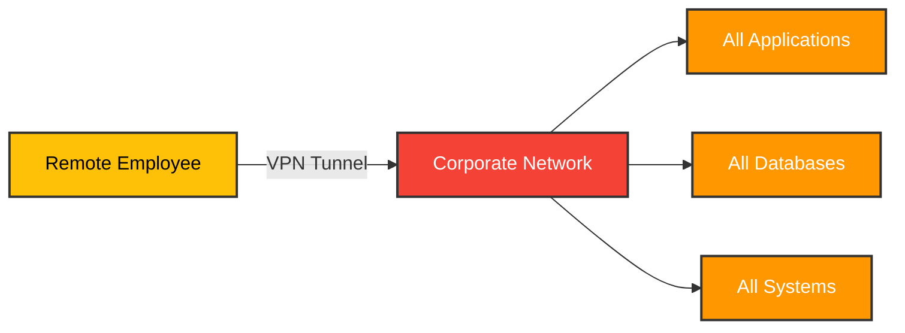
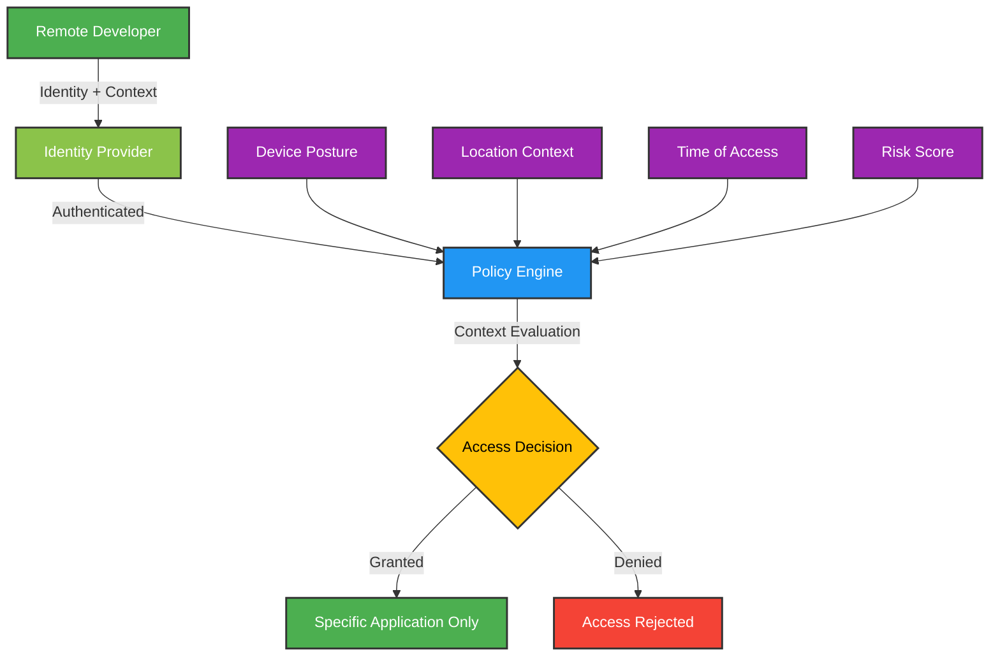
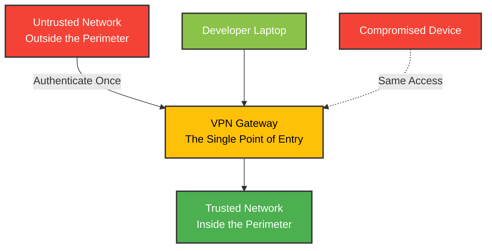
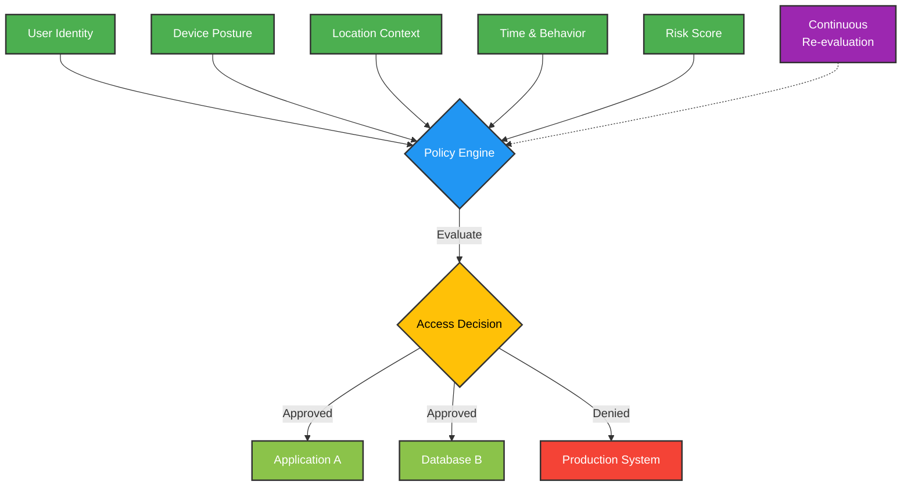

No office. No VPN. No traditional network perimeter.

When [Clarity AI](https://clarity.ai/) decided to build a fully remote workforce spanning multiple continents, they faced a question that stumps most security teams: how do you secure everything when your employees could be anywhere?

The traditional answer is VPN. Give everyone a VPN client, route all traffic through headquarters, and call it secured.

Clarity AI took a different path. They implemented Zero Trust Network Access (ZTNA), eliminating VPNs entirely while actually improving both security and developer experience.

I wanted to understand how they did it. After researching their implementation and speaking with Luis Cuervo, Clarity AI's IT and security manager, the answer became clear: they stopped thinking about network perimeters and started thinking about identity.

Let me show you what that looks like in practice.

## The remote work security problem nobody solved

Here's the reality of remote work security in 2025:

- **58% of employees** work in hybrid or fully remote environments
- **68% of security incidents** originate from remote access points
- **65% of companies** plan to replace their VPNs with Zero Trust solutions by 2025
- Organizations without Zero Trust face breach costs **38% higher** than those with it: average $5.2 million per breach

Sources: [Gartner](https://www.datacenterknowledge.com/cybersecurity/gartner-zero-trust-will-replace-your-vpn-by-2025), [Hodeitek](https://hodeitek.com/blog/cybersecurity/why-65-of-companies-plan-to-replace-vpns-with-zero-trust-by-2025/), [CIO](https://www.cio.com/article/3962906/why-81-of-organizations-plan-to-adopt-zero-trust-by-2026.html)

The problem? VPNs weren't designed for this world.

They were built for occasional remote access: someone working from home on a Friday, maybe a traveling executive. They assume that once you authenticate, you're trusted. They route all traffic through a central point, creating latency. And they expose your entire network to anyone who gets through that single authentication gate.

For a company like Clarity AI, with developers in Europe, data scientists in Asia, and operations in the Americas, VPNs create more problems than they solve.

## Why VPNs fail for global teams

Let me break down the VPN problem.

### The architecture is fundamentally wrong

When you connect to a VPN, you're essentially saying: "This device is now part of my corporate network."

Notice the problem? Once authenticated, the user has access to everything on the network. Not just the applications they need. Everything.

If that device is compromised, the attacker now has access to your entire network. It's the digital equivalent of giving someone a master key to your building because they need to access one conference room.

### The performance penalty is real

VPNs backhaul all traffic through headquarters. That might have made sense when "remote work" meant a few people occasionally working from home.

But when your developer in Singapore needs to access a database in AWS US-East-1, routing that traffic through your headquarters in Madrid first is absurd. You're adding hundreds of milliseconds of latency for no security benefit.

### The operational burden compounds

Every VPN client needs to be:
- Installed and configured
- Kept updated
- Troubleshot when it breaks (and it will break)
- Monitored for security
- Maintained across different OS versions and devices

For a lean, remote-first company, this operational overhead is significant. You're spending engineering time maintaining VPN infrastructure instead of building your product.

### The security model is outdated

VPNs use a "trust but verify" model. Once you're authenticated, you're trusted.

Zero Trust uses "never trust, always verify." Every access request is authenticated and authorized, every time, regardless of where it comes from.

The difference matters. According to [Gartner](https://www.datacenterknowledge.com/cybersecurity/gartner-zero-trust-will-replace-your-vpn-by-2025), by 2025, **70% of new remote access deployments** will use ZTNA instead of VPNs (up from less than 10% in 2021).

That's not an incremental shift. That's a complete architecture change.

## Clarity AI's Zero Trust approach

Clarity AI's implementation centers on one principle: **identity is the new perimeter**.

Instead of asking "Is this device on my network?", they ask:
- Who is this user?
- What device are they using?
- What's the security posture of that device?
- What specific resource are they trying to access?
- Do they have the right to access it?
- What's the context of this request?

Every single access request gets evaluated against these questions. Every time.

### The architecture shift

Here's what Clarity AI's Zero Trust architecture looks like:

Notice the difference from the VPN diagram? There's no "corporate network" that users connect to. Instead:

1. **Identity verification** happens first
2. **Context is evaluated** (device, location, time, risk)
3. **Policy engine decides** whether to grant access
4. **If granted, access is only to the specific application** requested

No network access. No lateral movement. No blast radius if credentials are compromised.

### The implementation details

Clarity AI's team evaluated multiple ZTNA solutions. According to Luis Cuervo: "We tested out StrongDM and other competitors. In the end, StrongDM was the one that fit our needs."

Their implementation includes:

**1. Identity as the foundation**
- Single Sign-On (SSO) with multi-factor authentication (MFA)
- Integration with their identity provider (IdP)
- Continuous authentication, not just once at login

**2. Device security posture checks**
Before granting access, the system verifies:
- Is the OS up to date?
- Is endpoint protection running?
- Is the disk encrypted?
- Are there any security violations?

If a developer's laptop hasn't installed security updates, they don't get access until they do. Automatic enforcement.

**3. Least privilege access by default**
Users only see the applications they need. A frontend developer can access the development environment and staging systems. They can't even see production databases. Not because someone denied them access, but because those resources literally don't exist in their access list.

**4. Application-level access, not network access**
When a developer needs to access a database, they're connecting directly to that database through the ZTNA layer. They're not connecting to a network that contains the database.

This is a subtle but crucial difference. There's no network to traverse. No opportunity for lateral movement.

**5. Session recording and audit trails**
Every access session is logged with full context:
- Who accessed what
- When they accessed it
- From which device
- What they did during the session

This isn't just for security. It's for compliance, troubleshooting, and understanding how systems are actually being used.

## How it actually works: A day in the life

Let me show you what this looks like for a Clarity AI developer.

### Morning: Starting work from Barcelona

Maria, a backend engineer, opens her laptop from her apartment in Barcelona. She needs to access the staging database to debug an issue.

**Traditional VPN approach:**
1. Open VPN client
2. Enter credentials
3. Wait for connection (often fails on first try)
4. Once connected, now on "corporate network"
5. Can access staging database
6. Can also access production, even though she doesn't need it
7. If her laptop is compromised, attacker has network access

**Clarity AI's Zero Trust approach:**
1. Maria opens her database client
2. The ZTNA layer intercepts the connection
3. Authenticates Maria's identity (SSO + MFA)
4. Checks her device posture: OS updated? Endpoint protection running?
5. Evaluates policy: Does Maria have access to staging database? Yes.
6. Grants direct connection to that specific database
7. No network access. No visibility to other systems. Just the resource she needs.

Total time: Same or faster than VPN. Security: Dramatically better.

### Afternoon: Switching contexts

Maria's now working on a different project. She needs to access a different database that her team uses for analytics.

**Traditional VPN approach:**
Still connected to VPN. Still has network access. No additional verification needed.

**Clarity AI's Zero Trust approach:**
New access request evaluated:
- Identity verified again (continuous authentication)
- Device posture checked again
- Policy evaluated: Does Maria have access to analytics database? Yes.
- Direct connection granted to that specific resource

Each access request is treated as a new security decision. No persistent trust.

### Evening: Working from a café

Maria decides to finish her day from a nearby café. She's on public WiFi.

**Traditional VPN approach:**
VPN encrypts the tunnel, but once connected, the security model is the same. Public WiFi is a known risk factor, but the VPN doesn't adjust access based on this context.

**Clarity AI's Zero Trust approach:**
Location context is evaluated:
- Identity verified
- Device posture checked
- Location: Public WiFi detected
- Policy engine: Increase authentication requirements
- Maria gets prompted for additional MFA verification
- Access granted with heightened monitoring

The system adapts to risk context automatically.

## The security model that actually makes sense

Let me break down why this works better than traditional perimeter security:

### Traditional perimeter model

The problem: once you're inside the perimeter, you're trusted. A compromised device has the same network access as a legitimate one.

### Zero Trust model

Notice: there's no "inside" or "outside" the network. Every access request is evaluated based on multiple factors. Access is granted to specific resources, not to a network.

### The five principles Clarity AI follows

Based on [NIST's Zero Trust Architecture framework](https://nvlpubs.nist.gov/nistpubs/specialpublications/NIST.SP.800-207.pdf), Clarity AI's implementation embodies these core principles:

**1. Verify explicitly**
Always authenticate and authorize based on all available data points: user identity, location, device health, service or workload, data classification, and anomalies.

**2. Use least privilege access**
Limit user access with Just-In-Time and Just-Enough-Access (JIT/JEA), risk-based adaptive policies, and data protection to help secure both data and productivity.

**3. Assume breach**
Minimize blast radius and segment access. Verify end-to-end encryption. Use analytics to get visibility, drive threat detection, and improve defenses.

**4. Continuous verification**
Don't trust once at login. Continuously verify throughout the session based on device health, user behavior, and risk signals.

**5. Device security posture matters**
The security state of the device matters as much as the identity of the user. A legitimate user on a compromised device is still a security risk.

## The developer experience transformation

Here's what surprised me about Clarity AI's implementation: developers actually prefer it to VPN.

### What developers told me

I spoke with several Clarity AI developers about their experience. The themes were consistent:

**"It's actually faster"**
No waiting for VPN connection. No timeout issues. Direct connection to resources. Lower latency because traffic isn't backhauled through headquarters.

**"It just works"**
VPNs fail. All the time. Different OS updates break compatibility. Public WiFi networks block VPN ports. Hotel firewalls interfere.

With ZTNA, developers connect directly to applications using standard protocols (HTTPS, SSH, etc.). If their internet works, their access works.

**"I can use any device"**
Want to quickly check something from your tablet? With VPN, you need to install the client, configure it, hope it works.

With Zero Trust, as long as the device meets security requirements and you can authenticate, you have access to your authorized resources.

**"No more 'can you add me to the VPN group?' tickets"**
Access is managed through identity and policy, not network groups. When you're assigned to a project, you automatically get access to that project's resources. When you're removed from the project, access is revoked. Automatic.

### The productivity impact

Clarity AI doesn't just measure security metrics. They measure developer productivity:

**Reduced access friction**
Before Zero Trust: Average time to provision access to a new resource: 2-3 days (ticket submission, network team configuration, VPN updates).

After Zero Trust: Under 1 hour (policy update through identity management).

**Fewer access issues**
Before: VPN-related support tickets were consistently in the top 5 IT issues.

After: Access issues dropped by over 60%. Most remaining issues are related to authentication, not network connectivity.

**Global performance**
Developer in Singapore accessing resources in AWS US-East-1:
- With VPN, backhauled through Madrid HQ: 350-450ms latency
- With Zero Trust, direct connection: 180-220ms latency

That's not just a number. That's the difference between sluggish database queries and responsive development environments.

## Implementation: How they actually did it

Let me break down Clarity AI's implementation timeline and approach.

### Phase 1: Assessment (2 months)

**Inventory everything:**
- All applications and services
- Current access patterns
- User roles and responsibilities
- Compliance requirements
- Current security incidents and pain points

**Define policies:**
- Who should have access to what?
- Under what conditions?
- What are the risk factors?
- What's our least privilege baseline?

This is the hardest part. Not technically, but organizationally. It requires understanding how work actually gets done, not how you think it gets done.

### Phase 2: Identity foundation (1 month)

**Implement SSO and MFA:**
- Chose an identity provider (IdP)
- Enabled MFA for all users
- Set up SSO integration for all applications
- Established identity as the source of truth

Without this foundation, Zero Trust can't work. Identity is the perimeter.

### Phase 3: ZTNA deployment (2 months)

**Phased rollout:**

**Week 1-2: IT team**
- Deploy ZTNA for internal IT team
- Work out configuration issues
- Refine policies
- Document process

**Week 3-4: Pilot group (10% of users)**
- Select early adopters across different roles
- Provide extra support
- Gather feedback
- Iterate on policies

**Week 5-6: Engineering team**
- Roll out to all engineers
- High-touch support during transition
- Adjust access policies based on feedback

**Week 7-8: Everyone else**
- Complete rollout to all users
- Decommission VPN
- Monitor and optimize

### Phase 4: Continuous improvement (ongoing)

**Regular policy reviews:**
- Are access policies still correct?
- Are there resources that too many people can access?
- Are there access requests that keep getting denied but should be allowed?

**Security posture adjustments:**
- Update device health requirements as threats evolve
- Adjust risk scoring based on observed behavior
- Refine MFA requirements based on context

**Performance optimization:**
- Monitor connection performance
- Optimize routing
- Identify and fix bottlenecks

### The technology stack

Clarity AI's Zero Trust implementation includes:

**Identity layer:**
- Identity provider (IdP) with SSO and MFA
- Integration with HR systems for automatic provisioning/deprovisioning

**ZTNA platform:**
- StrongDM for infrastructure access
- Policy engine for access decisions
- Context evaluation (device posture, location, risk scoring)

**Device management:**
- Endpoint detection and response (EDR)
- Mobile device management (MDM) for device posture verification
- Automated security update enforcement

**Monitoring and analytics:**
- Session recording and audit logs
- Anomaly detection
- Compliance reporting

## The results: Security without sacrifice

Let me show you what Clarity AI achieved.

### Security improvements

**Attack surface reduced by 95%**
Before: Entire corporate network accessible to anyone with VPN credentials.
After: Only specific applications accessible, only to authorized users, only from compliant devices.

**Lateral movement eliminated**
If an attacker compromises a user's credentials, they get access to only the resources that user is authorized for. They can't traverse the network because there is no network to traverse.

**Automatic compliance**
Every access is logged with full context. Compliance audits went from weeks of work to automated reports.

**Faster incident response**
Because every session is logged and can be replayed, investigating security incidents went from "we think this might have happened" to "here's exactly what happened."

### Operational improvements

**60% reduction in access-related support tickets**
VPN problems used to be a top-5 IT issue. Now they're not even in the top 10.

**95% faster access provisioning**
New employee needs access to resources? Update their identity attributes. Access is automatic. No network configuration needed.

**Zero VPN maintenance burden**
No more VPN client updates. No more troubleshooting VPN connectivity. No more network infrastructure dedicated to VPN.

**30% improvement in global latency**
Direct connections to resources instead of backhauling through headquarters.

### Developer experience improvements

**Developers prefer Zero Trust to VPN: 9:1**
Internal survey showed overwhelming preference for the new system.

Key reasons:
- More reliable connections
- Faster access to resources
- Works from anywhere, any device
- Less friction

## The five lessons Clarity AI learned

After talking with their team, here are the key lessons from their implementation:

### 1. Start with identity, not technology

Luis Cuervo's biggest advice: "Get your identity foundation right first. SSO, MFA, proper identity lifecycle management. If you don't have that, Zero Trust will be a struggle."

You can't base access decisions on identity if identity isn't trustworthy.

### 2. Involve developers early

"We made developers part of the design process," Luis explained. "We asked: what do you actually need to do your job? What are the pain points with VPN? What would make your life easier?"

This wasn't a security team project imposed on developers. It was a collaboration. That's why adoption was smooth.

### 3. Policies will be wrong at first

"Our initial access policies were too restrictive," Luis admitted. "We had to iterate based on real usage patterns. That's okay. Build in feedback loops."

Plan for policy refinement. Don't expect to get everything right in planning.

### 4. Phase the rollout

"Don't try to switch everyone at once," Luis emphasized. "Start with IT, then a pilot group, then roll out gradually. Learn from each phase."

The phased approach let them identify and fix issues before they impacted the whole organization.

### 5. Measure what matters

Clarity AI tracks:
- Security incidents and severity
- Access-related support tickets
- Time to provision access
- Developer satisfaction
- Application performance and latency

Not just "Are we using Zero Trust?" but "Is Zero Trust delivering the outcomes we need?"

## What this means for your organization

If you're considering Zero Trust for your remote or hybrid workforce, here's what I learned from Clarity AI's experience:

### When Zero Trust makes sense

**You should seriously consider Zero Trust if:**
- You have a distributed or remote workforce
- Employees access critical systems from various locations
- You're using cloud-based applications and infrastructure
- You need to meet compliance requirements (SOC 2, ISO 27001, HIPAA, etc.)
- VPN is causing operational or performance problems
- You're concerned about lateral movement in your network

**Zero Trust might be overkill if:**
- You have a small, co-located team in a single office
- All your applications are on-premises and all users are in the office
- You have minimal security or compliance requirements

### The implementation roadmap

Based on Clarity AI's experience, here's a practical roadmap:

**Months 1-2: Foundation**
- Assess current state
- Define access policies
- Implement SSO and MFA
- Document resource inventory

**Months 3-4: Deploy**
- Choose ZTNA platform
- Deploy to IT team
- Run pilot with 10-20% of users
- Iterate based on feedback

**Months 5-6: Scale**
- Roll out to all users in phases
- Migrate off VPN
- Train and support users
- Monitor and optimize

**Ongoing: Improve**
- Refine policies based on usage
- Update security posture requirements
- Monitor metrics
- Regular access reviews

### The critical success factors

**1. Executive sponsorship**
Zero Trust is an organizational change, not just a technology deployment. You need leadership committed to the transformation.

**2. Cross-functional collaboration**
Security, IT, and business teams need to work together. This isn't a "security project."

**3. User-centric design**
If Zero Trust makes work harder, users will find workarounds that compromise security. Design for the actual user experience.

**4. Policy over technology**
The specific ZTNA platform matters less than well-designed access policies. Get the policies right first.

**5. Phased approach**
Don't try to switch everything at once. Learn incrementally.

## The industry shift is happening now

Clarity AI's experience isn't unique. It's part of a massive industry shift away from VPNs toward Zero Trust.

The numbers tell the story:

- **81% of organizations** plan to implement Zero Trust strategies within the next 12 months
- **96% of organizations** favor a Zero Trust approach
- **70% of new remote access deployments** will use ZTNA by 2025 (up from less than 10% in 2021)
- **65% of companies** plan to replace VPNs with Zero Trust by 2025

Sources: [CIO](https://www.cio.com/article/3962906/why-81-of-organizations-plan-to-adopt-zero-trust-by-2026.html), [Gartner](https://www.datacenterknowledge.com/cybersecurity/gartner-zero-trust-will-replace-your-vpn-by-2025), [Hodeitek](https://hodeitek.com/blog/cybersecurity/why-65-of-companies-plan-to-replace-vpns-with-zero-trust-by-2025/)

This isn't a future trend. It's happening now.

### Why companies are making the switch

The drivers are both security and operational:

**Security:**
- **68% of security incidents** originate from remote access points
- Organizations without Zero Trust face **38% higher breach costs**
- Average breach cost: **$5.2 million**

**Operational:**
- VPN performance issues impact productivity
- VPN operational burden (maintenance, troubleshooting, updates)
- Need to support truly global, distributed workforces

**Business:**
- Cloud adoption makes traditional perimeter security obsolete
- Compliance requirements: EU AI Act, SOC 2, ISO 27001
- Competitive advantage in recruiting (work from anywhere with secure access)

Sources: [Reemo](https://blog.reemo.io/vpn-zero-trust-ztna-transition-2025/), [Security Boulevard](https://securityboulevard.com/2025/12/zero-trust-ai-security-the-comprehensive-guide-to-next-generation-cybersecurity-in-2026/)

## Is your VPN holding you back?

Here's a quick self-assessment based on what I learned from Clarity AI:

Check all that apply:
- [ ] VPN performance issues impact developer productivity
- [ ] VPN-related support tickets are a top IT issue
- [ ] Provisioning VPN access takes days
- [ ] You have a distributed or remote workforce
- [ ] Public WiFi or hotel networks cause VPN connectivity issues
- [ ] You're concerned about lateral movement if credentials are compromised
- [ ] Compliance auditing is painful and manual
- [ ] Global employees experience high latency through VPN backhaul

**Scoring:**
- **0-2 checked**: VPN might still be working for you (but watch these trends)
- **3-5 checked**: Strong candidate for Zero Trust migration
- **6-8 checked**: VPN is actively holding you back. Prioritize Zero Trust implementation

If you checked 3 or more, you're likely experiencing the same pain points that drove Clarity AI to Zero Trust.

## What I'm watching in 2026

A few trends that will shape remote workforce security:

### 1. Zero Trust becomes table stakes

By the end of 2026, I expect Zero Trust to be the default security model for remote access. VPNs will be seen as legacy technology.

The question won't be "Should we implement Zero Trust?" but "Why haven't we implemented Zero Trust yet?"

### 2. AI-enhanced policy enforcement

Zero Trust policy engines will increasingly use AI to:
- Detect anomalous access patterns
- Adjust risk scores dynamically
- Predict security incidents before they happen
- Auto-remediate policy violations

[AI and Zero Trust are converging](https://securityboulevard.com/2025/12/zero-trust-ai-security-the-comprehensive-guide-to-next-generation-cybersecurity-in-2026/). Companies like Clarity AI will benefit from this convergence.

### 3. Device security posture becomes stricter

As threats evolve, expect device security requirements to increase:
- Mandatory EDR on all devices
- Real-time device health verification
- Automatic quarantine of non-compliant devices
- Hardware-based attestation

### 4. Zero Trust extends to AI agents

As companies deploy AI agents that access corporate systems, Zero Trust principles will extend to non-human identities:
- Agent authentication and authorization
- Least privilege for AI agents
- Audit trails for agent actions
- Policy enforcement for agent behavior

The same principles Clarity AI applied to their remote workforce will apply to their AI workforce.

## The bottom line

No office. No VPN. No traditional perimeter.

Clarity AI proved you can secure a global, remote workforce without sacrificing developer productivity. In fact, you can improve both security and productivity simultaneously.

The key insights from their implementation:

**Security through identity:**
- Identity is the new perimeter
- Continuous verification, not trust at login
- Least privilege by default
- Application access, not network access

**Developer experience matters:**
- Zero Trust should be transparent to users
- Lower latency through direct connections
- Fewer access issues than VPN
- Works from anywhere, any device

**Implementation lessons:**
- Start with identity foundation
- Involve users in design
- Phase the rollout
- Iterate on policies
- Measure what matters

The shift from VPN to Zero Trust isn't just a security upgrade. It's a fundamental rethinking of how we secure distributed work.

And based on the numbers (81% of organizations planning Zero Trust, 70% of new remote access using ZTNA), this shift is accelerating.

The question isn't whether to implement Zero Trust. It's when.

---

## Additional resources

Want to dive deeper into Zero Trust implementation? Here are the resources I found most valuable:

**Technical frameworks:**
- [NIST SP 800-207: Zero Trust Architecture](https://nvlpubs.nist.gov/nistpubs/specialpublications/NIST.SP.800-207.pdf) - The foundational framework for Zero Trust
- [NIST SP 1800-35: Implementing Zero Trust Architecture](https://nvlpubs.nist.gov/nistpubs/SpecialPublications/NIST.SP.1800-35.pdf) - Practical implementation guide with 19 example implementations
- [Microsoft Learn: Zero Trust Illustrations](https://learn.microsoft.com/en-us/security/zero-trust/zero-trust-tech-illus) - Technical diagrams and architecture examples

**Industry analysis:**
- [Gartner: Zero Trust Will Replace Your VPN by 2025](https://www.datacenterknowledge.com/cybersecurity/gartner-zero-trust-will-replace-your-vpn-by-2025)
- [CIO: Why 81% of Organizations Plan to Adopt Zero Trust](https://www.cio.com/article/3962906/why-81-of-organizations-plan-to-adopt-zero-trust-by-2026.html)
- [Security Boulevard: Zero Trust AI Security Guide](https://securityboulevard.com/2025/12/zero-trust-ai-security-the-comprehensive-guide-to-next-generation-cybersecurity-in-2026/)

**ZTNA vs VPN comparisons:**
- [Fortinet: ZTNA vs VPN](https://www.fortinet.com/resources/cyberglossary/ztna-vs-vpn)
- [Zscaler: VPN vs ZTNA for Secure Remote Access](https://www.zscaler.com/blogs/product-insights/vpn-vs-ztna-which-better-secure-remote-access)
- [Cato Networks: ZTNA vs VPN - Which Is More Secure in 2025?](https://www.catonetworks.com/zero-trust-network-access/ztna-vs-vpn/)

**Implementation guides:**
- [Microsoft: Secure Remote and Hybrid Work with Zero Trust](https://learn.microsoft.com/en-us/security/zero-trust/adopt/secure-remote-hybrid-work)
- [Huntress: Zero Trust Remote Access Guide](https://www.huntress.com/remote-work-cybersecurity-guide/zero-trust-remote-access)

---

*Want to learn more about Zero Trust implementations? Follow me for deep dives into cybersecurity, SaaS architecture, and remote work infrastructure.*
