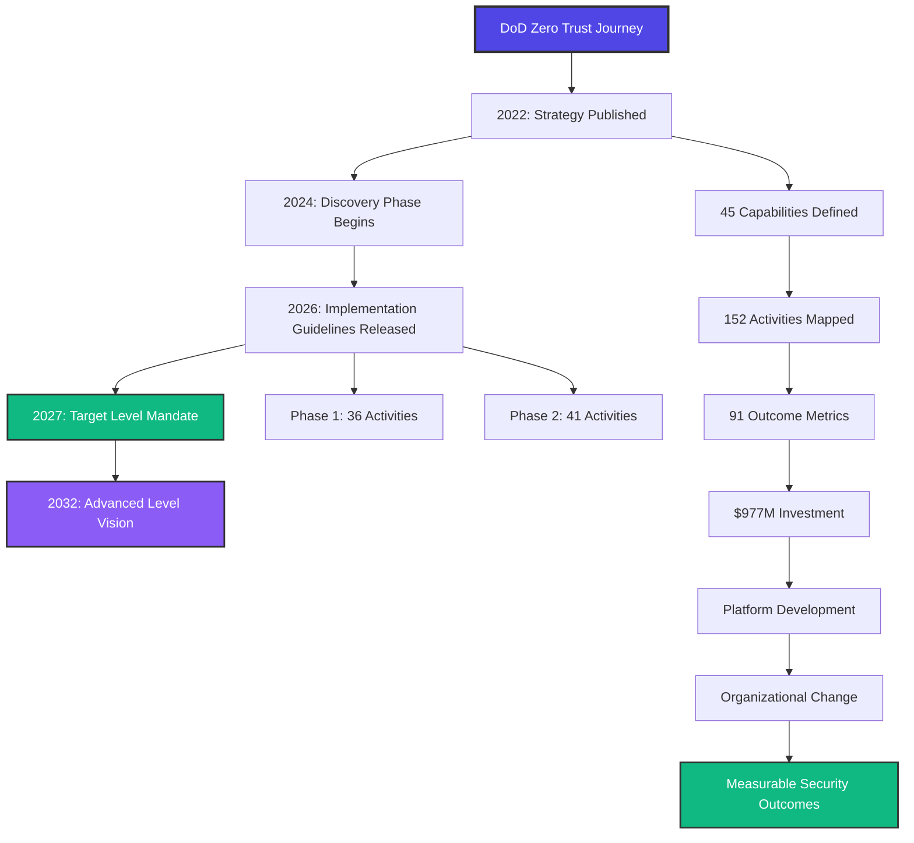

import zeroTrustArchitecture from '../../assets/blog/zero-trust-dod-1.svg';
import zeroTrustTimeline from '../../assets/blog/zero-trust-dod-2.svg';
import zeroTrustBudget from '../../assets/blog/zero-trust-dod-3.svg';
import zeroTrustMaturity from '../../assets/blog/zero-trust-dod-4.svg';

$977 million.

That's how much the Department of Defense allocated for zero trust transition in FY2025.

Part of a [$14.5 billion cybersecurity budget](https://defensescoop.com/2026/01/06/dod-zero-trust-assessments-ai-automation/), a $1 billion increase from the previous year.

In January 2026, the [National Security Agency released](https://www.globalsecurity.org/security/library/news/2026/01/sec-260114-nsa-css01.htm) the first two products in its Zero Trust Implementation Guidelines series: the Primer and the Discovery Phase. These aren't theoretical frameworks. They're practical, battle-tested blueprints for the largest zero trust implementation in the world.

I spent the last week diving into every public document, budget allocation, and timeline from the Pentagon's zero trust transformation. What I found surprised me. This isn't just another government IT project. It's a masterclass in enterprise-scale security transformation.

Let me show you what the DoD got right and what every enterprise can learn from it.

## The breach that changed everything

November 2020. [SolarWinds](https://www.cisa.gov/news-events/news/what-happened-solarwinds-supply-chain-attack).

Russian state-sponsored hackers compromised SolarWinds' Orion software, used by 18,000 customers including multiple federal agencies. They inserted malicious code into legitimate software updates. Then they waited.

For months, the attackers had access to:
- Department of Homeland Security networks
- Treasury Department systems
- State Department communications
- Pentagon contractor networks
- Nuclear weapons infrastructure

The traditional "castle and moat" security model (trust everything inside the network perimeter) had catastrophically failed.

The federal government's response was swift. Not just incident response. But a fundamental rethinking of how government networks operate.

By November 2021, DoD [published its Zero Trust Strategy](https://dodcio.defense.gov/Portals/0/Documents/Library/DoD-ZTStrategy.pdf). The goal wasn't incremental improvement. It was transformation.

**The core principle**: Never trust, always verify. Assume breach.

## What zero trust actually means

Here's what I kept hearing from security vendors: "We offer zero trust solutions!"

But zero trust isn't a product. It's a security model based on a simple premise:

**Don't trust anything or anyone, inside or outside your network, by default.**

Every user, device, application, and data flow must be continuously verified before access is granted.

The [DoD's framework](https://dodcio.defense.gov/Portals/0/Documents/Library/DoD-ZTStrategy.pdf) is built on seven pillars:

### The Seven Pillars

**1. User**
Continuous verification of user identities using multi-factor authentication, behavioral analytics, and risk-based access controls. No more "log in once, trusted all day."

**2. Device**
Every device (laptop, phone, IoT sensor) must prove it's compliant before accessing any resource. Security posture checks happen continuously, not just at login.

**3. Network and Environment**
Microsegmentation replaces the traditional network perimeter. Each network segment is isolated. Lateral movement becomes nearly impossible.

**4. Application and Workload**
Applications are secured through rigorous testing, secure coding practices, and runtime protection. Every API call is verified.

**5. Data**
Data is classified, encrypted, and access-controlled at the granular level. Access follows the data, not the network location.

**6. Visibility and Analytics**
Real-time monitoring of all activities across all seven pillars. AI/ML-driven threat detection spots anomalies humans would miss.

**7. Automation and Orchestration**
Automated policy enforcement and incident response. When a threat is detected, systems respond in milliseconds, not hours.

The DoD didn't invent these pillars. But they're implementing them at a scale no organization has attempted before.

## The roadmap: from strategy to execution

What impressed me most wasn't the strategy document. It was the execution roadmap.

Here's what the timeline actually looks like:

### 2022: Strategy Published

DoD [released its Zero Trust Strategy](https://dodcio.defense.gov/Portals/0/Documents/Library/DoD-ZTStrategy.pdf) outlining 45 zero trust capabilities across the seven pillars.

Not aspirational goals. Specific, measurable capabilities with clear definitions of success.

### FY 2024: Civilian Agency Deadline

The White House's [federal zero trust strategy (M-22-09)](https://www.cisa.gov/sites/default/files/publications/Final%20Draft%20NSTAC%20Report%20to%20the%20President%20on%20Zero%20Trust%20and%20Trusted%20Identity%20Management.pdf) set September 30, 2024 as the deadline for all civilian agencies to adopt zero trust architecture.

Results were mixed. [Many agencies made progress](https://www.cisa.gov/sites/default/files/2025-04/2025_0129_cisa_zero_trust_architecture_implementation.pdf) on identity and access management. But full implementation lagged due to legacy systems, budget constraints, and organizational complexity.

The lesson: Setting deadlines isn't enough. You need execution frameworks.

### January 2026: Implementation Guidelines Released

The [NSA released](https://www.globalsecurity.org/security/library/news/2026/01/sec-260114-nsa-css01.htm) two critical documents:
- **Zero Trust Implementation Guideline Primer**: Overview of the phased approach
- **Discovery Phase Guidelines**: 36 activities supporting 30 capabilities

These aren't high-level principles. They're step-by-step playbooks.

Phase One covers foundational capabilities: asset inventory, identity federation, network segmentation.

Phase Two (coming later in 2026) will cover 41 activities supporting 34 additional capabilities: advanced analytics, automated response, AI-driven threat hunting.

### FY 2027: DoD Target Level

All DoD components must achieve "target level" zero trust by end of fiscal year 2027.

What does target level mean? [91 specific cybersecurity capability outcomes](https://www.esd.whs.mil/Portals/54/Documents/DD/issuances/dtm/DTM%2025-003.PDF) that agencies must demonstrate. Not "we deployed some zero trust tools" but "we can prove our systems meet these measurable security outcomes."

### FY 2032: Advanced Level

The long-term vision: AI/ML-driven automation, predictive threat analytics, autonomous response systems.

This is where zero trust becomes truly transformative. Security that adapts faster than attackers can exploit.

## The $14.5 billion question

Let's talk about the money.

The [FY2025 Pentagon cyber budget](https://defensescoop.com/2026/01/06/dod-zero-trust-assessments-ai-automation/) is $14.5 billion. That's a $1 billion increase from FY2024.

Of that, $977 million is specifically allocated to zero trust transition.

That's only 6.7% of the total cyber budget. But here's what matters: it's not the only investment in zero trust.

Many other cybersecurity initiatives (cloud migration, identity management, network modernization, threat detection) are aligned with zero trust principles. The $977M is the dedicated transformation fund. The actual investment is much larger.

### What does $977 million buy?

Based on the [DoD Zero Trust Strategy](https://dodcio.defense.gov/Portals/0/Documents/Library/DoD-ZTStrategy.pdf), here's what that budget enables:

**152 Zero Trust Activities** spanning:
- Identity and access management infrastructure
- Network microsegmentation across global DoD networks
- Device compliance and endpoint security at scale
- Data classification and encryption systems
- Security orchestration and automation platforms
- AI/ML threat detection and analytics
- Operational technology (OT) security for critical infrastructure

**Organizational transformation**:
- Training for thousands of security professionals
- Process redesign across every DoD component
- Governance frameworks and compliance monitoring
- Change management across one of the world's largest organizations

**Technology platform**:
- Not 50 different point solutions per agency
- Standardized, reusable components that can scale
- Shared threat intelligence across the Department
- Unified visibility and analytics

The pattern here matches what I saw in [McKinsey's research on AI transformation](./state-of-ai-2025-why-94-percent-fail): high performers build platforms, not point solutions.

## The implementation framework that actually works

Here's where the DoD's approach gets really interesting.

Most organizations approach zero trust like this:
1. Buy some zero trust products
2. Deploy them alongside existing security tools
3. Hope everything works together
4. Wonder why nothing changes

The DoD did it differently. And that's why it's working.

### Phase 1: Discovery (where we are now)

From the [January 2026 guidelines](https://www.globalsecurity.org/security/library/news/2026/01/sec-260114-nsa-css01.htm), the Discovery Phase includes:

**Asset Inventory**
You can't secure what you don't know exists. Every device, application, data store, and network connection must be catalogued.

For DoD, this means:
- Millions of endpoints across global networks
- Thousands of legacy systems (some decades old)
- Shadow IT that nobody documented
- Operational technology in critical infrastructure

**Identity Federation**
Map every user, service account, and application identity. Understand who has access to what, and why.

**Network Mapping**
Document every network segment, connection, and data flow. This becomes the foundation for microsegmentation.

**Risk Assessment**
Identify the crown jewels: the systems and data that matter most. These get the highest priority for zero trust controls.

The Discovery Phase isn't glamorous. But it's essential. Most organizations skip this and jump straight to technology deployment. Then they discover (too late) that they don't understand their own environment well enough to secure it.

### Phase 2: Foundation Building

This is about establishing the core capabilities:

**Strong Identity**
- Multi-factor authentication everywhere, not just VPN access
- Phishing-resistant MFA: hardware tokens, biometrics
- Continuous authentication, not just login
- Privileged access management

**Device Trust**
- Endpoint detection and response on every device
- Automated compliance checking
- Device health attestation before granting access

**Network Segmentation**
- Microsegmentation to limit lateral movement
- Software-defined perimeters replacing VPNs
- Least-privilege network access

### Phase 3: Visibility and Intelligence

**Security Analytics**
- Log everything across all seven pillars
- AI/ML-driven anomaly detection
- Unified security operations center (SOC)

**Threat Intelligence**
- Real-time threat feeds
- Automated threat correlation
- Predictive analytics

### Phase 4: Automation

**Policy Automation**
- Automated access decisions based on risk
- Self-healing security controls
- Autonomous incident response

**Orchestration**
- Integration across all security tools
- Automated workflow for common scenarios
- Human-in-the-loop for complex decisions

## The maturity model that guides everything

The DoD didn't just define the target. They defined the journey.

[CISA's Zero Trust Maturity Model v2.0](https://www.cisa.gov/sites/default/files/2025-04/2025_0129_cisa_zero_trust_architecture_implementation.pdf) defines three maturity levels:

### Traditional (where most organizations start)

- Perimeter-based security: firewalls, VPNs
- "Trust but verify" mindset
- Static security policies
- Limited visibility into user and device behavior
- Manual processes and responses
- Reactive security posture

This is the "castle and moat" model. It worked when everything was inside the network. It fails in today's cloud-first, mobile, work-from-anywhere world.

### Target Level (2027 DoD mandate)

- "Never trust, always verify"
- Continuous authentication and authorization
- Microsegmentation and least-privilege access
- "Assume breach" mindset
- Comprehensive visibility and analytics
- Automated policy enforcement

This is the minimum viable zero trust architecture. It addresses the fundamental weaknesses of traditional security while remaining operationally feasible.

### Advanced Level (2032 vision)

- AI/ML-driven security decision-making
- Autonomous threat hunting and response
- Real-time, adaptive security policies
- Predictive threat analytics
- Zero-touch operations for common scenarios
- Security that evolves faster than threats

This is where zero trust becomes transformative. Security operations that scale to protect millions of users without requiring an army of analysts.

## What went wrong for others (and right for DoD)

I've watched plenty of zero trust initiatives fail. Here's what usually kills them:

### Failure pattern 1: Technology-first approach

**What happens**: Buy zero trust products. Deploy them. Wonder why nothing changes.

**Why it fails**: Zero trust is an architectural model, not a product category. Without redesigning workflows and processes, new tools just add complexity.

**What DoD did differently**: Started with a capabilities-based roadmap. Technology came last, after defining the outcomes they needed.

### Failure pattern 2: No executive commitment

**What happens**: Security team gets a mandate to "do zero trust," but no budget, no organizational authority, no process change approval.

**Why it fails**: Zero trust requires changing how everyone works. That needs executive-level commitment and organizational transformation.

**What DoD did differently**: [Directive-type memorandum (DTM 25-003)](https://www.esd.whs.mil/Portals/54/Documents/DD/issuances/dtm/DTM%2025-003.PDF) from the Secretary of Defense. Not a suggestion. A mandate with clear accountability.

### Failure pattern 3: Big bang transformation

**What happens**: Try to implement everything at once. Overwhelm the organization. Stall and eventually abandon the effort.

**Why it fails**: Organizations can only absorb so much change at once. Zero trust is a multi-year journey.

**What DoD did differently**: Phased approach with clear milestones. Discovery Phase first. Target level by 2027. Advanced level by 2032.

### Failure pattern 4: Pilot purgatory

**What happens**: Run successful pilots. Prove the technology works. Then never scale beyond the initial use case.

**Why it fails**: No platform thinking. Every use case requires custom integration. Organizations can't scale from 1 to 100 deployments.

**What DoD did differently**: Platform approach from the start. Reusable components. Standardized frameworks. What works in one DoD component can be replicated across all components.

### Failure pattern 5: Measuring activities, not outcomes

**What happens**: Track number of tools deployed, users trained, policies written. Declare success. Get breached anyway.

**Why it fails**: Activities don't equal security outcomes. You can deploy all the right tools and still have gaping security holes.

**What DoD did differently**: [91 cybersecurity capability outcomes](https://www.esd.whs.mil/Portals/54/Documents/DD/issuances/dtm/DTM%2025-003.PDF) that must be demonstrated. Not "did you deploy MFA?" but "can you prove unauthorized access is prevented?"

## The five lessons every enterprise should steal

After going through all this research, here's what stands out:

### 1. Start with outcomes, not technology

Define the security capabilities you need. Be specific. Measurable.

The DoD defined 45 capabilities across seven pillars. Each capability has clear success criteria.

Only after defining capabilities did they select technology.

Most organizations do this backwards: buy tools, then figure out what to do with them.

### 2. Build a platform, not point solutions

Every organization I've seen struggle with zero trust has the same problem: 50 different security tools that don't talk to each other.

The DoD approach: standardized, reusable components. Integration is built in. What works in one context can scale to others.

This is the same pattern that separates [the 6% of high-performing AI organizations](./state-of-ai-2025-why-94-percent-fail) from everyone else.

### 3. Phase the transformation

Zero trust isn't something you "turn on." It's a multi-year journey.

The DoD timeline:
- Discovery: Understand what you have
- Foundation: Build core capabilities
- Advanced: AI-driven automation

Trying to skip phases leads to failure. You need the foundation before you can build advanced capabilities.

### 4. Measure security outcomes, not activities

Don't track:
- Number of zero trust products deployed
- Percentage of users trained
- Policies documented

Track:
- Unauthorized access attempts blocked
- Mean time to detect and respond to threats
- Blast radius when breaches occur (they will)
- Recovery time from incidents

The DoD requires demonstrable proof of 91 specific cybersecurity outcomes. That's what accountability looks like.

### 5. Get executive commitment (real commitment)

Not "the CISO has a budget to explore zero trust."

But "the CEO/Secretary has mandated zero trust implementation with clear deadlines and accountability."

The DoD's [DTM 25-003](https://www.esd.whs.mil/Portals/54/Documents/DD/issuances/dtm/DTM%2025-003.PDF) comes from the Secretary of Defense. Every component is accountable. Progress is monitored. Deadlines are enforced.

That's the level of commitment required for transformation.

## The challenges ahead

This isn't a success story yet. It's a journey in progress.

The [DoD faces significant challenges](https://federalnewsnetwork.com/federal-insights/2024/10/dod-agencies-confront-zero-trust-challenges-misunderstandings-ahead-of-2026-deadline/):

**Legacy systems** that can't be easily replaced or upgraded. Some DoD systems are decades old. Zero trust principles weren't designed with them in mind.

**Operational technology** with unique constraints. You can't just reboot a weapons system to apply a security patch. The [DoD published specific OT guidance](https://dodcio.defense.gov/Portals/0/Documents/Library/ZT-OperationalTechnologyActivitiesOutcomes.pdf) in late 2025 to address this.

**Organizational complexity**. DoD has thousands of components, each with different missions, risk profiles, and technical environments. One-size-fits-all doesn't work.

**Cultural resistance**. Security controls that add friction to workflows face pushback. Change management at this scale is brutally hard.

**Vendor ecosystem**. Reliance on contractors and commercial technology creates integration and security challenges.

But here's what gives me confidence they'll succeed:

They're treating this as an **organizational transformation**, not a technology project.

They have **executive commitment** with clear accountability.

They're taking a **phased approach** with realistic timelines.

They're **measuring outcomes**, not activities.

They're building a **platform** that can scale.

These are the exact patterns that separate successful transformations from failed ones.

## What this means for your organization

You don't need a $14.5 billion budget to apply these lessons.

Here's how to start:

### For CISOs and security leaders:

**Stop launching more security pilots**
If you have 5+ zero trust initiatives and none have scaled, you have an organizational problem, not a technology problem.

**Map your current state**
Run your own Discovery Phase. You can't secure what you don't understand. Asset inventory, identity mapping, network documentation.

**Define clear outcomes**
Not "implement zero trust," but specific, measurable security capabilities you need to achieve. Write them down. Get executive agreement.

**Build a phased roadmap**
Don't try to boil the ocean. Pick the highest-impact capabilities. Implement them. Prove value. Then expand.

**Think platform, not products**
Every new security tool you add increases complexity. Focus on integration and standardization, not feature checklists.

### For CIOs and enterprise architects:

**Zero trust enables cloud and digital transformation**
The traditional perimeter model doesn't work for cloud-first, mobile, distributed workforces. Zero trust is how you secure modern infrastructure.

**Identity is your new perimeter**
Every digital transformation initiative should include identity federation, strong authentication, and access management as core components.

**Network segmentation is foundational**
Whether you're in the cloud or on-premises, microsegmentation limits blast radius when (not if) breaches occur.

### For CEOs and business leaders:

**This is a business risk issue, not just IT**
SolarWinds wasn't a technology failure. It was an operational failure with strategic consequences. Zero trust is risk management.

**Executive commitment required**
Your security team can't do this alone. Zero trust requires process change, budget allocation, and organizational accountability.

**The cost of inaction is higher**
The [average cost of a data breach is $4.45 million](https://www.ibm.com/reports/data-breach). Regulatory fines are increasing. Reputation damage is lasting. Zero trust is expensive, but breaches are more expensive.

## The future of government cybersecurity

The DoD's zero trust transformation is just the beginning.

[CISA's January 2025 report](https://www.cisa.gov/sites/default/files/2025-04/2025_0129_cisa_zero_trust_architecture_implementation.pdf) shows civilian agencies are making progress. Identity and access management are improving. Encryption is becoming standard. Incident logging is more comprehensive.

But full zero trust adoption across all federal agencies will take years.

The [10-year modernization campaign](https://www.govtech.com/blogs/lohrmann-on-cybersecurity/where-are-governments-in-their-zero-trust-journey) reflects reality. This is generational change.

What's emerging is a new security model for the digital age:

**Assume breach** as the default mindset.
**Continuous verification**, replacing "trust on first login."
**Least-privilege access** everywhere.
**Microsegmentation**, limiting lateral movement.
**Automation**, enabling security at scale.
**AI/ML**, augmenting human analysts.

This isn't just government. Every enterprise faces the same threats. The same architectural challenges. The same need for transformation.

The DoD is showing what enterprise-scale zero trust implementation actually looks like.

Not theory. Not marketing. But real transformation with measurable outcomes.

## Watch what they do next

I'm tracking a few specific developments:

**Phase Two Implementation Guidelines** (expected 2026): The advanced capabilities covering automation, AI-driven analytics, and autonomous response.

**Zero Trust Strategy 2.0** ([planned for early 2026](https://defensescoop.com/2025/12/09/dod-zero-trust-strategy-2-0-expected-early-2026/)): Updated strategy incorporating lessons learned from initial implementation.

**AI-powered assessments**: The Pentagon is [exploring AI and automation](https://defensescoop.com/2026/01/06/dod-zero-trust-assessments-ai-automation/) for continuous zero trust compliance monitoring. This could dramatically reduce the assessment burden.

**Operational technology expansion**: As [OT environments adopt zero trust principles](https://dodcio.defense.gov/Portals/0/Documents/Library/ZT-OperationalTechnologyActivitiesOutcomes.pdf), we'll learn how to secure critical infrastructure at scale.

These developments will shape how every enterprise approaches zero trust.

## The bottom line

The Department of Defense is implementing the largest zero trust transformation in the world.

$14.5 billion cybersecurity budget. $977 million for zero trust. 152 activities across 45 capabilities and 7 pillars. Mandatory deadlines for all DoD components.

This isn't just a government IT project. It's a blueprint for enterprise-scale security transformation.

What makes it work:
- **Outcomes-based approach** (91 measurable capability outcomes)
- **Executive mandate** from the Secretary of Defense
- **Phased implementation** with realistic timelines
- **Platform thinking** instead of point solutions
- **Organizational transformation**, not just technology deployment

The lessons apply to any enterprise serious about cybersecurity in the modern threat landscape.

Zero trust isn't optional anymore. It's how you survive in a world where the perimeter has dissolved and breaches are inevitable.

The DoD is showing us how to do it at scale.

The question is: will your organization follow?

---

---

## Sources & Further Reading

Key sources for this article:

- [DoD Zero Trust Strategy](https://dodcio.defense.gov/Portals/0/Documents/Library/DoD-ZTStrategy.pdf) - Official Department of Defense Zero Trust Strategy document
- [NSA Zero Trust Implementation Guidelines](https://www.globalsecurity.org/security/library/news/2026/01/sec-260114-nsa-css01.htm) - January 2026 release of Primer and Discovery Phase
- [DTM 25-003: Implementing the DoD Zero Trust Strategy](https://www.esd.whs.mil/Portals/54/Documents/DD/issuances/dtm/DTM%2025-003.PDF) - Official mandate and implementation directive
- [CISA Zero Trust Architecture Implementation Report](https://www.cisa.gov/sites/default/files/2025-04/2025_0129_cisa_zero_trust_architecture_implementation.pdf) - Federal agency progress report
- [Pentagon Zero Trust Budget and Timeline](https://defensescoop.com/2026/01/06/dod-zero-trust-assessments-ai-automation/) - FY2025 budget details
- [DoD OT Zero Trust Activities](https://dodcio.defense.gov/Portals/0/Documents/Library/ZT-OperationalTechnologyActivitiesOutcomes.pdf) - Operational technology guidance
- [Federal Zero Trust Challenges](https://federalnewsnetwork.com/federal-insights/2024/10/dod-agencies-confront-zero-trust-challenges-misunderstandings-ahead-of-2026-deadline/) - Implementation obstacles
- [Government Zero Trust Roundup 2025](https://www.govtech.com/blogs/lohrmann-on-cybersecurity/zero-trust-architecture-in-government-spring-2025-roundup) - State of federal implementation

---

*Want to dive deeper into cybersecurity transformation? Check out my other case studies on enterprise-scale security implementations and modern architecture patterns.*
