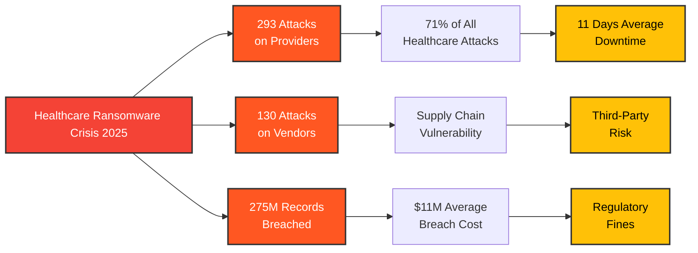
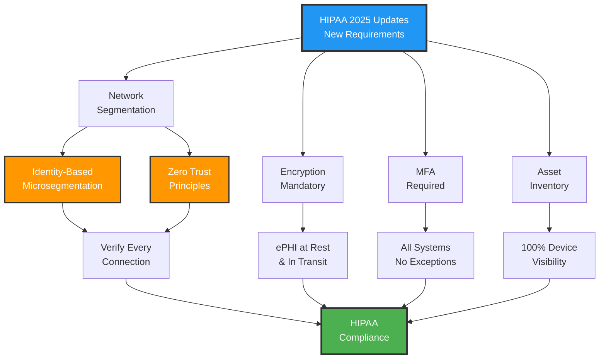
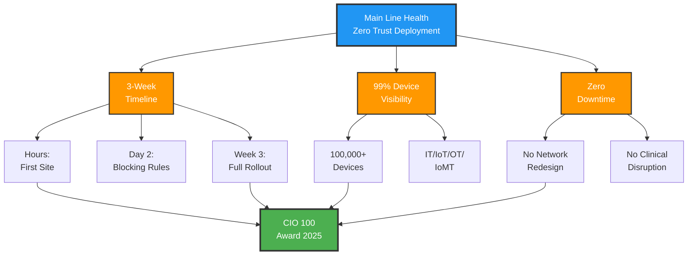

293 ransomware attacks on healthcare providers in the first nine months of 2025.

275 million patient records breached, a [63.5% increase](https://deepstrike.io/blog/healthcare-data-breaches-2025-statistics) from 2023.

Average breach cost: [$11 million](https://thehackernews.com/2025/04/automating-zero-trust-in-healthcare.html).

Meanwhile, Main Line Health, a 50,000-user healthcare system spanning hospitals, outpatient facilities, and acute care centers, deployed enterprise Zero Trust in hours at their first site, with blocking rules active the next day. Full enterprise rollout: three weeks.

They won the [CIO 100 Award for 2025](https://www.mainlinehealth.org/news/2025/03/25/main-line-health-named-a-2025-cio-100-award-winner) and the [CSO 50 Award in 2024](https://www.businesswire.com/news/home/20250423716260/en/Main-Line-Health-Secures-CIO-100-Honors-Through-Deployment-of-the-Elisity-Armis-Integration).

I wanted to understand how they did it. Because the gap between healthcare's security crisis and Main Line Health's execution speed is remarkable. After going through case studies, technical documentation, and interviews with their CISO, I found out why. It's not what you'd expect.

This isn't a story about buying better security tools. It's about deploying Zero Trust when hospitals can't afford downtime, when legacy medical devices can't be patched, and when HIPAA compliance just got a lot harder.

Let me show you what I found.

## The healthcare ransomware crisis nobody's talking about

Here's the landscape most hospital CISOs are dealing with right now:

**Q1-Q3 2025 alone**:
- [293 ransomware attacks](https://www.comparitech.com/news/healthcare-ransomware-roundup-q1-q3-2025-stats-on-attacks-ransoms-and-data-breaches/) on hospitals and healthcare providers
- [130 additional attacks](https://www.comparitech.com/news/healthcare-ransomware-roundup-q1-q3-2025-stats-on-attacks-ransoms-and-data-breaches/) on healthcare businesses (vendors, billing services, labs)
- 7.4 million patient records breached from direct provider attacks
- 6 million more from healthcare business attacks

The largest breaches in 2025? All ransomware:
- [Yale New Haven Health: 5.56 million people](https://www.hipaajournal.com/largest-healthcare-data-breaches-of-2025/)
- DaVita: 2.69 million individuals
- Anne Arundel Dermatology: 1.91 million patients
- Frederick Health: 934,000 patient records



And it's getting worse. [Ransomware now represents 71%](https://thehackernews.com/2025/04/automating-zero-trust-in-healthcare.html) of all attacks against healthcare organizations.

But here's what makes healthcare different from other industries: **downtime kills people**.

When a hospital's systems go down for 11 days (the average ransomware downtime), we're not talking about lost revenue. We're talking about:
- Canceled surgeries
- Diverted ambulances
- Paper-based medical records
- Delayed diagnoses
- Patient safety risks

You can't just "restore from backup" when lives are on the line.

## Why healthcare is uniquely vulnerable

Most organizations have one network with maybe some segmentation. Healthcare has at least five:

1. **IT network** - Electronic health records, billing, email
2. **IoT network** - Badge readers, security cameras, building systems
3. **OT network** - HVAC, power management, physical infrastructure
4. **IoMT network** - Medical devices (infusion pumps, monitors, imaging equipment)
5. **Guest network** - Patient WiFi, visitor access

Main Line Health discovered they had **over 100,000 devices** across these networks when they deployed their Zero Trust solution. They didn't know exactly what was on their network before that.

Here's what Aaron Weismann, CISO at Main Line Health, said:

> "We have a very difficult time handling non-traditional compute because of not having tooling specifically designed to address and manage those devices."

Translation: Traditional security tools were designed for laptops and servers. Not for:
- 15-year-old MRI machines running Windows XP that can't be patched
- Infusion pumps with embedded Linux that vendors won't let you update
- Medical monitors with hard-coded credentials
- Imaging equipment that costs $2 million and has a 20-year lifecycle

These devices can't run endpoint protection. They can't be upgraded. They can't even be rebooted without FDA re-validation in some cases.

And yet they're all on the network. All potential entry points for ransomware.

## The HIPAA compliance problem just got harder

December 27, 2024: The U.S. Department of Health and Human Services [proposed major updates to the HIPAA Security Rule](https://www.hhs.gov/hipaa/for-professionals/security/hipaa-security-rule-nprm/factsheet/index.html).

The big change? Network segmentation is no longer "addressable" (nice to have). It's **required**.

Specifically, the new rule mandates:
- **Identity-based microsegmentation** to protect electronic Protected Health Information (ePHI)
- **Encryption at rest and in transit** for all ePHI (no exceptions)
- **Multi-factor authentication** across all systems
- **Comprehensive asset inventory** and network mapping
- **Regular vulnerability scanning** (every six months minimum)
- **Annual penetration testing** with documented remediation



The old approach? "We'll address network segmentation when we have budget."

The new approach: **You must implement network segmentation with documented policies and procedures**. Expected enforcement: 2026.

For most healthcare organizations, this is a nightmare. Redesigning network architecture across hospitals, clinics, and outpatient facilities? Minimum 12-18 month project. Massive disruption. Huge capital expense.

Unless you do what Main Line Health did.

## How Main Line Health deployed Zero Trust in 3 weeks

Here's their timeline:

**Week 1**:
- Deployed at first site within hours
- Gained visibility into 100,000+ devices
- Identified critical assets and data flows

**Day 2**:
- Created blocking rules based on discovered assets
- Implemented initial microsegmentation policies
- Zero network disruption

**Week 2-3**:
- Rolled out across entire enterprise
- Integrated with existing security stack (Armis for asset discovery)
- Achieved 99% discovery and visibility

Total deployment time: **Three weeks**. No network redesign. No forklift upgrades. No downtime.

How is that possible?

### The architecture that made it work

Most Zero Trust implementations require massive network infrastructure changes:
- Rip out old switches
- Redesign VLANs
- Reconfigure routing
- Update firewall rules (thousands of them)
- Test everything extensively

Main Line Health used a different approach: **identity-based microsegmentation without network redesign**.

Here's how it works:

**Traditional approach**:
```
User → VPN → Firewall → VLAN → Resource
(Trust based on network location)
```

**Zero Trust approach**:
```
User → Identity Verification → Policy Engine → Dynamic Access → Resource
(Trust based on identity + context)
```

The key difference? Traditional security asks: "Are you on the right network?"

Zero Trust asks: "Who are you, what device are you using, is it secure, what are you trying to access, and should you be allowed to do that?"

Every time. For every connection.

### The implementation playbook

Based on their deployment, here's what Main Line Health actually did:

#### Phase 1: Discovery (Hours, not months)

Deployed automated discovery to identify:
- All users (staff, contractors, patients, vendors)
- All devices (laptops, servers, medical devices, IoT)
- All applications and services
- All data flows between systems

Result: **100,000+ devices catalogued**. Including thousands they didn't know existed.

#### Phase 2: Risk scoring (Day 1)

Every discovered asset got a risk score based on:
- Device type and function
- Patch status and vulnerabilities
- Network behavior
- Access to ePHI
- Compliance requirements

Medical devices that couldn't be patched? High risk. But now they were visible and could be protected.

#### Phase 3: Policy creation (Day 2)

Instead of writing thousands of firewall rules manually, they used automated policy generation:

- "Infusion pumps can only communicate with pharmacy systems"
- "MRI machines can only send data to PACS"
- "Billing systems cannot access medical devices"
- "Third-party vendors get access only to specific applications, not entire network segments"

Policies based on identity and function, not IP addresses.

#### Phase 4: Enforcement (Week 2-3)

Policies deployed across the enterprise:
- Monitoring mode first (watch but don't block)
- Validated legitimate traffic patterns
- Switched to enforcement mode
- Blocked unauthorized connections automatically

Result: **99% device visibility and coverage** across IT, IoT, OT, and IoMT environments.

### What Aaron Weismann said about the deployment

> "The synergy between Armis and Elisity has fortified defenses against targeted cyber threats, improving overall operational efficiency with added layers of security and visibility. Microsegmentation is a key strategy for accelerating our Zero Trust program."

The critical insight? They didn't try to secure everything at once. They:
1. Got visibility first
2. Understood their attack surface
3. Protected the most critical assets (ePHI systems)
4. Progressively tightened policies
5. Automated policy enforcement

## The results: Why they won the awards

Main Line Health earned two major awards:
- [**CIO 100 Award (2025)**](https://www.mainlinehealth.org/news/2025/03/25/main-line-health-named-a-2025-cio-100-award-winner) - Recognizing innovation and business value
- [**CSO 50 Award (2024)**](https://www.businesswire.com/news/home/20250423716260/en/Main-Line-Health-Secures-CIO-100-Honors-Through-Deployment-of-the-Elisity-Armis-Integration) - Recognizing security excellence

Here's what they achieved:

### Security outcomes

**Before Zero Trust**:
- Limited visibility into medical devices
- Flat network architecture
- Perimeter-based security (attackers move freely once inside)
- Manual policy management
- No microsegmentation
- Third-party vendor access to entire network segments

**After Zero Trust**:
- [99% discovery and visibility](https://thehackernews.com/2025/04/automating-zero-trust-in-healthcare.html) of all devices
- Identity-based microsegmentation
- Automated policy enforcement
- Lateral movement blocked by default
- Third-party access strictly limited by function
- Real-time threat detection and response

### Operational outcomes

**Deployment efficiency**:
- Site deployment: Hours (not months)
- Policy activation: Next day (not weeks)
- Full enterprise rollout: 3 weeks (not 12-18 months)
- Network downtime: Zero
- Disruption to clinical operations: None

**Cost avoidance**:
- No network infrastructure redesign
- No hardware refresh required
- No rip-and-replace of existing security tools
- Average ransomware attack cost avoided: $11 million+

### Compliance outcomes

Positioned for 2025 HIPAA requirements:
- ✅ Network segmentation (required, not addressable)
- ✅ Identity-based access control
- ✅ Complete asset inventory
- ✅ Automated policy enforcement
- ✅ Continuous monitoring and validation



## What makes identity-based microsegmentation different

Let me break down why this approach worked when traditional network segmentation would have taken 18 months.

### Traditional network segmentation

**How it works**:
- Divide network into VLANs or subnets
- Configure firewall rules between segments
- Route traffic through security checkpoints

**Example**: Medical devices VLAN, EHR VLAN, staff VLAN, guest VLAN

**Problems**:
- Requires extensive network redesign
- Thousands of firewall rules to manage manually
- Devices in same VLAN can talk freely (lateral movement risk)
- IP-based policies break when devices move or get new addresses
- Massive testing required (what if you break something critical?)

**Timeline**: 12-18 months for enterprise deployment

### Identity-based microsegmentation

**How it works**:
- Every device gets a unique identity
- Policies based on "who/what is trying to access what"
- Enforcement happens in software, not network hardware
- No network infrastructure changes required

**Example**: "Infusion pump #3847 can only communicate with pharmacy system #2, only during active session, only using specific protocol"

**Benefits**:
- Deploy without network changes
- Policies follow the device (not tied to IP or location)
- Automated policy generation based on discovered behavior
- Microscopic segmentation (device-to-device, not VLAN-to-VLAN)
- Changes don't require network-wide testing

**Timeline**: Hours to weeks for enterprise deployment

### Why this matters for healthcare

Medical devices move. A portable ultrasound machine goes from ICU to ER to surgical suite. With VLAN-based segmentation, that's a configuration nightmare.

With identity-based segmentation? The ultrasound's policies follow it. It can access the imaging server from anywhere. But **only** the imaging server. Not the billing system. Not the internet. Not other medical devices.

When a device behaves abnormally (say, an infusion pump suddenly tries to access the internet, classic ransomware behavior), the system blocks it automatically. No human intervention required.

## What other hospitals should know

I talked to several healthcare CISOs after studying Main Line Health's deployment. Here's what I learned:

### Mistake #1: Waiting for a "security refresh"

Most hospitals plan to implement Zero Trust "during our next network refresh" or "when we upgrade our data center."

That's backwards. You don't need new infrastructure to deploy Zero Trust. Main Line Health proved that.

The hospitals that wait? They're the ones getting hit by ransomware before they deploy.

### Mistake #2: Treating medical devices as "too hard to secure"

The attitude I hear: "Medical devices can't run security agents, so we can't protect them."

Wrong. You can't put an agent on an MRI machine. But you **can**:
- Discover it and profile its normal behavior
- Microsegment it so it can only communicate with authorized systems
- Block any abnormal network behavior automatically
- Monitor it continuously for compromise indicators

Main Line Health secured 100,000+ devices, most of which can't run traditional security software.

### Mistake #3: Thinking Zero Trust means "zero trust in users"

Zero Trust isn't about treating doctors and nurses like threats. It's about:
- Verifying devices before they access patient data
- Limiting blast radius if a device gets compromised
- Protecting against third-party vendor breaches
- Stopping lateral movement after initial compromise

A nurse with proper credentials can still access exactly what they need. A compromised vendor laptop? It gets blocked.

### Mistake #4: Doing it all at once

Main Line Health's approach:
- Deploy to one site first (hours)
- Validate it works (day 2)
- Roll out progressively (week 2-3)

They didn't try to secure everything on day one. They:
1. Started with visibility
2. Protected critical assets first (ePHI systems)
3. Progressively tightened policies
4. Let automation handle enforcement

### Mistake #5: Building it yourself instead of buying proven solutions

Some healthcare systems try to cobble together Zero Trust from:
- Existing firewalls
- NAC products
- SIEM tools
- Endpoint protection

Result? Integration nightmare. Gaps in coverage. Manual policy management.

Main Line Health used an integrated platform (Elisity + Armis) designed specifically for healthcare environments with medical devices, IoT, and complex compliance requirements.

Time saved: Months of integration work and testing.

## The five principles that made it work

Based on Main Line Health's deployment and conversations with their team, here are the core principles:

### 1. Automate discovery and policy generation

Manual device inventory? Impossible at scale. Main Line Health didn't manually catalogue 100,000 devices. They automated it.

Manual policy creation? Too slow and error-prone. They automated policy generation based on discovered behavior and business context.

The CISO's time went to strategy and risk decisions, not spreadsheets.

### 2. Start with visibility, move to enforcement progressively

They didn't flip a switch and start blocking everything. They:
- Discovered all devices first
- Observed normal behavior patterns
- Created policies in monitor mode
- Validated policies with stakeholders
- Switched to enforcement mode selectively

Clinical teams never lost access to critical systems. No surprises. No disruption.

### 3. Integrate with existing security stack

Main Line Health already had Armis for cyber asset management. Their Zero Trust solution integrated with it instead of replacing it.

Result: Better security posture, no rip-and-replace, faster ROI.

### 4. Measure what actually matters

They didn't track:
- Number of policies created
- Devices scanned
- Training sessions delivered

They tracked:
- Percentage of assets with visibility and protection
- Time to detect and block unauthorized access
- Reduction in lateral movement risk
- HIPAA compliance readiness

Outcomes over activities.

### 5. Focus on business enablement, not just security

Zero Trust wasn't sold as "we need better security" (even though they did).

It was sold as:
- HIPAA 2025 compliance readiness
- Ransomware resilience
- Third-party risk reduction
- Operational efficiency (automated policy management)
- Business continuity (no network redesign required)

Security teams got better protection. Business leaders got risk reduction. IT teams got automation. Clinical teams got zero disruption.

Everyone won.

## What this means for healthcare cybersecurity

Main Line Health's deployment proves three things:

**1. You don't need 18 months to deploy Zero Trust**

The "we'll get to it next year" excuse doesn't hold up anymore. Hours to weeks is achievable.

**2. You don't need to redesign your network**

Identity-based microsegmentation works with your existing infrastructure. No forklift upgrades required.

**3. You don't need to choose between security and operations**

Zero Trust can improve security **and** reduce operational complexity. Automated policy management is less work than manual firewall rules.

The hospitals getting hit by ransomware in 2025? They're not the ones who couldn't afford Zero Trust.

They're the ones who thought they couldn't deploy it fast enough to matter.

## The playbook for your organization

If you're a healthcare CISO, CIO, or on the security team, here's what Main Line Health's deployment teaches us:

### Phase 1: Get executive buy-in (Week 1)

**Frame it as business risk, not security tech**:
- "HIPAA 2025 requires network segmentation: enforcement expected in 2026"
- "Average healthcare ransomware cost: $11 million + 11 days downtime"
- "We can deploy enterprise Zero Trust in weeks, not years, with zero disruption"

**Show the ROI**:
- Ransomware attack avoided: $11M+
- Network redesign avoided: $2-5M
- HIPAA compliance fines avoided: $100K-$1.5M per violation
- Deployment cost: Fraction of one avoided breach

### Phase 2: Select the right platform (Week 2)

**Must-haves for healthcare**:
- ✅ Works without network redesign
- ✅ Discovers and protects medical devices (IoMT)
- ✅ Automated policy generation and enforcement
- ✅ Integration with existing security stack
- ✅ HIPAA compliance features built-in
- ✅ Proven in healthcare environments (not just slides)

**Red flags**:
- ❌ Requires VPN or agent on every device
- ❌ Needs network infrastructure replacement
- ❌ Manual policy creation and management
- ❌ No medical device support
- ❌ No healthcare customer references

### Phase 3: Pilot deployment (Week 3-4)

**Start small**:
- Pick one facility or one network segment
- Deploy automated discovery
- Identify critical assets and data flows
- Create policies in monitor mode
- Validate with stakeholders

**Success criteria**:
- 95%+ device discovery
- Zero disruption to clinical operations
- Policies validated by clinical and IT teams
- Measurable risk reduction

### Phase 4: Enterprise rollout (Week 5-8)

**Progressive deployment**:
- Site by site, not big bang
- Monitor mode first, enforcement second
- Clinical systems before administrative systems
- High-risk devices (third-party access) first

**Continuous validation**:
- Daily review of blocked connections
- Weekly policy optimization
- Monthly risk assessment
- Quarterly compliance audit

### Phase 5: Continuous improvement (Ongoing)

**Evolve the program**:
- Add new devices automatically as they're discovered
- Refine policies based on actual behavior
- Integrate with incident response
- Measure and report on risk reduction

**Track what matters**:
- % of assets with microsegmentation policies
- Mean time to detect unauthorized access
- Lateral movement attempts blocked
- Third-party risk exposure
- HIPAA compliance status

## The bottom line

293 ransomware attacks on healthcare providers in 9 months.

275 million patient records breached in 2024-2025.

HIPAA 2025 making network segmentation mandatory.

Main Line Health deployed enterprise Zero Trust in 3 weeks, won two major awards, and secured 100,000+ devices without network downtime.

The gap isn't technology. The gap is execution.

Healthcare organizations have two choices:

1. Wait for the "right time" to deploy Zero Trust (spoiler: there is no right time)
2. Deploy now while you can do it proactively, not reactively after a breach

The hospitals that wait? Some of them will be in next year's "largest healthcare breaches" report.

The ones that act? They'll be case studies like Main Line Health.

Your choice.

---

## Key takeaways for healthcare CISOs

If you remember nothing else from this article, remember these five things:

**1. Time is the enemy**

Every day without Zero Trust is a day you're vulnerable. [71% of healthcare attacks are ransomware](https://thehackernews.com/2025/04/automating-zero-trust-in-healthcare.html). Average downtime: 11 days. Average cost: $11 million.

You can deploy in weeks. Start now.

**2. You don't need perfect to start**

Main Line Health didn't wait until they had every device catalogued and every policy defined. They started with visibility, then progressively tightened security.

Perfect is the enemy of done. Deploy, learn, improve.

**3. Automation is non-negotiable**

You cannot manually manage 100,000 devices. You cannot manually write policies for every possible connection. You cannot manually monitor for threats 24/7.

If your Zero Trust solution requires manual work at scale, it will fail.

**4. Integration beats replacement**

Work with your existing security stack. Integrate, don't replace. Main Line Health's success came partly from integrating with Armis, not ripping it out.

Leverage what you have. Fill the gaps.

**5. Compliance is the business case**

HIPAA 2025 makes network segmentation required. That's not a security recommendation anymore. It's a regulatory mandate.

Zero Trust isn't just good security. It's compliance readiness. Frame it that way with leadership.

---

## Sources and further reading

This article draws from multiple sources about Main Line Health's deployment and the healthcare cybersecurity landscape:

**Main Line Health Case Study**:
- [Main Line Health Named a 2025 CIO 100 Award Winner](https://www.mainlinehealth.org/news/2025/03/25/main-line-health-named-a-2025-cio-100-award-winner)
- [Main Line Health Secures CIO 100 Honors Through Deployment of the Elisity-Armis Integration](https://www.businesswire.com/news/home/20250423716260/en/Main-Line-Health-Secures-CIO-100-Honors-Through-Deployment-of-the-Elisity-Armis-Integration)
- [Automating Zero Trust in Healthcare](https://thehackernews.com/2025/04/automating-zero-trust-in-healthcare.html)

**Healthcare Ransomware Statistics**:
- [Healthcare Ransomware Roundup: Q1-Q3 2025 Stats](https://www.comparitech.com/news/healthcare-ransomware-roundup-q1-q3-2025-stats-on-attacks-ransoms-and-data-breaches/)
- [275 Million Records Exposed: The 2025 Healthcare Breach Crisis](https://deepstrike.io/blog/healthcare-data-breaches-2025-statistics)
- [Largest Healthcare Data Breaches of 2025](https://www.hipaajournal.com/largest-healthcare-data-breaches-of-2025/)

**HIPAA 2025 Updates**:
- [HIPAA Security Rule Notice of Proposed Rulemaking](https://www.hhs.gov/hipaa/for-professionals/security/hipaa-security-rule-nprm/factsheet/index.html)
- [HIPAA Security Rule Changes 2025: New Network Segmentation Requirements](https://www.elisity.com/blog/hipaa-security-rule-changes-2025-new-network-segmentation-requirements-and-implementation-guidelines)

**Zero Trust in Healthcare**:
- [The Zero Trust Blueprint for Healthcare IT 2025](https://www.capminds.com/blog/the-zero-trust-blueprint-for-healthcare-it-2025/)

---

*Want to discuss Zero Trust implementation for your healthcare organization? I write about cybersecurity, compliance, and digital transformation. Connect with me on [LinkedIn](https://linkedin.com/in/aaronxdsilva).*
