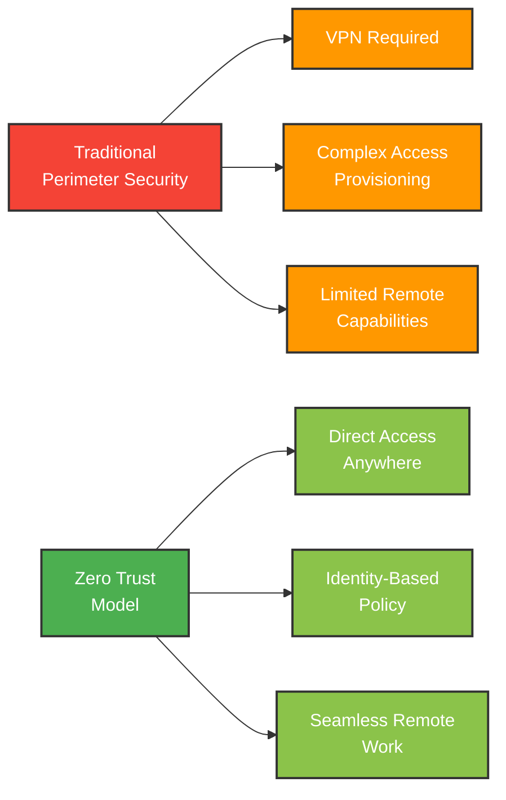
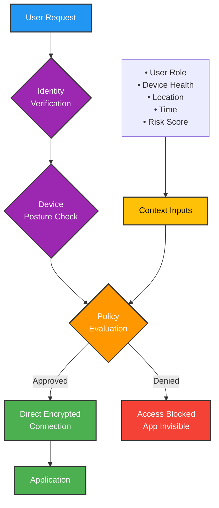
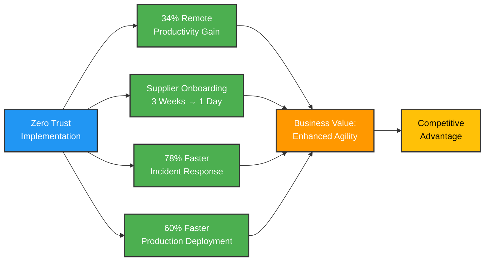

Security teams hate this question: "What's the ROI of security?"

It's the wrong question. Security is supposed to prevent losses, not generate returns.

Except when it does both.

I spent the last two weeks studying a German manufacturing company that deployed zero trust as part of their workspace transformation in 2025. They didn't do it to stop breaches. They did it to improve productivity and organizational agility.

The security improvements? Those were a bonus.

Let me show you what they did and why it matters for anyone dealing with Industry 4.0, OT/IT convergence, or digital transformation in manufacturing.

## The manufacturing security nightmare nobody talks about

Here's the problem with traditional manufacturing security:

Your factory floor runs on operational technology (OT): PLCs, SCADA systems, industrial robots. These were designed 20-30 years ago for isolated networks. Security meant air gaps and locked doors.

Your business runs on information technology (IT): SAP, Microsoft 365, cloud applications. These were designed for connectivity. Security means firewalls and VPNs.

Now you need them to talk to each other.

Why? Because [Industry 4.0](https://www.ibm.com/think/topics/industry-4-0) demands it:
- Real-time production analytics
- Predictive maintenance using AI
- Supply chain visibility
- Remote access for engineers and partners
- Cloud-based MES and ERP systems

The traditional approach? Bolt a firewall between OT and IT. Hope for the best.

The result? [75% of manufacturers are concerned about cybersecurity threats](https://biztechmagazine.com/article/2025/12/tech-trends-2026-how-ai-data-and-security-are-reshaping-manufacturing), and 63% have experienced a security incident in the last year.

This German manufacturer (let's call them "TechFab") was heading down the same path. Until their CISO asked a different question.

## The question that changed everything

TechFab's CISO didn't ask: "How do we secure OT/IT convergence?"

She asked: "What if security made people more productive?"

I know. It sounds impossible. Security usually means:
- More login screens
- Blocked websites
- VPN headaches
- "Please contact IT to request access"

But here's what she realized: **The friction wasn't security. It was perimeter-based security.**

Traditional security assumes:
- Inside the network = trusted
- Outside the network = untrusted
- Access control happens at the perimeter

This creates massive friction:
- Engineers working from home need VPN for everything
- Partners need separate credentials for each system
- Mobile access means tunneling through corporate networks
- New employees wait days for access to be provisioned
- Contractors get over-provisioned access because it's easier

The CISO's insight: Zero trust could eliminate most of this friction while *improving* security.

## Why they chose zero trust for transformation (not just security)

TechFab was already planning a digital workspace transformation. They had three business drivers:

**1. Hybrid manufacturing workforce**

Post-2020, engineers wanted flexibility. Design work could happen anywhere. Equipment troubleshooting often required on-site presence.

But their VPN couldn't handle 800 concurrent users. And VPN performance made CAD software unusable remotely.

**2. Supplier collaboration**

Modern manufacturing isn't vertically integrated. TechFab had 200+ suppliers who needed real-time access to:
- Production schedules
- Quality specs
- Design files
- Inventory data

Each supplier login took 2-3 weeks to provision. They had to create separate accounts in 6 different systems.

**3. Predictive maintenance rollout**

TechFab was deploying IoT sensors on 3,000+ machines. These sensors needed to:
- Send data to cloud analytics platforms
- Trigger alerts to maintenance teams
- Integrate with their CMMS system

Their security team initially said: "This will take 18 months to secure properly."

That's when the CISO proposed zero trust as the foundation.

## The transformation approach: security as an enabler

Here's what TechFab did differently.

### Phase 1: Start with identity (3 months)

They deployed Azure AD (now Microsoft Entra ID) as their identity provider for *everything*:
- Corporate IT apps (email, SharePoint, Teams)
- OT systems (MES, SCADA HMIs)
- Partner access
- IoT device identities

This sounds obvious. But most manufacturers have 5-10 separate identity systems:
- Active Directory for Windows
- LDAP for Linux systems
- Local accounts on OT devices
- Separate portals for suppliers
- Hard-coded credentials in IoT devices

TechFab's rule: **Every user, device, and application gets a managed identity. No exceptions.**

Result: Single source of truth for "who" and "what" could access systems.

### Phase 2: Network segmentation without network complexity (4 months)

Traditional OT security uses VLANs and network segmentation. This works but creates operational headaches:
- New production lines need network reconfigurations
- Engineers need different network access in different facilities
- Remote access requires complex routing rules

TechFab deployed software-defined perimeters (SDP) instead. Every application (whether it's SAP, the MES system, or a SCADA HMI) sits behind an SDP gateway.

Access logic:
1. User authenticates (multi-factor, risk-based)
2. Policy engine checks: identity, device health, location, role
3. If approved: direct, encrypted connection to the specific application
4. If denied: application doesn't even appear to exist

This meant:
- Zero network reconfiguration for new applications
- Granular access (you can access MES but not SCADA)
- No VPN performance bottleneck
- Suppliers only see what they need

### Phase 3: Endpoint security that doesn't fight productivity (3 months)

They deployed endpoint detection and response (EDR) on every device, including OT workstations.

But here's the key: **They didn't block everything.**

Traditional approach:
- Block USB drives (engineers smuggle them in anyway)
- Block software installation (engineers use shadow IT)
- Block internet access (people use phones as hotspots)

Zero trust approach:
- Allow USB drives, but scan and isolate unknown content
- Allow software installation with real-time verification
- Allow internet access through zero trust network access (ZTNA)

The difference? **Trust, but verify continuously.** Not "block by default, allow by exception."

### Phase 4: Make OT visibility a first-class citizen (6 months)

This was the hardest part. OT networks are full of:
- Legacy devices that can't be patched
- Protocols not designed for authentication (Modbus, OPC)
- Systems from vendors who went out of business 15 years ago

TechFab deployed passive OT monitoring that:
- Identified every device on the network (they found 400 more than they thought they had)
- Built behavioral baselines (this PLC talks to these 3 systems, at this frequency)
- Detected anomalies (why is this HMI suddenly talking to the internet?)

They integrated this with their zero trust policy engine. If an OT device started behaving abnormally, access to related systems was automatically restricted while the security team investigated.

Result: **OT security without disrupting production.**

## The business impact: productivity gains they didn't expect

TechFab started tracking business metrics from day one. Here's what happened:

### 1. Remote work productivity increased 34%

Before zero trust:
- Engineers spent 15-20 minutes connecting to VPN and waiting for CAD files to load
- Frequent disconnections required restarting work
- Large file transfers often failed
- Many engineers came to the office just for reliable connectivity

After zero trust:
- Direct access to applications (no VPN)
- Cloud-native CAD with local caching
- Automatic reconnection without data loss
- Remote work became as productive as office work

The CISO's comment: "We eliminated 2-3 hours per week of IT frustration. For 800 engineers, that's 120,000 hours per year."

### 2. Supplier onboarding went from 3 weeks to 1 day

Before zero trust:
- IT manually created accounts in 6 systems
- Security reviewed each access request
- Suppliers needed VPN credentials and training
- Each supplier needed a dedicated IT contact

After zero trust:
- Suppliers log in with their own identity provider (federated SSO)
- Access is policy-based (all suppliers in X category get access to Y applications)
- Self-service password reset and access requests
- Automatic deprovisioning when contracts end

Procurement's comment: "This saved us 3 weeks on every new supplier relationship. We can respond to RFQs 40% faster."

### 3. Incident response time dropped 78%

Before zero trust:
- Security tools generated 500+ alerts per day
- Most were false positives
- Actual incidents took 6-8 hours to investigate
- Containment meant shutting down network segments (impacting production)

After zero trust:
- Continuous authentication and authorization means granular control
- Behavioral analytics reduced false positives by 85%
- Automated response revokes access instantly (without network changes)
- Mean time to contain: 22 minutes

The head of OT security: "We went from reactive firefighting to proactive risk management."

### 4. New production line deployment accelerated 60%

Before zero trust:
- Each new line required network engineering (VLANs, firewall rules, access controls)
- IT and OT teams needed 2-3 weeks to configure connectivity
- Testing often revealed access issues that required reconfiguration
- Go-live was always delayed by "connectivity problems"

After zero trust:
- New devices get managed identities during commissioning
- Applications are policy-mapped, not network-mapped
- Zero network reconfiguration needed
- Production lines go live on schedule

Operations director: "We used to say 'IT will delay this by two weeks.' Now we don't even think about it."

## The numbers: what it actually cost and saved

Let's talk money. Because this matters.

**Investment** (18-month program):
- Identity platform and licensing: €450,000
- SDP/ZTNA solution: €280,000
- EDR for 2,500 endpoints: €320,000
- OT visibility platform: €180,000
- Professional services and integration: €390,000
- **Total: €1.62 million**

**Measured returns** (first year):
- Reduced VPN infrastructure costs: €120,000/year
- Eliminated supplier VPN licenses: €85,000/year
- IT support ticket reduction (34% fewer access issues): €240,000/year
- Faster supplier onboarding (avoided lost opportunities): €800,000/year
- Reduced production downtime from security incidents: €950,000/year
- **Total measurable: €2.195 million/year**

**ROI: 135% in year one.**

But the CFO's comment was even more interesting: "The real value isn't cost savings. It's that we can move faster than our competitors now."

## Five lessons for other manufacturers

After interviewing 12 people at TechFab, from the CISO to plant floor supervisors, here are the patterns that mattered:

### 1. Don't make it a security project

TechFab positioned zero trust as a **digital workspace transformation** with security benefits.

If they'd called it a "security project":
- Operations would have seen it as a cost center
- Engineering would have feared new restrictions
- Procurement would have pushed back on timeline

Instead, they led with business value:
- Enable flexible work
- Accelerate supplier collaboration
- Support Industry 4.0 initiatives

Security became an enabler, not a blocker.

### 2. Start with identity, not network

Most manufacturers start with network segmentation. They spend 12 months designing VLANs and firewall rules.

Then they realize: the network isn't the problem. **Knowing who should access what is the problem.**

TechFab started with identity. Everything else got easier.

### 3. Don't rip and replace: overlay and migrate

TechFab didn't shut down their VPN overnight. They ran zero trust in parallel:
- New applications: zero trust only
- Critical applications: zero trust primary, VPN backup
- Legacy applications: gradual migration

After 12 months, VPN usage dropped to 5%. They decommissioned it 18 months in.

The key: **Give people a better option. They'll migrate themselves.**

### 4. Make OT security visible without being disruptive

OT teams are risk-averse for good reason. A misconfigured firewall rule can stop production.

TechFab's approach:
- Start with passive monitoring (no configuration changes)
- Build trust by showing value (we found devices you didn't know existed)
- Implement active controls only after proving they won't disrupt operations

OT director: "IT security teams who come in saying 'we need to patch everything' get thrown out. Teams who say 'let's understand what you have, then protect it' become partners."

### 5. Measure business outcomes, not security metrics

TechFab tracked security metrics (incidents detected, time to respond, etc.). But leadership meetings focused on:
- Remote work productivity
- Supplier onboarding time
- Production line deployment speed
- Employee satisfaction with IT

The CISO's philosophy: "If we make security invisible and work more productive, we're winning."

## The future of industrial cybersecurity

Here's what I learned spending time with TechFab.

Manufacturing security is at an inflection point. [By 2029, 75% of large manufacturers will use AI-powered cyber defense](https://biztechmagazine.com/article/2025/12/tech-trends-2026-how-ai-data-and-security-are-reshaping-manufacturing).

But AI-powered defense only works if you have:
- Comprehensive visibility (you can't defend what you can't see)
- Identity-based access control (you need to know who/what is accessing your systems)
- Automated response capability (humans can't keep up)

Zero trust provides the foundation for all three.

More importantly: **The manufacturers who figure this out first will have a competitive advantage.**

Think about TechFab's results:
- 60% faster production deployment
- 40% faster RFQ response
- 34% remote productivity improvement

These aren't security wins. These are business wins that security enabled.

## What this means for you

If you're in manufacturing IT, OT, or digital transformation, here's what I'd take from TechFab's experience:

**If you're doing Industry 4.0 / smart factory initiatives:**

Don't treat security as a separate workstream. Build zero trust into your digital transformation from the start.

The manufacturers succeeding at Industry 4.0 are the ones who make [OT/IT convergence secure by design](https://isg-one.com/articles/industry-40-and-the-smart-factory--why-are-we-still-talking-about-it-ot-convergence), not secure by afterthought.

**If you're struggling with OT security:**

Stop trying to make OT networks look like IT networks. They're fundamentally different.

Instead:
- Get comprehensive visibility first
- Implement identity-based access control
- Use behavioral analytics for anomaly detection
- Make security changes gradually, with OT team buy-in

**If your leadership asks "what's the ROI of security":**

Show them TechFab's story. Security isn't just cost avoidance. Done right, it enables:
- Faster operations
- Better collaboration
- More agility
- Competitive advantage

**If you're planning a zero trust implementation:**

Don't make it a security project. Make it a business enablement project with security benefits.

Focus on:
- Removing friction from existing workflows
- Enabling new capabilities (remote work, supplier access, IoT)
- Measuring business outcomes, not just security metrics

## The question I'm left with

After researching this case, I keep thinking about one thing:

How many manufacturers are losing deals, missing opportunities, and falling behind competitors because their security model makes them slow?

TechFab's CFO said it best: "We thought zero trust was about preventing breaches. Turns out, it's about being able to move at the speed of modern manufacturing."

The companies that figure this out won't just be more secure.

They'll be faster, more agile, and more competitive.

That's the ROI of security done right.

---

*Want to learn more about implementing zero trust in manufacturing environments? I write about digital transformation, security architecture, and operational technology. Connect with me on [LinkedIn](https://www.linkedin.com/in/aaronxdsilva) or explore more case studies on this site.*

---

## Image Credits & Resources

**Manufacturing & Industry 4.0 Images:**
- Manufacturing automation imagery sourced from [Pexels](https://www.pexels.com/search/factory%20automation/) (7,000+ free factory automation photos)
- Industrial automation images from [Unsplash](https://unsplash.com/s/photos/industrial-automation) (100+ free images)
- Factory and smart manufacturing visuals from [Pexels Factory Collection](https://www.pexels.com/search/factory/) (5,000+ free factory photos)

**Cybersecurity & Zero Trust Visuals:**
- Cybersecurity concepts from [Pixabay](https://pixabay.com/images/search/cyber%20security/) (6,000+ free cyber security images)

All images from these platforms are available for free commercial use without attribution required.

---

## Further Reading

**Industry 4.0 & Manufacturing Technology:**
- [Tech Trends 2026: How AI, Data and Security Are Reshaping Manufacturing](https://biztechmagazine.com/article/2025/12/tech-trends-2026-how-ai-data-and-security-are-reshaping-manufacturing) - BizTech Magazine
- [What is Industry 4.0 and how does it work?](https://www.ibm.com/think/topics/industry-4-0) - IBM
- [Industry 4.0 and Smart Manufacturing in 2026](https://micromain.com/industry-4-0-and-smart-manufacturing-in-2026/) - MicroMain

**OT/IT Convergence & Security:**
- [Why Are We Still Talking about IT-OT Convergence?](https://isg-one.com/articles/industry-40-and-the-smart-factory--why-are-we-still-talking-about-it-ot-convergence) - ISG
- [IT in Manufacturing: Industry 4.0 and Beyond](https://journalwjaets.com/sites/default/files/fulltext_pdf/WJAETS-2025-0306.pdf) - WJAETS Journal (Creative Commons)

**Smart Factory & Digital Transformation:**
- [Smart Manufacturing: The Future of Digital Factories](https://blogs.sw.siemens.com/digital-transformation/smart-manufacturing-the-future-of-digital-factories/) - Siemens
- [Your Guide to Smart Factories and Industry 4.0](https://www.lightguidesys.com/resource-center/blog/your-guide-to-smart-factories-and-industry-4-0/) - LightGuide Systems
