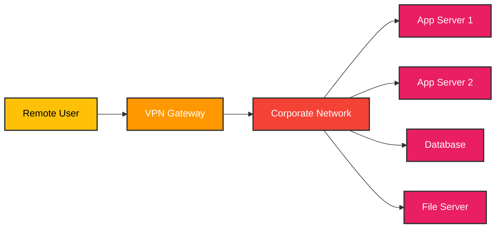
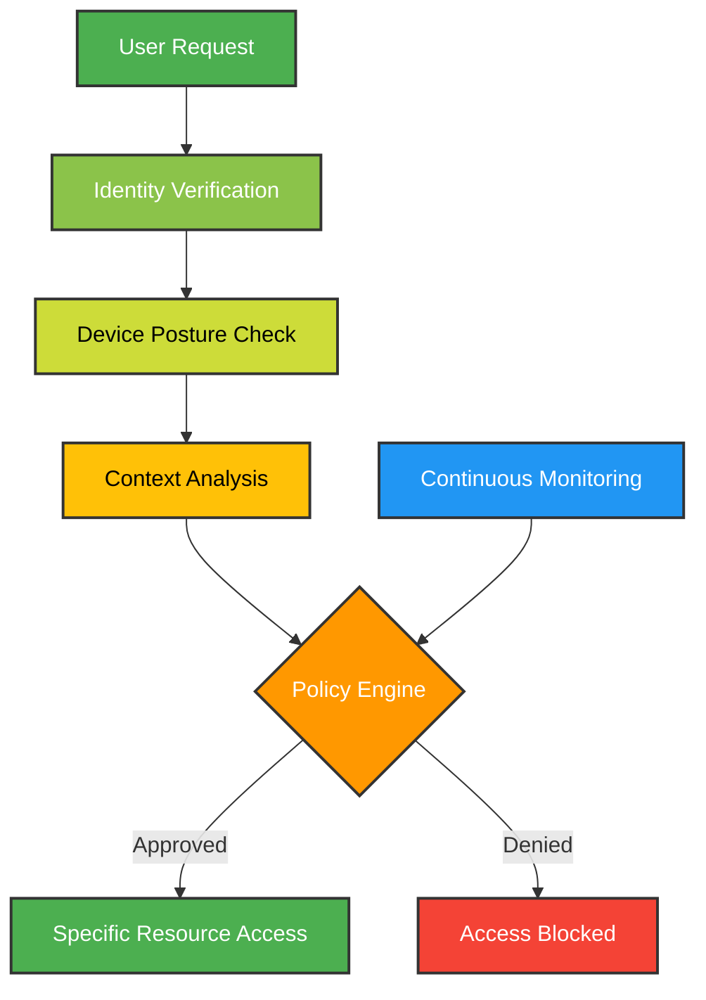
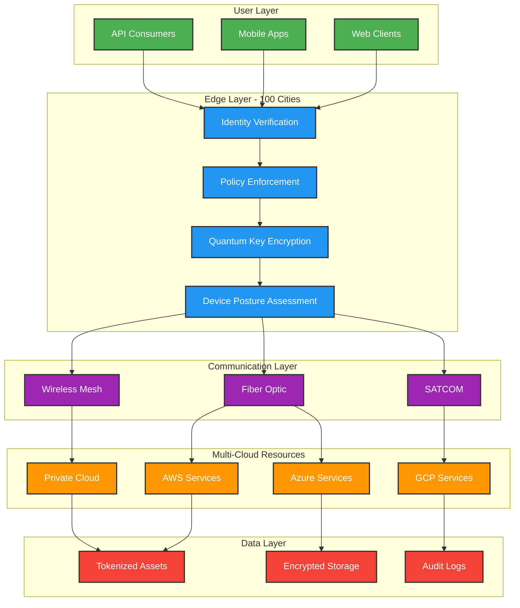
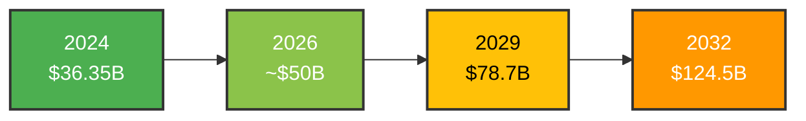

On January 5, 2026, [Datavault AI announced something ambitious](https://ir.datavaultsite.com/news-events/press-releases/detail/406/datavault-ai-and-available-infrastructure-to-scale-physical): they're deploying quantum-ready zero trust infrastructure across 100 U.S. cities.

Not in 5 years. Not as a pilot. Starting now, with 33 top cities beginning immediate systems integration.

This isn't just another cybersecurity announcement. It's a blueprint for how SaaS platforms will secure themselves in the post-VPN era.

Because here's what's happening in 2026: [65% of organizations are planning to replace their VPN services](https://www.zscaler.com/blogs/security-research/threatlabz-2025-vpn-report-why-81-organizations-plan-adopt-zero-trust-2026) this year. Not upgrade them. Replace them entirely.

And [81% plan to adopt zero trust frameworks by 2026](https://www.cio.com/article/3962906/why-81-of-organizations-plan-to-adopt-zero-trust-by-2026.html).

The question isn't whether to move to zero trust anymore. It's *how* to do it at scale. Especially for SaaS platforms operating across multiple clouds, serving millions of users, handling sensitive data.

Datavault's deployment gives us the first real-world playbook.

Let me show you what they're building and why it matters.

## The death of the VPN (and nobody's crying)

I've watched VPNs struggle for years. They were built for a different era: when your network had a perimeter, when employees sat in offices, when "inside the network" meant something.

That world is gone.

Now? Your employees are everywhere. Your data is in six different clouds. Your applications are SaaS. Your customers access systems from mobile devices you've never seen.

**VPNs weren't designed for this.**

The numbers tell the story. In the last year alone, [56% of organizations reported VPN-exploited breaches](https://www.zscaler.com/blogs/security-research/threatlabz-2025-vpn-report-why-81-organizations-plan-adopt-zero-trust-2026), a significant jump from the year before.

Think about that. More than half of companies using VPNs got breached *because* of their VPNs.

The problem is architectural. VPNs create a trust boundary: you're either in (trusted) or out (untrusted). Once you're in, you can move laterally across the network.

That's not a feature. That's the vulnerability.

### The old model vs. the new reality

Here's how traditional VPN security worked:

Notice the problem? Once you're through the VPN gateway, you're on the corporate network. You can potentially access *everything*.

One compromised credential = full network access.

Zero trust changes the game completely:

No network-level trust. Every request is verified. Every access is scoped to exactly what's needed. Continuous monitoring instead of "authenticate once, trust forever."

This is why companies are ditching VPNs. Not because VPNs are old. Because they're fundamentally incompatible with modern cloud architectures.

## Why SaaS platforms need different security models

I've worked on both traditional enterprise software and SaaS platforms. The security requirements are night and day different.

Traditional enterprise software? You control the environment. You know the network topology. You can whitelist IP addresses. You manage the infrastructure.

SaaS platforms? None of that applies.

### The SaaS security challenge

Your SaaS platform needs to:
- Serve customers from anywhere, on any device
- Integrate with multiple third-party services
- Store data across multiple cloud providers
- Handle API calls from thousands of different sources
- Scale from 10 to 10 million users without re-architecting security
- Comply with different regulations in different jurisdictions

You can't solve this with a VPN. You need zero trust architecture.

But here's what makes it hard: **you need zero trust at scale**.

It's one thing to implement zero trust for a single application. It's completely different to deploy it across:
- 100 cities
- Multiple cloud providers
- Thousands of endpoints
- Millions of authentication requests per day
- Real-time policy enforcement

This is exactly what Datavault AI is attempting.

## Datavault AI's architecture: quantum-ready zero trust at scale

Let's break down what they're actually building. The [partnership with Available Infrastructure](https://ir.datavaultsite.com/news-events/press-releases/detail/406/datavault-ai-and-available-infrastructure-to-scale-physical) combines several key technologies:

### 1. Distributed quantum-ready encryption

Datavault is deploying **Quantum Key Encryption** across all 100 locations. Not as a future upgrade. As the foundation.

Why does this matter? Because quantum computers will break current encryption methods. It's not an "if" question anymore. It's "when."

Organizations that build quantum-resistant security now won't need a massive, expensive retrofit later.

### 2. Multi-site architecture with redundant communications

Each location uses multiple communication channels:
- Fiber optic connections (high bandwidth, low latency)
- SATCOM (satellite communications for redundancy)
- Wireless mesh networks (resilience against infrastructure failures)

This isn't paranoia. It's designing for reality. Networks fail. Cables get cut. Satellites experience outages.

Mission-critical zero trust infrastructure needs to work even when primary communications fail.

### 3. Edge compute integration

The architecture pushes compute to the edge: closer to where data is generated and consumed.

According to CEO Daniel C. Gregory: ["Each network location has serviceable addressable market potential exceeding $100 million annually driven by regional demand for high-performance computing."](https://ir.datavaultsite.com/news-events/press-releases/detail/406/datavault-ai-and-available-infrastructure-to-scale-physical)

Edge compute is projected to grow at [30% CAGR through 2033](https://ir.datavaultsite.com/news-events/press-releases/detail/406/datavault-ai-and-available-infrastructure-to-scale-physical). Datavault is building the secure infrastructure to support that growth.

### The architecture at a glance

Here's how the system works end-to-end:

Every request goes through multiple verification layers. Every connection is encrypted with quantum-resistant algorithms. Every city location can operate independently if communications to other sites fail.

This is what zero trust at scale looks like.

## The 100-city deployment strategy: why geographic distribution matters

When I first saw "100 cities," I thought: why not start smaller? Prove it works in 10 cities, then expand?

But the more I researched zero trust architecture, the more I realized: geographic distribution *is* the strategy.

### Latency kills user experience

Zero trust means every request gets verified. If that verification happens 2,000 miles away, you're adding 40-80ms latency to every interaction.

For API calls? That's noticeable.
For real-time applications? That's unacceptable.
For high-frequency trading or financial services? That's impossible.

By deploying across 100 cities, Datavault ensures that most users are within 100 miles of an edge node. Latency drops to single-digit milliseconds.

Security verification becomes invisible to users.

### Regulatory compliance through data sovereignty

Different regions have different data regulations:
- GDPR in Europe requires data residency
- CCPA in California has specific requirements
- Financial services have geographic restrictions
- Healthcare data often can't cross state lines

With edge nodes in 100 cities, Datavault can process and store data where regulations require it, without sacrificing the benefits of a unified platform.

### Resilience through distribution

Cybersecurity isn't just about preventing breaches. It's about surviving them.

With 100 distributed nodes:
- No single point of failure
- DDoS attacks can't take down the entire platform
- Natural disasters or infrastructure failures affect only local regions
- Load can be redistributed automatically

The deployment strategy isn't just about coverage. It's about building a platform that can't be taken down.

## The market shift: why zero trust is becoming table stakes

Let me show you what's driving this massive industry transformation.

### The economics are compelling

Organizations that implement zero trust save an average of **[$1.76 million per data breach](https://www.ibm.com/reports/data-breach)** compared to those that don't.

That's not a small difference. That's the difference between:
- A manageable incident and a company-ending crisis
- Minor customer churn and major reputation damage
- Regulatory fines you can absorb and ones that threaten operations

But here's the kicker: organizations with *mature* zero trust deployments save an additional [$1.51 million](https://www.ibm.com/reports/data-breach) compared to those with early-stage implementations.

**Total savings: $3.27 million per breach for mature zero trust vs. no zero trust.**

### The market is exploding

The numbers tell a clear story:

The [zero trust security market was valued at $36.35 billion in 2024](https://www.grandviewresearch.com/industry-analysis/zero-trust-security-market-report). It's projected to reach:
- **$78.7 billion by 2029** (16.6% CAGR)
- **$124.5 billion by 2032** (16.7% CAGR)
- **Over $190 billion by 2035**

That's not incremental growth. That's a fundamental platform shift.

### Why the acceleration?

Three trends are converging:

**1. VPN vulnerabilities are getting worse**

56% of organizations suffered VPN-exploited breaches last year. That number was lower the year before. The trend is going the wrong way.

Meanwhile, attacks are getting more sophisticated. Ransomware groups specifically target VPN vulnerabilities because once they're in, they have network-level access.

**2. Cloud adoption demands new security models**

You can't protect cloud-native applications with network perimeter security. It doesn't work architecturally.

As more companies move to multi-cloud environments (AWS + Azure + GCP), they need security that works across all of them. Zero trust is cloud-agnostic.

**3. Regulatory pressure is increasing**

The [EU AI Act](https://artificialintelligenceact.eu/) is now enforced. GDPR penalties are real. CCPA is strengthening. Healthcare and financial regulations are tightening.

Zero trust makes compliance easier because it provides:
- Complete audit trails
- Granular access controls
- Data residency capabilities
- Automated policy enforcement

## Breaking down the numbers: zero trust ROI

Let me make this concrete with actual numbers.

### Organizations without zero trust face:
- Average breach cost: **$5.10 million**
- 38% higher breach costs than the global average
- Longer detection and response times
- Higher regulatory penalties

### Organizations with mature zero trust see:
- Average breach cost: **$1.83 million** (64% reduction)
- **76% reduction in breaches** with AI-enhanced zero trust
- Response times: **days → minutes**
- Compliance audit times: **weeks → hours**

| Metric | Without Zero Trust | With Mature Zero Trust | Improvement |
|--------|-------------------|----------------------|-------------|
| Average breach cost | $5.10M | $1.83M | **64% reduction** |
| Breach frequency | Baseline | 76% fewer | **76% reduction** |
| Detection time | Days | Minutes | **99% faster** |
| Compliance audit time | Weeks | Hours | **90% faster** |
| False positive rate | High | Low | **Better accuracy** |

Sources: [IBM Cost of Data Breach Report 2025](https://www.ibm.com/reports/data-breach), [Zscaler ThreatLabz 2025 VPN Report](https://www.zscaler.com/blogs/security-research/threatlabz-2025-vpn-report-why-81-organizations-plan-adopt-zero-trust-2026)

The ROI isn't theoretical. It's measurable, repeatable, and significant.

## What this means for enterprise SaaS security

Datavault's deployment is significant because it's *operationalizing* what was mostly theoretical.

We've had zero trust frameworks for years. NIST published [Special Publication 800-207](https://nvlpubs.nist.gov/nistpubs/specialpublications/NIST.SP.800-207.pdf) defining zero trust architecture. Vendors have built point solutions.

But nobody had deployed quantum-ready zero trust infrastructure at this scale across distributed geography.

Until now.

### What this deployment proves

**1. Zero trust works at SaaS scale**

100 cities. Multiple clouds. Quantum-ready encryption. Real-time policy enforcement.

This isn't a pilot. It's production infrastructure designed to handle millions of transactions.

**2. Edge-based security is viable**

By pushing security controls to the edge (100 city locations), Datavault proves you can do comprehensive security verification without adding noticeable latency.

This matters because latency has been the traditional objection to zero trust. "It'll slow everything down."

Not if you architect it correctly.

**3. Quantum-resistant security can be deployed today**

Most organizations treat quantum threats as a future problem. Datavault is deploying quantum-resistant encryption now.

This creates a competitive advantage. When quantum computers break current encryption (and they will), Datavault's customers won't need emergency re-architecture.

### The three deployment patterns emerging

Based on Datavault's approach and industry trends, I'm seeing three patterns for zero trust deployment:

**Pattern 1: Centralized Zero Trust (Traditional)**
- Single policy enforcement point
- Lower deployment cost
- Higher latency
- Single point of failure
- Works for: Small to mid-size organizations with limited geographic spread

**Pattern 2: Regional Zero Trust (Hybrid)**
- 3-5 regional enforcement points
- Moderate deployment cost
- Moderate latency
- Some geographic redundancy
- Works for: National companies with regional customer bases

**Pattern 3: Distributed Zero Trust (Datavault's Model)**
- 50-100+ edge enforcement points
- Higher deployment cost
- Minimal latency
- Maximum resilience
- Works for: Global SaaS platforms, financial services, critical infrastructure

Each pattern has trade-offs. Datavault is betting that for SaaS platforms serving critical use cases, distributed zero trust is worth the investment.

The economics support this: with each location having $100M+ annual addressable market potential, the deployment pays for itself through the services it enables.

## The future of cloud-native security

Let me make a prediction: by 2028, distributed zero trust will be table stakes for enterprise SaaS platforms.

Here's why I believe this:

### 1. The VPN exodus is accelerating

65% plan to replace VPNs this year. That's not a slow migration. It's a mass exodus.

Organizations replacing VPNs need something better. Zero trust is the only viable alternative.

### 2. AI workloads demand better security

AI models process sensitive data. They make autonomous decisions. They handle PII, financial data, healthcare records.

Traditional perimeter security doesn't work for AI workflows that span multiple clouds and process data at the edge.

Zero trust, with its "verify every request, trust nothing" model, maps naturally to AI security requirements.

### 3. Quantum computing timelines are compressing

In 2020, quantum computing breaking encryption felt like science fiction.

In 2026, it feels like a planning requirement.

Organizations that deploy quantum-resistant security now (like Datavault) won't face emergency retrofits later. That's a massive competitive advantage.

### 4. Compliance is getting stricter

EU AI Act. Strengthening GDPR. Expanding CCPA. New healthcare regulations.

Zero trust makes compliance *easier* because it provides:
- Complete audit trails of every access request
- Granular policy enforcement
- Data residency controls
- Automated compliance reporting

As regulations increase, zero trust adoption will accelerate.

## What you should do now

If you're building or operating a SaaS platform, here's what Datavault's deployment teaches us:

**1. Stop thinking of zero trust as a future project**

65% of organizations are replacing VPNs *this year*. If you're not planning your zero trust migration, you're falling behind.

Start with:
- Inventory your current authentication and access systems
- Identify your highest-risk access points
- Map your data flows across clouds and services
- Assess your current compliance gaps

**2. Think distributed from day one**

If you're building new infrastructure, design for distribution. Edge-based security isn't just about performance. It's about resilience.

Don't optimize for a single data center. Optimize for 10, then 100.

**3. Plan for quantum resistance**

You don't need to deploy quantum-resistant encryption tomorrow. But you need to understand:
- Which systems will need it first (financial, healthcare, government)
- What the migration path looks like
- How much it will cost
- When you need to start

Organizations that wait until quantum threats are imminent will face expensive, rushed migrations.

**4. Measure the right metrics**

Don't just track "zero trust adoption." Track:
- **Breach cost reduction** (the real ROI)
- **Detection and response times**
- **Compliance audit efficiency**
- **False positive rates**

These metrics tell you if zero trust is actually working, not just deployed.

**5. Start with high-value, high-risk workflows**

You don't need to migrate everything to zero trust on day one. Start with:
- Admin access to production systems
- Access to customer PII
- Financial transaction systems
- AI model training and deployment pipelines

Prove the value, then expand.

## The bottom line

Datavault AI's 100-city deployment isn't just a press release. It's a blueprint for how SaaS platforms will secure themselves in the post-VPN era.

The numbers are clear:
- **81% of organizations** plan zero trust adoption by 2026
- **65% are replacing VPNs** this year
- **$3.27M savings per breach** for mature zero trust deployments
- **Zero trust market growing at 16.7% CAGR** to $124.5B by 2032

The trend is undeniable. VPNs are dying. Zero trust is becoming table stakes.

The question isn't whether to move to zero trust. It's how fast you can get there and whether you'll deploy it centralized (cheaper, slower, less resilient) or distributed (more expensive, faster, more resilient).

Datavault is betting on distributed. With quantum-ready encryption, edge-based enforcement, and 100-city deployment, they're building infrastructure for the next decade of cloud security.

For SaaS platforms handling critical workloads (financial services, healthcare, government, AI), I think they're right.

The future of cloud security is distributed, quantum-resistant, and zero trust.

And it's being deployed right now.

---

*Image credits: Architecture diagrams created by author. Cloud security concepts inspired by [NIST SP 800-207 Zero Trust Architecture](https://nvlpubs.nist.gov/nistpubs/specialpublications/NIST.SP.800-207.pdf), [Cloudflare Zero Trust Reference Architecture](https://developers.cloudflare.com/reference-architecture/design-guides/zero-trust-for-saas/), and [CISA Cloud Security Technical Reference Architecture](https://www.cisa.gov/sites/default/files/2023-02/cloud_security_technical_reference_architecture_2.pdf). Stock imagery should be sourced from [Unsplash Cloud Security Collection](https://unsplash.com/s/photos/cloud-security) and [Unsplash Cybersecurity Collection](https://unsplash.com/s/photos/cybersecurity) under free commercial use license.*

---

## Sources

- [Datavault AI Press Release - 100 City Deployment Announcement](https://ir.datavaultsite.com/news-events/press-releases/detail/406/datavault-ai-and-available-infrastructure-to-scale-physical)
- [Zscaler ThreatLabz 2025 VPN Risk Report](https://www.zscaler.com/blogs/security-research/threatlabz-2025-vpn-report-why-81-organizations-plan-adopt-zero-trust-2026)
- [CIO: Why 81% of Organizations Plan to Adopt Zero Trust by 2026](https://www.cio.com/article/3962906/why-81-of-organizations-plan-to-adopt-zero-trust-by-2026.html)
- [IBM Cost of a Data Breach Report 2025](https://www.ibm.com/reports/data-breach)
- [Grand View Research: Zero Trust Security Market Report](https://www.grandviewresearch.com/industry-analysis/zero-trust-security-market-report)
- [MarketsandMarkets: Zero Trust Security Market](https://www.marketsandmarkets.com/Market-Reports/zero-trust-security-market-2782835.html)
- [NIST Special Publication 800-207: Zero Trust Architecture](https://nvlpubs.nist.gov/nistpubs/specialpublications/NIST.SP.800-207.pdf)
- [Cloudflare Reference Architecture: Zero Trust for SaaS](https://developers.cloudflare.com/reference-architecture/design-guides/zero-trust-for-saas/)
- [CISA Cloud Security Technical Reference Architecture](https://www.cisa.gov/sites/default/files/2023-02/cloud_security_technical_reference_architecture_2.pdf)
- [Reco.ai: Top 11 Zero Trust Security Solutions in 2026](https://www.reco.ai/learn/zero-trust-tools)
